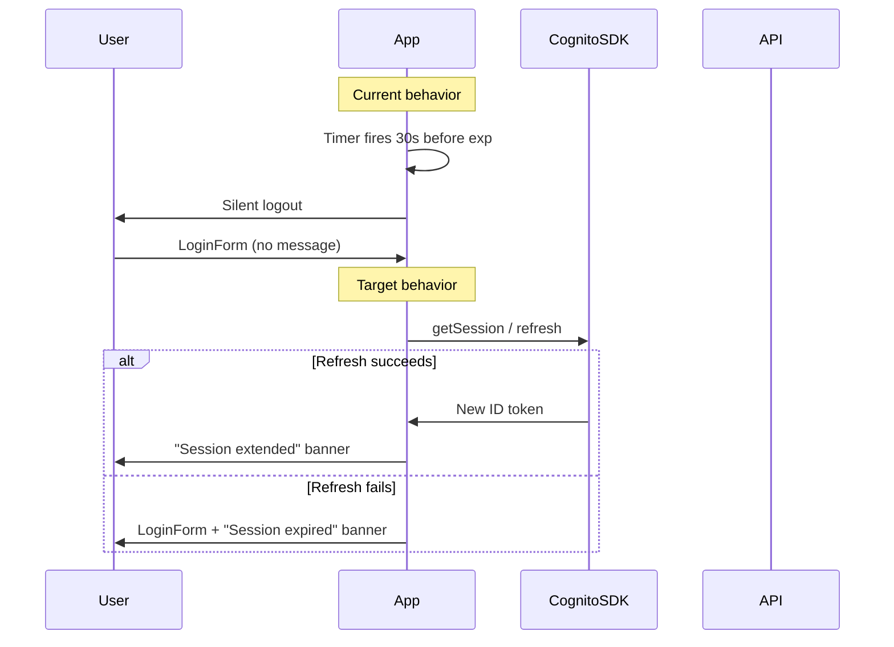

# Admin session expiry and password reset

## Current state

The admin SPA (`[apps/admin/src/infrastructure/auth.cognito.ts](apps/admin/src/infrastructure/auth.cognito.ts)`) stores Cognito sessions in browser `localStorage` and treats an expired ID token as an immediate logout. `[App.tsx](apps/admin/src/App.tsx)` schedules a silent logout **30 seconds before** ID token expiry without attempting refresh. When logout happens, the user lands on `[LoginForm.tsx](apps/admin/src/ui/LoginForm.tsx)` with **no explanation**.

Password reset does not exist in the app. Cognito only supports first-login `NEW_PASSWORD_REQUIRED` via `[SetNewPasswordForm](apps/admin/src/App.tsx)` (copy incorrectly says “temporary password has expired”).

Infrastructure (`[infra/terraform/cognito.tf](infra/terraform/cognito.tf)`) sets invite-only users, 1-hour ID tokens, and `**ALLOW_USER_SRP_AUTH` only**. Because `explicit_auth_flows` is set, `**ALLOW_REFRESH_TOKEN_AUTH` is not enabled**, so the SDK cannot refresh tokens via `REFRESH_TOKEN_AUTH` today.

---

## Part 1: Enable and use token refresh

### Terraform (`[infra/terraform/cognito.tf](infra/terraform/cognito.tf)`)

- Add `ALLOW_REFRESH_TOKEN_AUTH` to `explicit_auth_flows` (required for `amazon-cognito-identity-js` `refreshSession`).
- Set explicit refresh token validity (e.g. 30 days) via `refresh_token_validity` + `token_validity_units` for documentation and predictable behavior.
- Add `account_recovery_setting` with `verified_email` so forgot-password is explicitly enabled.

### Auth layer

Refactor `[auth.cognito.ts](apps/admin/src/infrastructure/auth.cognito.ts)`:

- Add `refreshSession(): Promise<CognitoUserSession | null>` — wraps `pool.getCurrentUser()?.getSession()` and returns the session only if valid after SDK refresh; returns `null` on error or dead refresh token.
- Change `getIdToken()` to call `refreshSession()` when the cached ID token is expired instead of immediately calling `notifySessionExpired()`.
- Extend session callbacks beyond a single “expired” hook:
  - `onSessionRefreshed(handler)` — invoked when refresh succeeds
  - Keep `onSessionExpired(handler)` — invoked only when refresh is impossible
- Add `logoutReason` support: `notifySessionExpired(reason: 'expired' | 'manual')` so the login screen can distinguish user-initiated sign-out from forced expiry.

Update `[auth.mock.ts](apps/admin/src/infrastructure/auth.mock.ts)` with matching exports (no-op refresh, same callback signatures) so mock dev stays working.

Update `[auth.ts](apps/admin/src/infrastructure/auth.ts)` facade to re-export `refreshSession`, `onSessionRefreshed`, and password-reset functions (Part 2).

### App session orchestration (`[App.tsx](apps/admin/src/App.tsx)`)

Replace the “logout 30s early” timer with refresh-first logic:

1. On login / session check, schedule a timer at **ID token expiry** (not 30s early).
2. When the timer fires (and on tab visibility resume if token is expired): call `refreshSession()`.
  - **Success:** set a short-lived banner state (`sessionStatus: 'refreshed'`), reschedule timer from new `getSessionExpiresAt()`.
  - **Failure:** call `handleLogout('expired')`.
3. Pass `logoutMessage` to `LoginForm` when reason is `'expired'` (amber/red info banner: “Your session expired. Please sign in again.”).
4. Pass `sessionStatus` to `Dashboard` for a dismissible success banner (reuse existing slate status styling from `[Dashboard.tsx](apps/admin/src/ui/Dashboard.tsx)`): “Your session was extended automatically.”

Fix `[SetNewPasswordForm](apps/admin/src/App.tsx)` copy to: “Choose a permanent password to finish setting up your account.” (first-login challenge, not expiry).

### API retry (`[contentApi.ts](apps/admin/src/infrastructure/contentApi.ts)`)

On HTTP **401** or `SessionExpiredError` from `getIdToken()`:

1. Attempt `refreshSession()` once.
2. If refresh succeeds, notify `onSessionRefreshed` and **retry the request** with the new token.
3. If refresh fails, trigger session-expired logout with messaging.

This avoids logging users out when the worker rejected a stale token but Cognito can still refresh.

---

## Part 2: Forgot-password flow

### Auth API (`[auth.cognito.ts](apps/admin/src/infrastructure/auth.cognito.ts)`)

Add Cognito SDK calls (SRP client, no secret):

- `requestPasswordReset(email)` → `CognitoUser.forgotPassword()` (always show generic success copy because `prevent_user_existence_errors = ENABLED`).
- `confirmPasswordReset(email, code, newPassword)` → `CognitoUser.confirmPassword()`.

Map common Cognito errors to user-friendly messages (invalid/expired code, password policy violations). Client-side validation should mirror pool policy: min 12 chars, upper, lower, number.

Mock implementations in `[auth.mock.ts](apps/admin/src/infrastructure/auth.mock.ts)`: accept any email, fixed code `123456`, then succeed.

### UI

Extend auth view state in `[App.tsx](apps/admin/src/App.tsx)`:

| View          | Component                                      | Purpose                                           |
| ------------- | ---------------------------------------------- | ------------------------------------------------- |
| `login`       | `[LoginForm](apps/admin/src/ui/LoginForm.tsx)` | Add “Forgot password?” link (hidden in mock mode) |
| `forgot`      | new `ForgotPasswordForm.tsx`                   | Enter email, submit reset request                 |
| `reset`       | new `ResetPasswordForm.tsx`                    | Enter verification code + new password + confirm  |
| `newPassword` | existing `SetNewPasswordForm`                  | First-login challenge only                        |

After successful reset, return to login with success message: “Password updated. Sign in with your new password.”

New components should match existing Tailwind patterns (`card`, `field-label`, `field-input`, `btn-primary`).

---

## Part 3: SES email for Cognito (production reset emails)

Add to `[infra/terraform/](infra/terraform/)`:

**New variables** (`[variables.tf](infra/terraform/variables.tf)`):

- `cognito_from_email` — e.g. `noreply@bonaetech.com` (must match verified SES identity)
- `ses_domain` — default `bonaetech.com`

**New resources** (new `ses.tf` or extend `cognito.tf`):

- `aws_ses_domain_identity` + `aws_ses_domain_dkim` for `ses_domain`
- `aws_iam_role` + policy allowing Cognito to send via SES (`cognito-idp.amazonaws.com` → `ses:SendEmail`)
- Wire `email_configuration` on the user pool:
  - `email_sending_account = "DEVELOPER"`
  - `from_email_address = var.cognito_from_email`
  - `source_arn = aws_ses_domain_identity...arn`

**New outputs** (`[outputs.tf](infra/terraform/outputs.tf)`):

- SES domain verification TXT record
- DKIM CNAME records (for DNS at `bonaetech.com`)

**Post-apply ops (document in plan, not a new markdown file):**

1. `terraform apply` in `infra/terraform/`
2. Add DNS records from Terraform outputs
3. Request SES production access in AWS console if still in sandbox (sandbox only delivers to verified addresses)
4. Re-deploy admin SPA (no new env vars needed for reset flow)

---

## Files to change (summary)

| Area  | Files                                                                                                                                                                                                                                                |
| ----- | ---------------------------------------------------------------------------------------------------------------------------------------------------------------------------------------------------------------------------------------------------- |
| Infra | `[cognito.tf](infra/terraform/cognito.tf)`, new `ses.tf`, `[variables.tf](infra/terraform/variables.tf)`, `[outputs.tf](infra/terraform/outputs.tf)`                                                                                                 |
| Auth  | `[auth.cognito.ts](apps/admin/src/infrastructure/auth.cognito.ts)`, `[auth.mock.ts](apps/admin/src/infrastructure/auth.mock.ts)`, `[auth.ts](apps/admin/src/infrastructure/auth.ts)`, `[contentApi.ts](apps/admin/src/infrastructure/contentApi.ts)` |
| UI    | `[App.tsx](apps/admin/src/App.tsx)`, `[LoginForm.tsx](apps/admin/src/ui/LoginForm.tsx)`, new `ForgotPasswordForm.tsx`, new `ResetPasswordForm.tsx`, minor `[Dashboard.tsx](apps/admin/src/ui/Dashboard.tsx)` prop for refresh banner                 |

---

## Test plan

**Local mock (`npm run admin:dev:mock`):**

- Login → wait/simulate expiry → confirm refresh banner or expired login message appears
- Forgot-password link hidden in mock; optional mock reset with code `123456`

**Cognito (staging/prod after Terraform apply + DNS):**

- Sign in, leave tab idle past 1h (or shorten ID token in a test pool) → session extends with banner, no data loss
- Revoke refresh token / wait 30 days → expired message on login
- Forgot password: request code → email received via SES → reset → sign in with new password
- First-login invite user still completes `SetNewPasswordForm` unchanged

**Regression:**

- Content API calls still send Bearer JWT; worker auth unchanged
- Manual “Sign out” does not show expired message

