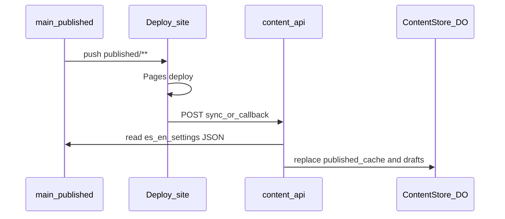

# Git-ahead Durable Object rehydrate

## Problem

Today the DO only loads from git when [`published_cache` is empty](workers/content-api/src/content-store/bootstrap.ts) (`bootstrapFromGitIfNeeded`). After that, `published_cache` updates only on a successful **admin** publish callback via [`syncPublishedCacheFromDrafts`](workers/content-api/src/content-store/queries.ts).

A direct push/edit under `apps/static/content/published/` triggers **Deploy site** and updates the live site, but the DO stays on the old snapshot. Admin then diffs against stale `published_cache` / drafts (schema skew, “phantom” changes, crashes).

**Policy (confirmed):** when git published content is ahead, **git wins completely** — overwrite both `published_cache` and `drafts` from the committed files (discard local draft edits).

## System to put in place

**Git-authoritative rehydrate** (pull-from-git), triggered whenever Deploy site finishes successfully for a commit that may have changed published content—not only when an admin publish is in flight.

Core pieces:

1. **Detect “git ahead”** — compare DO `published_cache.commit_sha` (and/or content hash) to the deploy’s `github.sha` / blob content from that commit. If SHAs differ **or** any locale JSON differs, rehydrate.
2. **Rehydrate** — read `es.json` / `en.json` / `settings.json` from GitHub at that commit; validate with `@bonae/content`; write all locales into `published_cache` **and** `drafts`; set `commit_sha` to the deploy SHA; leave `publish_state` alone unless a matching in-flight publish can complete as today.
3. **Trigger** — extend the existing CI → Worker path so every successful **Deploy site** run can rehydrate, not only admin-publish callbacks.

## Implementation approach

### 1. Worker: shared rehydrate from git

Add something like `rehydrateFromGit(sql, env, { commitSha, mode: 'force' })` next to bootstrap (refactor [`bootstrap.ts`](workers/content-api/src/content-store/bootstrap.ts)):

- Octokit: `readPublishedJson` (already in [`github.ts`](workers/content-api/src/github.ts)) for all `CONTENT_LOCALES`, preferring the given `commitSha` as `ref` when reading.
- Validate with `parseContentDocument` / `parseSiteSettings` (fail the sync with a logged error / non-2xx if invalid—do not half-write).
- Upsert `published_cache` and `drafts` for every locale; set `commit_sha` / `updated_at`.
- Keep empty-cache bootstrap as a thin call into the same helper.

### 2. Wire CI callback / sync endpoint

**Preferred:** broaden [`handlePublishCallback`](workers/content-api/src/content-store/publish.ts) / `POST /content/publish/callback` behavior:

- Keep current behavior when `publish_state` is `building` and SHA matches (success/failure + `syncPublishedCacheFromDrafts` on success—or switch success path to rehydrate-from-git for one source of truth).
- **New:** when status is `success` and state is **not** a matching in-flight publish (idle / wrong SHA / already settled), still **rehydrate from git** for that `commitSha` (git wins). Return `204`.
- When status is `failure`/`cancelled` with no matching in-flight publish: no rehydrate (unchanged ignore).

Alternatively (cleaner API): `POST /content/sync/from-git` with the same bearer secret, called from [`deploy-site.yml`](.github/workflows/deploy-site.yml) on success; keep publish callback for overlay only. Prefer **one** CI step: either extend callback payload with `action: "rehydrate"` or always rehydrate on successful callback as above—avoids a second secret/route unless we want clearer separation.

**Default choice for this plan:** on successful callback, always rehydrate DO from git at `commitSha` (and if in-flight publish matches, also mark publish `success` / clear alarm). That makes admin publish and direct git edits share one path.

### 3. Deploy site workflow

[`deploy-site.yml`](.github/workflows/deploy-site.yml) already posts `{ commitSha, status, runUrl }` with `PUBLISH_CALLBACK_SECRET`. No secret change required if we reuse callback. Ensure the step still runs on success after Pages deploy (`if: always()` already); document that a successful deploy now **must** reach the Worker or the DO stays stale (callback already `continue-on-error`—consider promoting DNS/HTTP failures to visible `::error::` as previously discussed, without failing Pages).

### 4. Admin / UX

No new draft UI required for the force policy. After rehydrate, next `GET /content/state` shows draft === published from git. Optional small improvement: log `action: "rehydrate_from_git"` with `commitSha` for Cloudflare Worker logs / Postman note.

Mock admin ([`mockContentStore.ts`](apps/admin/mockContentStore.ts)): on mock “deploy”, already writes disk; ensure mock path keeps draft/published aligned (already local).

### 5. Tests + docs

- Unit tests: rehydrate overwrites cache + drafts; successful callback with idle state rehydrates; matching in-flight publish still settles to `success`.
- Docs: [architecture.md](docs/architecture.md) § Niveles de contenido + publish sequence; [admin-content-api-map.md](docs/admin-content-api-map.md) callback semantics; note that **drafts are DO-only** (no git `drafts/` folder)—“correct drafts” means the DO `drafts` table.

## Out of scope

- Pushing DO drafts back to git without publish.
- Partial/merge sync when drafts are dirty (rejected in favor of git-wins-completely).
- Changing Astro build; site already reads git `published/` at build time.
