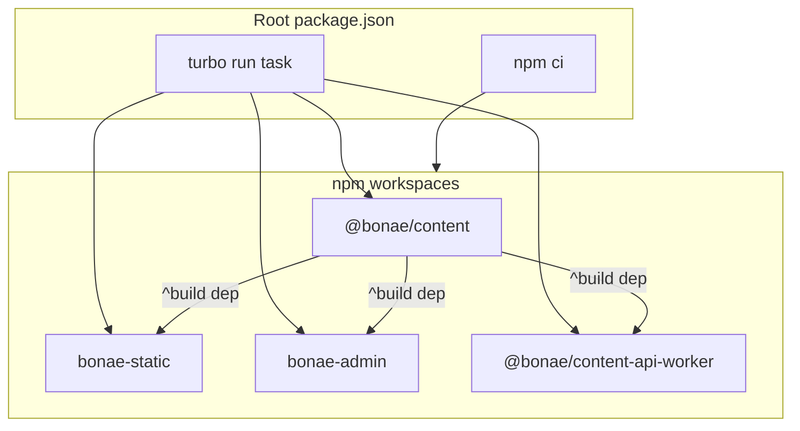

# Migrate Makefile orchestration to npm workspaces + Turborepo

## Current state

- [Makefile](Makefile) runs `npm ci` + `npm run build` per package, then wrangler deploys.
- [package.json](package.json) already has partial root scripts (`npm --prefix …`), but `build:all` and `deploy:*` still delegate to `make`.
- Each workspace has its **own** `package-lock.json` and `node_modules` (no hoisting).
- CI ([`.github/workflows/ci.yml`](.github/workflows/ci.yml)) installs and builds each package independently.

## Target architecture



**Dependency rule:** Turborepo `dependsOn: ["^build"]` ensures `@bonae/content` compiles before any consumer builds — replacing the manual `build-content` prerequisite in the Makefile and the redundant `npm run build --prefix ../../packages/content` inside [workers/content-api/package.json](workers/content-api/package.json).

## 1. Enable npm workspaces at the root

Update [package.json](package.json):

```json
{
  "workspaces": ["apps/*", "packages/*", "workers/*"],
  "packageManager": "npm@10.9.2",
  "devDependencies": {
    "turbo": "^2.5.0"
  }
}
```

**Lockfile consolidation:** Delete the four per-package lockfiles and generate a single root `package-lock.json` via `npm install` at the repo root. This is required for workspaces and simplifies CI caching to one path.

**Dependency linking:** In [apps/admin/package.json](apps/admin/package.json), [apps/static/package.json](apps/static/package.json), and [workers/content-api/package.json](workers/content-api/package.json), replace:

```json
"@bonae/content": "file:../../packages/content"
```

with:

```json
"@bonae/content": "*"
```

(npm workspaces resolve `*` to the local workspace package.)

## 2. Add Turborepo task pipeline

Create [`turbo.json`](turbo.json) at the repo root:

| Task | `dependsOn` | Notes |
|------|-------------|-------|
| `build` | `["^build"]` | Outputs: `dist/**` (content, admin, static); worker has no dist output (typecheck only) |
| `dev`, `dev:mock` | `["^build"]` | `cache: false`, `persistent: true` |
| `test` | `["^build"]` | Worker vitest suite |
| `validate:published` | `["build"]` | Content CLI validation |
| `deploy` | `["build"]` | `cache: false`; wrangler commands live in package scripts |

## 3. Simplify per-package scripts

**[@bonae/content](packages/content/package.json)** — no build changes; keep `validate:published` and `test`.

**[bonae-static](apps/static/package.json)** — simplify `content:validate` to stop re-running `npm ci` + content build (Turbo handles build order):

```json
"content:validate": "npm run validate:published -w @bonae/content",
"deploy": "wrangler pages deploy dist --project-name bonae-tech"
```

**[bonae-admin](apps/admin/package.json)** — add deploy script:

```json
"deploy": "wrangler pages deploy dist --project-name bonae-admin"
```

**[@bonae/content-api-worker](workers/content-api/package.json)** — remove embedded content build:

```json
"build": "tsc --noEmit"
```

(Deploy script already exists; CI will keep passing Cognito vars via workflow env, not package.json.)

## 4. Root orchestration scripts (replace Makefile)

Replace Makefile delegation in [package.json](package.json) with Turbo-driven scripts:

| Old (Makefile / current root) | New root script |
|-------------------------------|-----------------|
| `make build-all` | `turbo run build` (`build` / `build:all`) |
| `make deploy-site` | `turbo run deploy --filter=bonae-static` |
| `make deploy-admin` | `turbo run deploy --filter=bonae-admin` |
| `make deploy-worker` | `turbo run deploy --filter=@bonae/content-api-worker` |
| `make deploy-all` | `turbo run deploy --filter=@bonae/content-api-worker --filter=bonae-admin` |
| `make dev-admin-mock` | `turbo run dev:mock --filter=bonae-admin` |
| `make dev-worker` | `turbo run dev --filter=@bonae/content-api-worker` |
| `make test-worker` | `turbo run test --filter=@bonae/content-api-worker` |

Keep **backward-compatible aliases** for existing names (`admin:dev:mock`, `worker:build`, `content:build`, etc.) pointing at the new Turbo commands so docs and habits don't break abruptly.

Add a convenience install script:

```json
"postinstall": "turbo run build --filter=@bonae/content"
```

Optional but recommended: building `@bonae/content` after `npm ci` so `file:`/`workspace` imports resolve immediately for IDE and one-off package commands.

**Delete [Makefile](Makefile)** once scripts and docs are updated.

## 5. Update CI / GitHub Actions

Simplify all workflows to a two-step pattern at the repo root:

```yaml
- uses: actions/setup-node@v4
  with:
    node-version: 20
    cache: npm
    cache-dependency-path: package-lock.json
- run: npm ci
- run: npx turbo run build test   # adjust filters per workflow
```

**Files to update:**

- [`.github/workflows/ci.yml`](.github/workflows/ci.yml) — replace 4× `npm ci` + per-package builds with `turbo run build test`
- [`.github/workflows/deploy-site.yml`](.github/workflows/deploy-site.yml), [deploy-admin.yml](.github/workflows/deploy-admin.yml), [deploy-worker.yml](.github/workflows/deploy-worker.yml) — root `npm ci` + `turbo run build` (keep wrangler deploy steps with env-specific vars)
- [`.github/workflows/content-pr-check.yml`](.github/workflows/content-pr-check.yml) — `turbo run build validate:published --filter=@bonae/content` + drafts validate
- [`.github/workflows/setup-worker.yml`](.github/workflows/setup-worker.yml) — root install + turbo build/test for worker
- [`.github/actions/build-content/action.yml`](.github/actions/build-content/action.yml) — replace with root `npm ci && turbo run build --filter=@bonae/content`, or inline and remove the composite action

Deploy workflows that pass Cognito env vars to admin build and worker deploy **keep those env blocks** in YAML; only the install/build steps consolidate.

## 6. Housekeeping

- [`.gitignore`](.gitignore) — add `.turbo/`; fix stale `services/content-api/dist/` → `workers/content-api/dist/`
- Update docs referencing `make` / Makefile:
  - [README.md](README.md) (structure diagram, command table, setup instructions)
  - [CLAUDE.md](CLAUDE.md) — replace "no workspace hoisting" with workspaces + Turbo guidance
  - [docs/architecture.md](docs/architecture.md)
  - [workers/content-api/README.md](workers/content-api/README.md)
  - [apps/static/README.md](apps/static/README.md), [packages/content/README.md](packages/content/README.md)

## 7. Convention for adding future packages

Document this checklist (in README or CLAUDE.md):

1. Create `package.json` under `apps/*`, `packages/*`, or `workers/*` — workspaces glob picks it up automatically.
2. If consuming shared schema: `"@bonae/content": "*"` in `dependencies`.
3. Add standard scripts: `build`, `dev`, `test` as applicable.
4. Turborepo discovers the package via workspace glob — no `turbo.json` edit needed unless custom task outputs or cross-package ordering is required.
5. Add path filters to relevant `.github/workflows/*.yml` if the new package should trigger CI/deploy.

## Risk notes

- **One-time migration friction:** Developers must run `npm ci` at the **repo root** (not per-package). Per-package `npm ci` will no longer work correctly once child lockfiles are removed.
- **Worker deploy in CI** still needs workflow-level `--var` flags for Cognito; local `npm run deploy:worker` uses plain `wrangler deploy` (same as today via Makefile).
- **Turbo remote cache** is intentionally out of scope — add later if build times become a bottleneck.

## Verification

From repo root after migration:

```bash
npm ci
npm run build          # all packages
npm run test           # worker tests
npm run dev:admin:mock # admin mock mode
npm run validate:published
```

Confirm CI-equivalent: `npx turbo run build test` exits 0.
