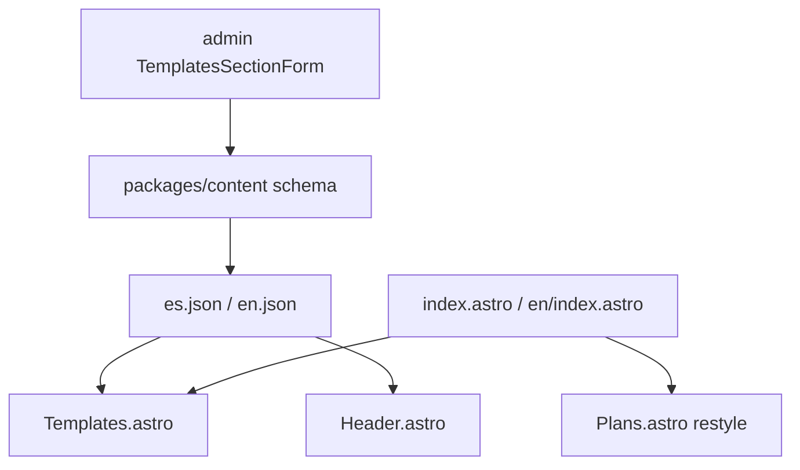

# Plantillas section, header, and Plans CTA

## Source mockups

Design references (project assets from Jul 13):

- Header with **Plantillas** nav + coral underline
- **Plantillas** section: badge, title, subtitle, 3 cards (2 live + dashed “coming soon”), “Ver todas las plantillas”
- Plans CTA: solid coral banner, white pill **Cotiza Ahora** + phone icon (not glass/WhatsApp pill)
- Social icon row already matches Contact — **out of scope**

## Defaults (change before implement if needed)

- **Content:** full pipeline — Zod schema + published ES/EN + admin form (same pattern as ValueProp/Plans)
- **Images:** paths in JSON → files under [`apps/static/public/images/templates/`](apps/static/public/images/templates/); v1 uses crops from the mockup screenshot until final assets are supplied
- **Plans CTA link:** keep WhatsApp (`whatsappHref`); only change visuals/icon
- **“Ver todas”:** content field `viewAllHref`, default `#plantillas` (section is the catalog for now)



## 1. Content schema and published copy

In [`packages/content/src/schema.ts`](packages/content/src/schema.ts):

- Add `nav.templates` (string)
- Add `templates` section:

```ts
templates: {
  sectionBadge, title, subheadline, viewAllLabel, viewAllHref,
  items: [{
    category, title, description,
    imageSrc,           // e.g. /images/templates/empresarial.webp
    href?,              // optional external/demo link
    comingSoon: boolean
  }]
}
```

- Cap `items` (e.g. 2–6); coming-soon card has empty `imageSrc` / no image
- Extend [`validate.ts`](packages/content/src/validate.ts) `arrayPaths` with `['templates', 'items']`
- Extend admin section enum / labels in [`content-store.ts`](packages/content/src/content-store.ts), [`apps/admin/src/ui/editor/types.ts`](apps/admin/src/ui/editor/types.ts), and review labels in [`contentReview.ts`](apps/admin/src/infrastructure/contentReview.ts)

Seed [`apps/static/content/published/es.json`](apps/static/content/published/es.json) and [`en.json`](apps/static/content/published/en.json) from mockup copy:

| Card | ES category / title |
|------|---------------------|
| 1 | SITIO CORPORATIVO / Modelo Empresarial |
| 2 | PANEL DE GESTIÓN / model-3 Dashboard |
| 3 | comingSoon: “Más plantillas próximamente” |

Run `npm run content:build` + `content:validate` after JSON updates.

## 2. Admin editor

- Add [`TemplatesSectionForm.tsx`](apps/admin/src/ui/sections/TemplatesSectionForm.tsx) (mirror ValueProp: section fields + repeatable items)
- Wire into section switcher / autosave like other sections
- Image fields are path strings (no upload in this pass)

## 3. Static site UI

**Header** — [`Header.astro`](apps/static/src/components/Header.astro):

- Insert Plantillas link (`t.nav.templates` → `#plantillas`) between Servicios and Contacto (desktop + mobile)
- Replace cream bottom border with coral accent (`border-terracotta` or `h-0.5 bg-terracotta` bar)

**Templates** — new [`Templates.astro`](apps/static/src/components/Templates.astro):

- `id="plantillas"`, cream/light section background
- Centered badge / title / subtitle
- 3-column grid: image cards for live items; dashed border + “+” for `comingSoon`
- Category in terracotta uppercase; outline “Ver todas” button
- Mount on both homepages **after About, before Plans**

**Plans CTA** — [`Plans.astro`](apps/static/src/components/Plans.astro) + [`.plans-cta*`](apps/static/src/styles/global.css):

- Solid `bg-terracotta` (drop multi-stop gradient / glass panel)
- White pill button, terracotta label text, phone SVG (keep `whatsappHref`)
- Soft coral glow shadow on the button per mockup
- Remove unused `.plans-cta-glass` / gradient CSS vars usage for this block if nothing else needs them

**Assets:**

- Add `public/images/templates/` previews for the two live cards (mockup crops OK for v1)
- Confirm favicon/header mark already uses monogram PNG (no change)

## 4. Footer (light touch)

Add Plantillas to footer nav if footer schema already has a parallel slot; otherwise leave footer as-is to avoid unused nav keys sprawl. Prefer only Header + `#plantillas` unless footer already lists all main anchors.

## 5. Verification

- `npm run content:build && npm run content:validate`
- `npm run build --filter=bonae-static`
- Visual: `/` and `/en/` — header underline, Plantillas grid, solid CTA, no leftover glass/WhatsApp icon on Plans button
- Admin mock: open Templates section, edit a string, confirm draft save shape

## Out of scope

- New `/plantillas` catalog route
- Image upload in admin
- Social icon restyle (already present in Contact)
- Renaming `terracotta` token to `coral`
- Admin app branding
