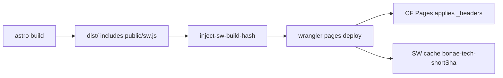

# Fix static site caching (`_headers` + `sw.js`)

## Context

`[apps/static/public/_headers](apps/static/public/_headers)` currently caches `/assets/*`, which never matches Astro’s hashed output under `/_astro/*`. `[apps/static/public/sw.js](apps/static/public/sw.js)` uses a broken cache name (`'bonae tech-v1'`) and cache-first for all GETs (including HTML navigations). CI deploys via `[deploy-site.yml](.github/workflows/deploy-site.yml)` (`turbo build` then `wrangler pages deploy`), not `npm run deploy`.

## 1. Update `[apps/static/public/_headers](apps/static/public/_headers)`

**Keep** the existing security headers on `/`*. **Replace** only the broken `/assets/`* cache rule with the cache policy from the request:

```
/*
  X-Frame-Options: DENY
  X-Content-Type-Options: nosniff
  Referrer-Policy: strict-origin-when-cross-origin
  Permissions-Policy: camera=(), microphone=(), geolocation=()
  Cache-Control: public, max-age=60, must-revalidate

/_astro/*
  Cache-Control: public, max-age=31536000, immutable

/sw.js
  Cache-Control: no-store

/manifest.webmanifest
  Cache-Control: public, max-age=60, must-revalidate
```

Do not drop the security headers — the pasted plan’s cache-only `/*` block would remove them if applied literally.

## 2. Update `[apps/static/public/sw.js](apps/static/public/sw.js)`

- Set `const CACHE_NAME = 'bonae-tech-__BUILD_HASH__';` (fix typo + placeholder).
- Leave `install` / `activate` / `PRECACHE_ASSETS` as-is.
- Replace the `fetch` handler with the network-first navigation + cache-first static assets logic from the request (exact behavior as specified).

## 3. Inject `__BUILD_HASH__` before deploy (portable)

Avoid raw `sed -i` (macOS vs Linux). Add a small Node script, e.g. `[apps/static/scripts/inject-sw-build-hash.mjs](apps/static/scripts/inject-sw-build-hash.mjs)`, that:

1. Resolves `dist/sw.js` relative to `apps/static`
2. Reads `BUILD_HASH` from env, or falls back to `git rev-parse --short HEAD`
3. Replaces `__BUILD_HASH__` and writes the file
4. Fails clearly if `dist/sw.js` is missing or the placeholder is absent

Wire it in both places CI and local actually deploy:

- `[apps/static/package.json](apps/static/package.json)`:  
`"deploy": "node ./scripts/inject-sw-build-hash.mjs && wrangler pages deploy dist --project-name bonae-tech"`
- `[.github/workflows/deploy-site.yml](.github/workflows/deploy-site.yml)`: after the turbo build step, before wrangler:

```yaml
- name: Inject SW build hash
  working-directory: apps/static
  env:
    BUILD_HASH: ${{ github.sha }}
  run: node ./scripts/inject-sw-build-hash.mjs
```

Use the short hash in the script (`BUILD_HASH.slice(0, 7)` when the env value is a full SHA) so the cache name stays readable.

## 4. Ensure this change can ship on merge

`[deploy-site.yml](.github/workflows/deploy-site.yml)` push paths today are only `apps/static/content/published/**` and `packages/content/**`. Add `apps/static/public/**` (and the inject script path if desired) so `_headers` / `sw.js` changes auto-deploy to Pages.

## Flow




## Verification (post-deploy)

In Chrome DevTools → Network:

- `/_astro/*.js` or `/_astro/*.css` → `cache-control: public, max-age=31536000, immutable`
- HTML pages → `cache-control: public, max-age=60, must-revalidate`
- `/sw.js` → `cache-control: no-store`

Locally before deploy: after build + inject script, confirm `dist/sw.js` contains `bonae-tech-<shortSha>` and no leftover `__BUILD_HASH__`.