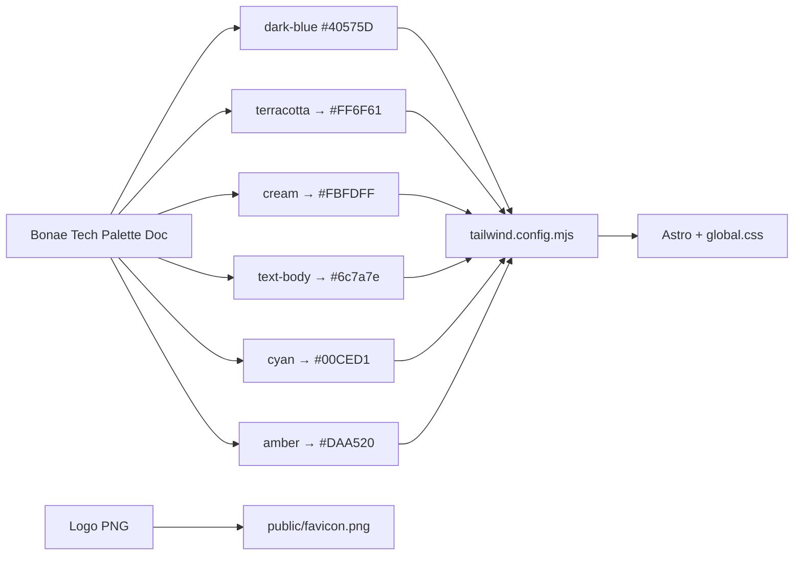

# Update static site palette and favicon

## Current state

Brand colors live only in `[apps/static/tailwind.config.mjs](apps/static/tailwind.config.mjs)`. There are no CSS variables.

| Token                     | Current               | Role                       |
| ------------------------- | ---------------------- | -------------------------- |
| `dark-blue`               | `#40575D`              | Primary surfaces / CTAs    |
| `terracotta`              | `#FF6B35`              | Accent (stats, highlights) |
| `cream`                   | `#d4d4b9`              | Page / section background  |
| `pacificblue`             | `#0b4d5e`              | Body text                  |
| `light-blue` / `mid-blue` | `#6bb0dd` / `#458b9c`  | Borders / secondary        |

Favicon is a placeholder SVG (`public/favicon.svg` — dark square + gold **N**), linked from `[Layout.astro](apps/static/src/layouts/Layout.astro)`, `[manifest.webmanifest](apps/static/public/manifest.webmanifest)`, and `[sw.js](apps/static/public/sw.js)`. Header/Footer use the same **N** mark.

## Palette source of truth — Bonae Tech expanded palette (overrides logo sampling)

The following values come from the approved brand palette document and take precedence over any earlier logo-sampled hexes.

| Role                         | Name (ES)              | Hex        | Maps to token                     |
| ----------------------------- | ----------------------- | ---------- | ---------------------------------- |
| Primary CTA / accent          | Coral                   | `#FF6F61`  | `terracotta`                       |
| Primary surfaces / headings   | Gris Petróleo           | `#40575D`  | `dark-blue` (unchanged)            |
| Body text                     | Antracita Claro         | `#6c7a7e`  | new token `text-body` (was unmapped; previously conflated with `light-blue`) |
| Page background (primary)     | Blanco Hielo            | `#FBFDFF`  | `cream` (renamed role, name kept)  |
| Innovation accent (sparingly) | Cian Eléctrico          | `#00CED1`  | new token `cyan`                   |
| Secondary / success accent    | Ámbar Profundo          | `#DAA520`  | new token `amber`                  |
| Contrast text on dark bg      | Blanco Puro             | `#FFFFFF`  | existing white, no token needed    |

**Changes from the earlier logo-sampled draft:**
- Coral is `#FF6F61` (not `#FD7062`). No separate hover value is specified in the source palette doc — hover treatment should be a darkened/opacity variant of `#FF6F61` (e.g. `#E65A4C`) pending design confirmation, since the palette doc gives one CTA value, not a hover pair.
- Page background is `#FBFDFF` (not `#F2F5F5`).
- Body text gets its own defined value, `#6c7a7e`, rather than being folded into `light-blue`.
- Two new accent tokens are in scope: `cyan` (`#00CED1`) and `amber` (`#DAA520`), used sparingly for tech/data highlights and secondary buttons or success states, respectively.



## 1. Update Tailwind tokens

In `[apps/static/tailwind.config.mjs](apps/static/tailwind.config.mjs)`:

- Keep `dark-blue` / `dark-blue-dark` unchanged
- Retarget `terracotta` → `#FF6F61`, `terracotta-dark` → `#E65A4C` (keep the token name to avoid renaming every class; confirm hover value with design since the palette doc specifies only the base coral)
- Change `cream` → `#FBFDFF` (Blanco Hielo, cool page surface)
- Add `text-body` → `#6c7a7e` (Antracita Claro) for body copy; audit existing usages of `light-blue` that were standing in for body text and repoint them
- Add `cyan` → `#00CED1` (Cian Eléctrico) for sparing use on tech/data highlights
- Add `amber` → `#DAA520` (Ámbar Profundo) for secondary buttons / success or confirmation states
- Soften supporting blues toward the slate family: `pacificblue` → `#2C454C`, `mid-blue` → `#5A7A82`, `light-blue` → `#8AA3AB` (borders/secondary only, no longer doubling as body text)
- Remove unused `brown`
- Update safelist entries that reference terracotta gradients if hex-driven classes stay the same (names unchanged)

Most components update automatically via existing classes (`text-terracotta`, `bg-cream`, etc.). New `cyan` / `amber` / `text-body` classes need to be added wherever the palette doc's usage guidance applies (tech icons/data viz for cyan, secondary CTAs/success messaging for amber, body copy for text-body).

## 2. Align hardcoded brand colors

In `[apps/static/src/styles/global.css](apps/static/src/styles/global.css)`:

- Retarget `.plans-cta` / `.plans-cta-button` gradients from `#ff6f61…` — note: this was already the palette doc's coral value, so the gradient's *base* color is correct; only the lighter gradient stops need re-checking against `#FF6F61` for consistency
- Leave WhatsApp / social brand greens and blues untouched

In `[Layout.astro](apps/static/src/layouts/Layout.astro)` + `[manifest.webmanifest](apps/static/public/manifest.webmanifest)`:

- `theme-color` / `theme_color` → `#40575D`
- `background_color` → `#FBFDFF`

## 3. Replace favicon with the logo PNG

Source: the attached logo PNG (1024×1024). Unaffected by the palette override.

- Copy to `[apps/static/public/favicon.png](apps/static/public/favicon.png)`
- Update head link in `Layout.astro` to `type="image/png"` href `/favicon.png` (add `apple-touch-icon` pointing at the same file)
- Point `manifest.webmanifest` icons at `/favicon.png` (`sizes: "1024x1024"`, `type: image/png`)
- Update `sw.js` precache from `/favicon.svg` → `/favicon.png`
- Delete obsolete `public/favicon.svg`

## 4. Swap Header/Footer placeholder mark

Replace the CSS **N** boxes in `[Header.astro](apps/static/src/components/Header.astro)` and `[Footer.astro](apps/static/src/components/Footer.astro)` with:

```html

```

(alongside existing "BONAE TECH" wordmark). Scope stays `apps/static` only — admin's `bonae-logo.png` is left alone.

## Out of scope

- Fonts (keep Inter as established)
- Layout/structure redesign
- Admin app theming or logo
- Renaming Tailwind token keys (`terracotta` → `coral`) — hex change only to minimize churn
- Hover-state hex for coral is a placeholder pending design sign-off; not a blocker for the base rollout

## Verification

- Visual check of home + `/en/` (hero accents, KeyFigures, Plans CTA, background, body text, header mark, browser tab icon)
- Confirm cyan and amber render correctly wherever newly applied
- Confirm no remaining references to `favicon.svg`
- Confirm no remaining references to the old `#FD7062`/`#F2F5F5` logo-sampled values