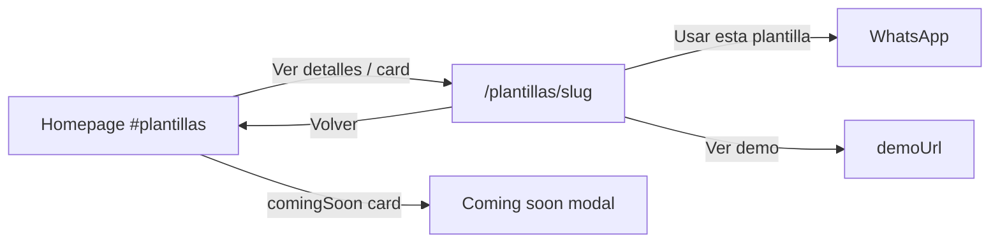

# Plantillas catalog + detail pages

## Source of truth

Draft: [`bonae-tech-docs/drafts/Website Template Selection Flow.html`](/Users/marialucena/code/Bonae-Tech-Org/bonae-tech-docs/drafts/Website%20Template%20Selection%20Flow.html) (unpacked logic: SPA toggle between catalog / detail / coming-soon modal). Screenshots show the same catalog cards + Modelo Empresarial detail layout.

## Defaults (locked for this plan)

- **No standalone catalog route** — keep homepage `#plantillas`; add detail routes only
- **Detail chrome** uses existing site [`Layout.astro`](apps/static/src/layouts/Layout.astro) + [`Header.astro`](apps/static/src/components/Header.astro) (not the draft’s “tu pagina” bar)
- **“Usar esta plantilla”** → WhatsApp via `buildWhatsAppHref`, message includes template title
- **“Ver demo en vivo”** → `demoUrl` from content; omit button when empty
- **Back** → `/{lang}/#plantillas` (ES `/#plantillas`, EN `/en/#plantillas`)

## Gap vs current site

| Draft | Current |
|-------|---------|
| Card click + “Ver detalles →” | Cards are static; no link |
| Detail view (preview + features + CTAs) | Missing |
| Desktop / Móvil preview toggle | Missing |
| Coming-soon modal | Card only |
| Rich detail copy + feature bullets | Only short `description` |

## 1. Extend content schema

In [`packages/content/src/schema.ts`](packages/content/src/schema.ts), extend `templates`:

**Section-level UI strings** (ES/EN):

- `viewDetailsLabel` — “Ver detalles →”
- `backLabel` — “← Volver a plantillas”
- `desktopTabLabel` / `mobileTabLabel`
- `useTemplateLabel` — “Usar esta plantilla”
- `demoLabel` — “Ver demo en vivo”
- `comingSoonModalBody` / `comingSoonModalDismiss` (modal copy)

**Per item** (replace thin `href` usage):

- `slug` — required when `comingSoon === false` (Zod refine); empty for coming-soon
- `detailDescription` — longer detail body
- `features` — `z.array(z.string().min(1)).max(8)` (empty array OK for coming-soon)
- `demoUrl` — string (may be empty)
- `mobileImageSrc` — string (may be empty; falls back to `imageSrc` in phone frame)
- Keep `imageSrc` as desktop / card preview
- Keep `href` unused or remove in the same change (prefer **remove** to avoid two link fields)

Parity: add `['templates', 'items', 'features']` length checks per item index in [`validate.ts`](packages/content/src/validate.ts) (same pattern as `about.members[].highlights`).

Seed ES/EN published JSON from draft copy (`empresarial`, `model-3-dashboard` slugs + 4 features each).

## 2. Homepage section UI

Update [`Templates.astro`](apps/static/src/components/Templates.astro):

- Live cards: whole card (or image + “Ver detalles”) links to detail URL
  - ES: `/plantillas/${slug}`
  - EN: `/en/templates/${slug}`
- Add terracotta “Ver detalles →” row
- Hover lift matching draft
- Coming-soon card opens modal (small client script or `<dialog>`); dismiss via “Entendido” / backdrop
- Drop reliance on empty `href`

## 3. Detail pages (Astro)

Add:

- [`apps/static/src/pages/plantillas/[slug].astro`](apps/static/src/pages/plantillas/[slug].astro)
- [`apps/static/src/pages/en/templates/[slug].astro`](apps/static/src/pages/en/templates/[slug].astro)

Shared presentation component e.g. [`TemplateDetail.astro`](apps/static/src/components/TemplateDetail.astro):

- Back link
- Left: Escritorio / Móvil segmented control + preview image(s) (`imageSrc` / `mobileImageSrc`)
- Right: category, title, `detailDescription`, feature checklist, primary WhatsApp CTA, optional demo button
- `getStaticPaths` from published locale items where `!comingSoon && slug`
- 404 for unknown slug
- Meta title/description from template title + detailDescription

WhatsApp helper: extend [`content.ts`](apps/static/src/lib/content.ts) with e.g. `whatsappHrefForTemplate(t, templateTitle)` appending template name to `contact.whatsappMessage` (or a short dedicated suffix).

## 4. Admin

Update [`TemplatesSectionForm.tsx`](apps/admin/src/ui/sections/TemplatesSectionForm.tsx) + validation/review for new fields (slug, detail description, features list, demo URL, mobile image). Mirror ValueProp item expand pattern for features.

## 5. Assets

Reuse existing card images for desktop preview. Add mobile crops under `public/images/templates/` when available; until then `mobileImageSrc` can equal desktop or stay empty (phone frame + `imageSrc` fallback).

## 6. Verification

- `npm run content:build && npm run content:validate`
- `npm run build --filter=bonae-static`
- Manual: `/#plantillas` → detail → back; EN paths; coming-soon modal; WhatsApp CTA; demo button hidden when `demoUrl` empty

## Out of scope

- Separate `/plantillas` catalog page with “tu pagina” branding
- Live iframe demos of real template sites
- Image upload in admin
