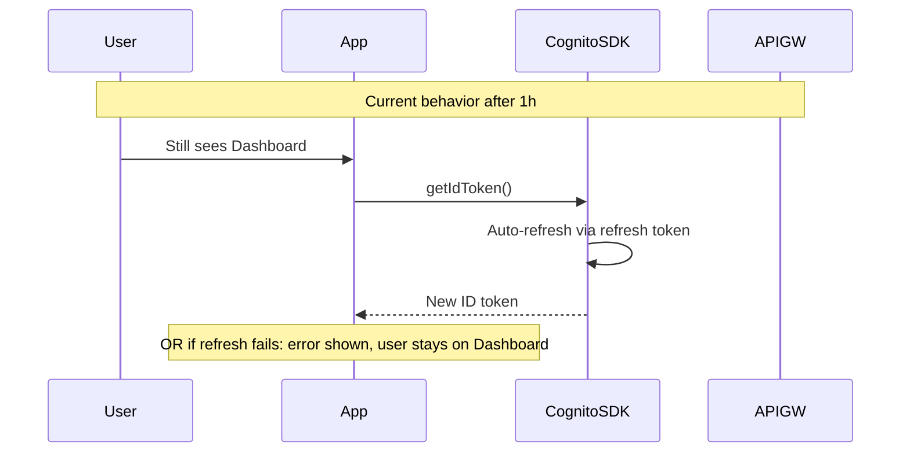
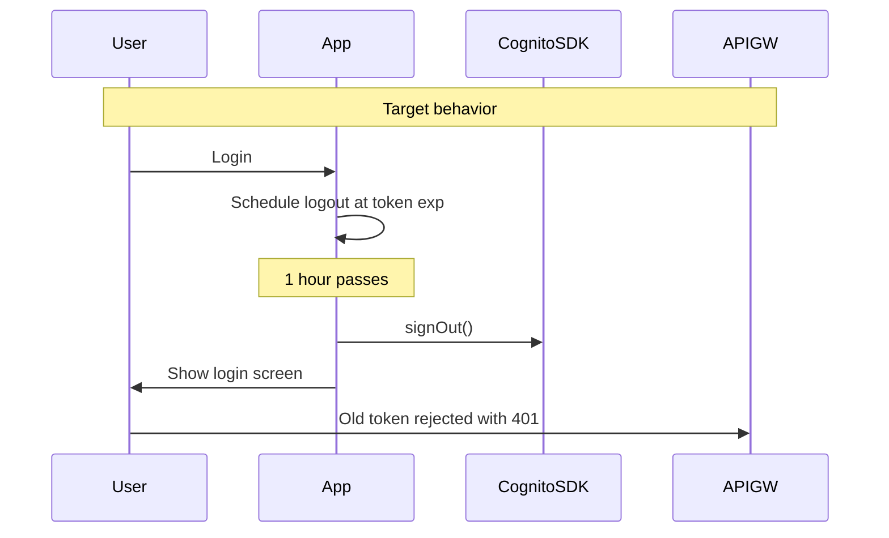

# Token expiration and forced logout

## Current state

Your admin SPA already sits on a secure baseline:

| Layer | Behavior today |
|-------|----------------|
| **Cognito** | Issues ID tokens with AWS default ~1h expiry; refresh tokens enabled via `ALLOW_REFRESH_TOKEN_AUTH` in [`infra/terraform/cognito.tf`](infra/terraform/cognito.tf) |
| **API Gateway** | JWT authorizer rejects expired/invalid tokens with **401** before Lambda runs |
| **Client `getIdToken()`** | Checks `session.isValid()` in [`apps/admin/src/infrastructure/auth.cognito.ts`](apps/admin/src/infrastructure/auth.cognito.ts) |
| **Client UI** | Sets `authenticated` **once on mount** in [`apps/admin/src/App.tsx`](apps/admin/src/App.tsx) — no re-check while dashboard is open |

**The security gap:** when the ID token expires, the user still sees the dashboard. API calls fail with a generic error; there is no redirect to login. Worse, the Cognito SDK's `getSession()` **silently refreshes** expired tokens when a refresh token exists — so hard 1-hour re-login is **not enforced today** even though tokens expire server-side.



## Recommended practice (for your choice: hard ID-token expiry)

For a small invite-only admin panel, **hard ID-token expiry with forced re-login** is a valid, conservative model:

1. **Short-lived ID tokens** (1 hour is standard) — limits window if a token is stolen from browser storage.
2. **No silent refresh** — disable refresh-token auth on the Cognito app client so the SDK cannot extend the session beyond the ID token lifetime.
3. **Proactive client logout** — decode the token `exp`, schedule logout before/at expiry, and re-check on tab focus.
4. **Reactive logout on auth failures** — any 401 from API Gateway or `getIdToken()` failure clears session and returns to login.
5. **Explicit infra config** — set `id_token_validity` in Terraform so expiry is documented and reproducible (not relying on AWS defaults).

What you do **not** need for this model:

- Idle-timeout timers (unless you add them later)
- Refresh-on-401 retry logic (you already have refresh only on a specific 403 for stale group claims — remove it)
- Backend/Lambda changes (API Gateway already enforces expiry)

**Trade-off to accept:** editors must re-enter credentials every hour. That is intentional for your security model.

## Implementation plan

### 1. Infra — lock in 1-hour tokens, disable refresh (~30 min)

Update [`infra/terraform/cognito.tf`](infra/terraform/cognito.tf):

```hcl
resource "aws_cognito_user_pool_client" "spa" {
  # ...
  explicit_auth_flows = [
    "ALLOW_USER_SRP_AUTH",
    # Remove ALLOW_REFRESH_TOKEN_AUTH
  ]

  token_validity_units {
    id_token = "hours"
  }
  id_token_validity = 1
}
```

After `terraform apply`, existing refresh tokens in users' browsers become unusable for new sessions; users re-login once.

### 2. Auth module — expiry helpers and no refresh (~1–2 hours)

In [`apps/admin/src/infrastructure/auth.cognito.ts`](apps/admin/src/infrastructure/auth.cognito.ts):

- Add `getSessionExpiresAt(): Promise<number | null>` using `session.getIdToken().getExpiration()` (SDK returns Unix seconds).
- Add `isSessionExpired(session)` guard used before returning tokens.
- On expired session: call `signOut()` and throw a typed error (e.g. `SessionExpiredError`).
- **Remove or stop exporting `refreshSession`** — it conflicts with hard expiry.

In [`apps/admin/src/infrastructure/auth.ts`](apps/admin/src/infrastructure/auth.ts): expose `getSessionExpiresAt` and a shared `onSessionExpired` registration (simple callback or tiny event emitter).

Mock mode ([`apps/admin/src/infrastructure/auth.mock.ts`](apps/admin/src/infrastructure/auth.mock.ts)): optionally simulate expiry in dev (e.g. 1h from login timestamp in `sessionStorage`) so behavior is testable locally — low priority.

### 3. Session monitor in App (~1 hour)

In [`apps/admin/src/App.tsx`](apps/admin/src/App.tsx):

- Extract `handleLogout()` (signOut + `setAuthenticated(false)` + clear expiry timer).
- After login success and on mount (if session valid), call `scheduleLogoutAt(expiresAt)`:
  - `setTimeout` fires `handleLogout()` at token expiry (with small buffer, e.g. 30s before `exp`).
  - `visibilitychange` / `focus` listener re-checks expiry when user returns to tab (covers sleeping laptop past expiry).
- On mount: if session exists but is expired → logout immediately.



### 4. API layer — logout on auth errors (~30 min)

In [`apps/admin/src/infrastructure/contentApi.ts`](apps/admin/src/infrastructure/contentApi.ts):

- Remove the `403 → refreshSession → retry` block (refresh is disabled; stale group claims resolve on next login within 1h).
- On **401** or `SessionExpiredError` / `'Not authenticated'` from `getIdToken()`: invoke the shared `onSessionExpired` callback before throwing.
- Optionally introduce a small `AuthError` class so Dashboard can show "Session expired — please sign in again" instead of a generic failure.

No changes needed in [`services/content-api/src/handler.ts`](services/content-api/src/handler.ts) or [`infra/terraform/api_gateway.tf`](infra/terraform/api_gateway.tf).

### 5. Verify (~30 min)

- **Mock mode:** login → confirm dashboard loads; manually shorten expiry in mock auth → confirm auto-logout.
- **Real Cognito (or staging):** login → wait or temporarily set `id_token_validity = 0.0167` (1 min) in a dev pool → confirm logout at expiry and 401 on stale API calls.
- Confirm `terraform plan` shows only Cognito client changes.

## Effort estimate

| Task | Time |
|------|------|
| Terraform token config + disable refresh | ~30 min |
| Auth expiry helpers, remove refresh | ~1–2 h |
| App session timer + focus re-check | ~1 h |
| contentApi 401 handling + remove 403 refresh | ~30 min |
| Manual testing | ~30 min |
| **Total** | **~3–5 hours** (half day) |

This is a **small, localized change** — roughly 4 files, ~80–120 lines net. No new dependencies, no backend work, no admin UI redesign.

## Out of scope (unless you ask later)

- **Idle timeout** (logout after 30 min inactivity regardless of token) — separate feature, +2–3 h
- **Silent refresh** (stay logged in up to 30 days) — opposite of your choice
- **Refresh token rotation / shorter refresh lifetime** — not applicable once refresh is disabled
- **Moving tokens out of localStorage** — Cognito SDK default; mitigated by short token lifetime and HTTPS-only admin host
