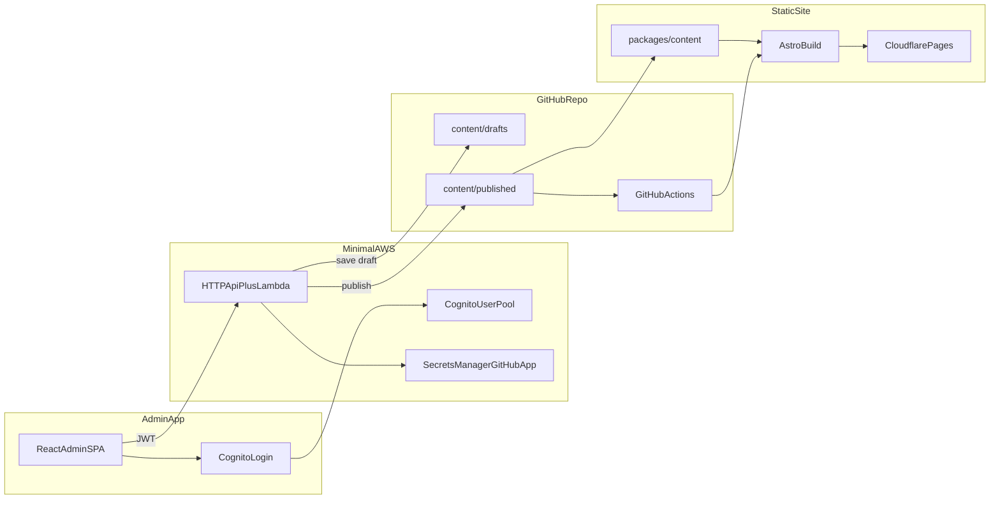

# Sitio Web de Servicios Digitales BONAE TECH

Este es el sitio web estático de BONAE TECH Digital Services, construido con Astro y Tailwind CSS en [`apps/static`](apps/static/). Desplegado en Cloudflare Pages.

## Principios de Diseño

- **Mobile-first**: La mayoría del tráfico latinoamericano es móvil. Los layouts y componentes están diseñados primero para pantallas pequeñas y luego mejorados para escritorio.
- **Optimizado para bajo ancho de banda**: Optimizado para conexiones 3G/4G. Recursos externos mínimos, estilos críticos en línea y soporte PWA para uso sin conexión.
- **Accesibilidad (WCAG 2.1 AA)**: HTML semántico, etiquetas ARIA, estados de foco y contraste de color suficiente. Los formularios y elementos interactivos son navegables con teclado.
- **Bilingüe por defecto**: Español (principal) e inglés con cambio de idioma claro y `hreflang` correcto para SEO.
- **Cercano y profesional**: El tono es accesible y empoderador—la digitalización está al alcance. Evitar jerga innecesaria; explicar términos técnicos cuando se usen.
- **Señales de confianza**: Propuestas de valor claras, perfiles de fundadores, opciones de contacto y CTAs visibles (WhatsApp, formulario de contacto) para reducir la fricción.

## Arquitectura

El repositorio es una **plataforma de contenido respaldada por git**: el sitio de marketing lee JSON publicado, los editores usan una app React de administración, y un stack mínimo de AWS gestiona la autenticación y los commits a GitHub.



| Componente | Ruta | Rol |
|-------|------|------|
| Sitio de marketing | `apps/static/` | Sitio Astro; solo lee `content/published/` |
| Esquema de contenido | `packages/content/` | Validación Zod compartida para el sitio, admin y API |
| Admin UI | `apps/admin/` | Editor React (login Cognito, formularios de sección) |
| Content API | `services/content-api/` | Stack Terraform: autenticación JWT + proxy git con GitHub App |
| Guía del editor | `docs/content-admin.md` | Configuración de AWS y flujo de publicación |

### Stack Tecnológico

| Capa | Tecnología |
|-------|------------|
| Generador estático | Astro 4.x |
| Estilos | Tailwind CSS |
| Contenido | JSON en git (`drafts/` + `published/`) |
| Validación | Zod (`@bonae/content`) |
| Admin UI | React + Vite + Cognito |
| Content API | Terraform (Cognito, HTTP API, Lambda) |
| Hosting | Cloudflare Pages |
| Salida | HTML estático (sin enrutamiento del lado del cliente) |

### Estructura de Páginas

- **Español**: `/` (índice)
- **Inglés**: `/en/`
- Layout de una sola página por idioma: todas las secciones (Hero, Propuesta de Valor, Servicios, Nosotros, Portafolio, Planes, Contacto) se renderizan en la página principal con navegación por anclas.

### i18n

- Archivos de contenido: `apps/static/content/published/es.json` y `en.json` (+ `settings.json`)
- El esquema compartido en `packages/content` mantiene ambas localidades sincronizadas estructuralmente
- Cada página carga el contenido publicado y lo pasa como `t` al Layout y los componentes
- Sin librería i18n en tiempo de ejecución; el contenido se valida y compila en tiempo de construcción

### Jerarquía de Componentes

```
Layout.astro (HTML shell, meta, PWA, WhatsApp float, Cookie banner)
├── Header.astro (nav, language switch, CTA)
├── <main>
│   ├── Hero.astro
│   ├── ValueProp.astro
│   ├── ServicesSummary.astro
│   ├── KeyFigures.astro
│   ├── About.astro
│   ├── Services.astro
│   ├── Portfolio.astro
│   ├── Testimonials.astro
│   ├── Plans.astro
│   ├── BlogPreview.astro
│   └── Contact.astro
└── Footer.astro (4-column: brand, nav, services, contact)
```

### Flujo de Datos

- El contenido del sitio vive en `apps/static/content/published/` (`es.json`, `en.json`, `settings.json`).
- Validado en tiempo de construcción mediante `@bonae/content` (`packages/content`).
- Edición de borradores y flujo de publicación: ver [docs/content-admin.md](docs/content-admin.md).
- Los componentes reciben `t: Translations` como prop y renderizan texto desde `t.*`.

### PWA y Rendimiento

- `manifest.webmanifest` y `sw.js` para instalabilidad y soporte sin conexión
- `compressHTML: true` e `inlineStylesheets: 'auto'` en la config de Astro
- Objetivo: Lighthouse performance > 90, tiempo de carga < 3s en 3G

---

## Inicio Rápido

### Requisitos Previos

- Node.js 20+
- npm

### 1. Instalar y ejecutar el sitio de marketing

```bash
npm ci --prefix packages/content && npm run content:build
npm ci --prefix apps/static
npm run dev
```

Abrir `http://localhost:4321`. El sitio solo lee **`apps/static/content/published/`**.

### 2. Validar contenido

```bash
npm run content:validate
```

### 3. Construir para producción

```bash
npm run build
npm run preview
```

Salida: `apps/static/dist/`

### 4. Ejecutar el admin de contenido (opcional)

**Modo mock local (sin AWS)** — probar el editor primero:

```bash
npm run admin:dev:mock
```

Abrir `http://localhost:5173`. Cualquier email/contraseña funciona. Los guardados se escriben en `apps/static/content/` en disco.

**Con AWS** — requiere una Content API desplegada y usuarios Cognito en el grupo `Administrators`:

```bash
cp apps/admin/.env.example apps/admin/.env
# Fill in VITE_API_BASE_URL, VITE_COGNITO_USER_POOL_ID, VITE_COGNITO_CLIENT_ID

npm ci --prefix apps/admin
npm run admin:dev
```

Ver [docs/content-admin.md](docs/content-admin.md) para la configuración de AWS y GitHub App.

### 5. Desplegar la Content API (opcional)

La infraestructura es gestionada por Terraform y se despliega automáticamente mediante GitHub Actions al hacer push a `main`. Ver [`services/content-api/README.md`](services/content-api/README.md) para los pasos de bootstrap inicial.

### Scripts raíz

| Comando | Descripción |
|---------|-------------|
| `npm run dev` | Servidor de desarrollo Astro |
| `npm run build` | Construir el sitio de marketing |
| `npm run preview` | Vista previa del build de producción |
| `npm run content:validate` | Validar JSON publicado |
| `npm run admin:dev` | Servidor de desarrollo del admin de contenido |
| `npm run admin:dev:mock` | Admin en modo mock local (sin AWS) |
| `npm run admin:build` | Construir la SPA de admin |
| `npm run api:build` | Empaquetar Lambda de la Content API |

---

## Configuración de Desarrollo

### Instalación

1. Clonar el repositorio:
   ```bash
   git clone <repository-url>
   cd bonae
   ```

2. Inicializar el paquete de contenido y la app estática:
   ```bash
   npm ci --prefix packages/content && npm run content:build
   npm ci --prefix apps/static
   ```

   Los scripts raíz (`npm run dev`, `npm run build`, etc.) delegan a las apps de abajo.

### Desarrollo

```bash
npm run dev
```

Inicia el servidor de desarrollo Astro en `http://localhost:4321` (ejecuta la validación de contenido primero).

### Construcción para Producción

```bash
npm run build
```

Archivos construidos: `apps/static/dist/`

### Vista Previa del Build de Producción

```bash
npm run preview
```

## Estructura del Proyecto

- `apps/static/` - Sitio de marketing (Astro): lee JSON de `content/published/`
- `apps/admin/` - SPA de admin de contenido en React (Cognito + content API)
- `packages/content/` - Esquema Zod compartido y validadores
- `services/content-api/` - Stack Terraform (Cognito, HTTP API, Lambda proxy de GitHub)
- `docs/content-admin.md` - Guía de configuración del editor y AWS

## Tecnologías Utilizadas

- [Astro](https://astro.build/) - Generador de sitios estáticos
- [Tailwind CSS](https://tailwindcss.com/) - Framework CSS de utilidades
- TypeScript - JavaScript con tipado seguro

## Licencia

Apache-2.0

---

## Referencia Rápida de Despliegue

| Elemento | Propósito |
|------|---------|
| GitHub `CLOUDFLARE_API_TOKEN` | Desplegar `apps/static/dist/` en Cloudflare Pages |

Despliega el sitio de **marketing** desde `apps/static` o usa GitHub Actions. El despliegue de marketing en GitHub Actions corre desde `apps/static` y usa [`wrangler pages deploy dist --project-name bonae-tech`](.github/workflows/deploy-site.yml).

**Si los builds siguen fallando,** verifica la línea del log que muestra `HEAD is now at <commit>` — debe coincidir con el commit en GitHub que contiene los últimos cambios (hacer push a `main` / tu rama de producción y redesplegar).

**No** configures el comando de despliegue de Cloudflare Pages como `npx wrangler deploy`: eso apunta a **Workers**, no a sitios estáticos, y fallará con “Missing entry-point to Worker script”. La GitHub Action del sitio de marketing usa `wrangler pages deploy` para subir la carpeta `dist` construida a Pages.

# Recomendaciones de Hosting

## Mejor Hosting para Venezuela + Disponibilidad Internacional

### 1. Cloudflare Pages (recomendado ampliamente)

Cloudflare es la mejor opción específicamente para Venezuela porque su CDN Anycast tiene más de 300 Puntos de Presencia globales, y los usuarios venezolanos son enrutados a través de nodos cercanos en Colombia, Brasil y el Caribe. Ninguna otra plataforma gratuita iguala esta cobertura latinoamericana.

El plan gratuito incluye: ancho de banda ilimitado, sitios ilimitados, 500 builds/mes, SSL y protección DDoS.

#### Alternativas ordenadas por ranking

| Servicio	| Cobertura CDN LatAm	| Plan Gratuito |
|-----------|-----------------------|-----------|
| Cloudflare Pages ⭐	| Mejor (Anycast, 300+ PoP)	| BW ilimitado |
| Vercel	| Bueno (región São Paulo)	| 100GB BW/mes |
| Netlify	| Bueno	| 100GB BW/mes |
| AWS S3 + CloudFront	| Bueno (São Paulo, Buenos Aires)	| Prueba gratuita 12 meses |


### Desplegar en Cloudflare Pages (3 pasos)

Tu sitio Astro vive en `apps/static`, construye en `apps/static/dist/`, y no requiere cambios en la config de Astro para el hosting:

1. Hacer push a GitHub (si aún no está allí)

2. Conectar en cloudflare.com → Workers & Pages → Create → Pages → Connect to Git

3. Configuración del build:
- **Directorio raíz:** `apps/static`
- **Comando de build:** `npm ci --prefix ../../packages/content && npm run build --prefix ../../packages/content && npm ci && npm run build`
- **Directorio de salida:** `dist`
- Variable de entorno de versión de Node: `NODE_VERSION=20`

Cada push a main se despliega automáticamente. Obtienes una URL gratuita *.pages.dev de inmediato, y puedes agregar un dominio personalizado después.

## Estilos

### Fuentes

```
# one
font-family: 'Inter', 'Segoe UI', Roboto, Helvetica, Arial, sans-serif;
# two
font-family: 'Poppins', 'Segoe UI', Roboto, Helvetica, Arial, sans-serif;
```

### Paleta de Colores

* terracota: #FF6B35
* brown: #9C8172
* mid-blue: #3996AE
* light-blue: #48A8C1
* dar-blue: #44808F
* pacificblue: #40575D
* cream: #F4F4ED

BDD0D5,3C707D,3C6F7B,DEEAED,518490
#### tailwind
Favorite: 40575D

{
  "dark-slate-grey": {
    "50": "#f0f4f5",
    "100": "#e1e8ea",
    "200": "#c3d2d5",
    "300": "#a5bbc0",
    "400": "#87a4ab",
    "500": "#698d96",
    "600": "#547178",
    "700": "#3f555a",
    "800": "#2a393c",
    "900": "#151c1e",
    "950": "#0f1415"
  }
}


🧩 Combinaciones Recomendadas
Para mantenerlo simple y moderno:

**Opción A** — Limpio y Amigable
Títulos: Poppins SemiBold
Cuerpo: Inter Regular
Etiquetas UI: Inter Medium

**Opción B** — Elegante y Profesional
- Títulos: Montserrat SemiBold
- Cuerpo: Inter Regular
- Botones: Inter Medium

**Opción C** — Ultra Ligero (Menor Ancho de Banda)
- Títulos: Segoe UI Bold
- Cuerpo: Segoe UI Regular
- Sin descargas de fuentes externas