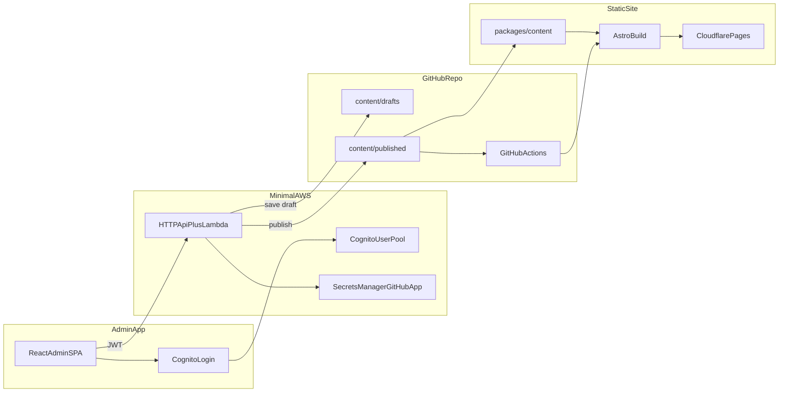

# BONAE TECH Digital Services Website

This is the static website for BONAE TECH Digital Services, built with Astro and Tailwind CSS in [`apps/static`](apps/static/). Deployed on Cloudflare Pages.

## Design Principles

- **Mobile-first**: The majority of Latin American traffic is mobile. Layouts and components are designed for small screens first, then enhanced for desktop.
- **Low-bandwidth friendly**: Optimized for 3G/4G connections. Minimal external assets, inline critical styles, and PWA support for offline use.
- **Accessibility (WCAG 2.1 AA)**: Semantic HTML, ARIA labels, focus states, and sufficient color contrast. Forms and interactive elements are keyboard-navigable.
- **Bilingual by default**: Spanish (primary) and English with clear language switching and proper `hreflang` for SEO.
- **Cercano y profesional**: Tone is approachable and empowering—digitalization is within reach. Avoid unnecessary jargon; explain technical terms when used.
- **Trust signals**: Clear value propositions, founder profiles, contact options, and visible CTAs (WhatsApp, contact form) to reduce friction.

## Architecture

The repo is a **git-backed content platform**: the marketing site reads published JSON, editors use a React admin app, and a minimal AWS stack handles auth plus GitHub commits.



| Piece | Path | Role |
|-------|------|------|
| Marketing site | `apps/static/` | Astro site; reads `content/published/` only |
| Content schema | `packages/content/` | Shared Zod validation for site, admin, and API |
| Admin UI | `apps/admin/` | React editor (Cognito login, section forms) |
| Content API | `services/content-api/` | SAM stack: JWT auth + GitHub App git proxy |
| Editor guide | `docs/content-admin.md` | AWS setup and publish workflow |

### Tech Stack

| Layer | Technology |
|-------|------------|
| Static generator | Astro 4.x |
| Styling | Tailwind CSS |
| Content | JSON in git (`drafts/` + `published/`) |
| Validation | Zod (`@bonae/content`) |
| Admin UI | React + Vite + Cognito |
| Content API | AWS SAM (Cognito, HTTP API, Lambda) |
| Hosting | Cloudflare Pages |
| Output | Static HTML (no client-side routing) |

### Page Structure

- **Spanish**: `/` (index)
- **English**: `/en/`
- Single-page layout per language: all sections (Hero, Value Prop, Services, About, Portfolio, Plans, Contact) are rendered on the homepage with anchor navigation.

### i18n

- Content files: `apps/static/content/published/es.json` and `en.json` (+ `settings.json`)
- Shared schema in `packages/content` keeps both locales structurally in sync
- Each page loads published content and passes it as `t` to Layout and components
- No runtime i18n library; content is validated and compiled at build time

### Component Hierarchy

```
Layout.astro (HTML shell, meta, PWA, WhatsApp float, Cookie banner)
├── Header.astro (nav, language switch, CTA)
├── <main>
│   ├── Hero.astro
│   ├── ValueProp.astro
│   ├── ServicesSummary.astro
│   ├── KeyFigures.astro
│   ├── About.astro
│   ├── Services.astro
│   ├── Portfolio.astro
│   ├── Testimonials.astro
│   ├── Plans.astro
│   ├── BlogPreview.astro
│   └── Contact.astro
└── Footer.astro (4-column: brand, nav, services, contact)
```

### Data Flow

- Site copy lives in `apps/static/content/published/` (`es.json`, `en.json`, `settings.json`).
- Validated at build time via `@bonae/content` (`packages/content`).
- Draft edits and publish workflow: see [docs/content-admin.md](docs/content-admin.md).
- Components receive `t: Translations` as a prop and render text from `t.*`.

### PWA & Performance

- `manifest.webmanifest` and `sw.js` for installability and offline support
- `compressHTML: true` and `inlineStylesheets: 'auto'` in Astro config
- Target: Lighthouse performance > 90, load time < 3s on 3G

---

## Quick Start

### Prerequisites

- Node.js 20+
- npm

### 1. Install and run the marketing site

```bash
npm ci --prefix packages/content && npm run content:build
npm ci --prefix apps/static
npm run dev
```

Open `http://localhost:4321`. The site reads **`apps/static/content/published/`** only.

### 2. Validate content

```bash
npm run content:validate
```

### 3. Build for production

```bash
npm run build
npm run preview
```

Output: `apps/static/dist/`

### 4. Run the content admin (optional)

**Local mock mode (no AWS)** — try the editor first:

```bash
npm run admin:dev:mock
```

Open `http://localhost:5173`. Any email/password works. Saves write to `apps/static/content/` on disk.

**With AWS** — requires a deployed content API and Cognito users in the `Administrators` group:

```bash
cp apps/admin/.env.example apps/admin/.env
# Fill in VITE_API_BASE_URL, VITE_COGNITO_USER_POOL_ID, VITE_COGNITO_CLIENT_ID

npm ci --prefix apps/admin
npm run admin:dev
```

See [docs/content-admin.md](docs/content-admin.md) for AWS and GitHub App setup.

### 5. Deploy the content API (optional)

```bash
npm run api:build
cd services/content-api
sam build && sam deploy --guided
```

### Root scripts

| Command | Description |
|---------|-------------|
| `npm run dev` | Astro dev server |
| `npm run build` | Build marketing site |
| `npm run preview` | Preview production build |
| `npm run content:validate` | Validate published JSON |
| `npm run admin:dev` | Content admin dev server |
| `npm run admin:dev:mock` | Admin in local mock mode (no AWS) |
| `npm run admin:build` | Build admin SPA |
| `npm run api:build` | Bundle content API Lambda |

---

## Development Setup

### Installation

1. Clone the repository:
   ```bash
   git clone <repository-url>
   cd bonae
   ```

2. Bootstrap the content package and static app:
   ```bash
   npm ci --prefix packages/content && npm run content:build
   npm ci --prefix apps/static
   ```

   Root scripts (`npm run dev`, `npm run build`, etc.) delegate to the apps below.

### Development

```bash
npm run dev
```

Starts the Astro dev server at `http://localhost:4321` (runs content validation first).

### Building for Production

```bash
npm run build
```

Built files: `apps/static/dist/`

### Preview Production Build

```bash
npm run preview
```

## Project Structure

- `apps/static/` - Marketing site (Astro): reads `content/published/` JSON
- `apps/admin/` - React content admin SPA (Cognito + content API)
- `packages/content/` - Shared Zod schema and validators
- `services/content-api/` - SAM stack (Cognito, HTTP API, Lambda GitHub proxy)
- `docs/content-admin.md` - Editor and AWS setup guide

## Technologies Used

- [Astro](https://astro.build/) - Static site generator
- [Tailwind CSS](https://tailwindcss.com/) - Utility-first CSS framework
- TypeScript - Type-safe JavaScript

## License

Apache-2.0

---

## Deploy Quick Reference

| Item | Purpose |
|------|---------|
| GitHub `CLOUDFLARE_API_TOKEN` | Deploy `apps/static/dist/` to Cloudflare Pages |

Deploy the **marketing** site from `apps/static` or rely on GitHub Actions. The marketing deploy in GitHub Actions runs from `apps/static` and uses [`wrangler pages deploy dist --project-name bonae-tech`](.github/workflows/deploy-site.yml).

**If builds still fail,** check the log line that shows `HEAD is now at <commit>` — it must match the commit on GitHub that contains your latest changes (push `main` / your production branch and redeploy).

Do **not** set a Cloudflare Pages deploy command to `npx wrangler deploy`: that targets **Workers**, not static sites, and will fail with “Missing entry-point to Worker script”. The marketing site’s GitHub Action uses `wrangler pages deploy` to push the built `dist` folder to Pages.

# Hosting Recommendations

## Best Hosting for Venezuela + International Availability

### 1 Cloudflare Pages (strongly recommended)

Cloudflare is the best choice specifically for Venezuela because their Anycast CDN has 300+ global Points of Presence, and Venezuelan users get routed through nearby nodes in Colombia, Brazil, and the Caribbean. No other free platform matches this Latin American coverage.

Free tier includes: unlimited bandwidth, unlimited sites, 500 builds/month, SSL, DDoS protection.

#### Ranked alternatives

| Service	| LatAm CDN Coverage	| Free Tier |
|-----------|-----------------------|-----------|
| Cloudflare Pages ⭐	| Best (Anycast, 300+ PoP)	| Unlimited BW |
| Vercel	| Good (São Paulo region)	| 100GB BW/mo |
| Netlify	| Good	| 100GB BW/mo |
| AWS S3 + CloudFront	| Good (São Paulo, Buenos Aires)	| 12mo free trial |


### Deploying to Cloudflare Pages (3 steps)

Your Astro site lives under `apps/static`, builds to `apps/static/dist/`, and requires no Astro config changes for hosting:

1. Push to GitHub (if not already there)

2. Connect at cloudflare.com → Workers & Pages → Create → Pages → Connect to Git

3. Build settings:
- **Root directory:** `apps/static`
- **Build command:** `npm ci --prefix ../../packages/content && npm run build --prefix ../../packages/content && npm ci && npm run build`
- **Output directory:** `dist`
- Node version env var: `NODE_VERSION=20`

Every push to main auto-deploys. You get a free *.pages.dev URL immediately, and can add a custom domain later.

## Styles

### Fonts

```
# one
font-family: 'Inter', 'Segoe UI', Roboto, Helvetica, Arial, sans-serif;
# two
font-family: 'Poppins', 'Segoe UI', Roboto, Helvetica, Arial, sans-serif;
```

### Pallete 

* terracota: #FF6B35
* brown: #9C8172
* mid-blue: #3996AE
* light-blue: #48A8C1
* dar-blue: #44808F
* pacificblue: #40575D
* cream: #F4F4ED

BDD0D5,3C707D,3C6F7B,DEEAED,518490
#### tailwind
Favorite: 40575D

{
  "dark-slate-grey": {
    "50": "#f0f4f5",
    "100": "#e1e8ea",
    "200": "#c3d2d5",
    "300": "#a5bbc0",
    "400": "#87a4ab",
    "500": "#698d96",
    "600": "#547178",
    "700": "#3f555a",
    "800": "#2a393c",
    "900": "#151c1e",
    "950": "#0f1415"
  }
}


🧩 Recommended Pairings
To keep things simple and modern:

**Option A** — Clean & Friendly
Headlines: Poppins SemiBold
Body: Inter Regular
UI Labels: Inter Medium

**Option B** — Sleek & Professional
- Headlines: Montserrat SemiBold
- Body: Inter Regular
- Buttons: Inter Medium

**Option C** — Ultra‑Lightweight (Lowest Bandwidth)
- Headlines: Segoe UI Bold
- Body: Segoe UI Regular
- No external font downloads needed