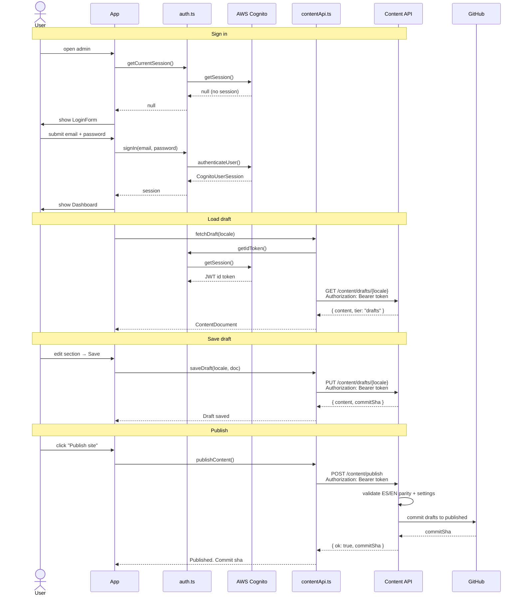

# bonae-admin

Content management UI for editing and publishing site copy (ES/EN) and settings.

## Stack

- React 18 + TypeScript, Vite, Tailwind CSS
- Auth: Amazon Cognito (`amazon-cognito-identity-js`)
- Data fetching: TanStack Query
- Forms: React Hook Form + Zod
- Content validation: `@bonae/content` (local package)

## Setup

```bash
cp .env.example .env
```

Fill in `.env`:

| Variable | Description |
|---|---|
| `VITE_API_BASE_URL` | Content API base URL (leave empty for same-origin `/content/*` on Cloudflare Pages) |
| `VITE_COGNITO_USER_POOL_ID` | Cognito User Pool ID |
| `VITE_COGNITO_CLIENT_ID` | Cognito App Client ID |
| `VITE_AWS_REGION` | AWS region (default: `sa-east-1`) |

## Dev

**Mock mode** — no AWS, no backend. Reads/writes `apps/static/content/` on disk:

```bash
npm run dev:mock
```

**Real mode** — requires `.env` with valid Cognito + API config:

```bash
npm run dev
```

Mock mode is active when `VITE_USE_MOCK=true`. Auth is bypassed and the Vite dev server intercepts all `/content/*` API calls locally.

## Build

```bash
npm run build
```

Runs `tsc --noEmit` then `vite build`. Output goes to `dist/`.

## Architecture

### Components


### User flow



### File tree

```
src/
  config.ts                  # Reads env vars, exposes isConfigured()
  App.tsx                    # Auth gate: ConfigMissing | LoginForm | Dashboard
  infrastructure/
    auth.ts                  # Lazy-loads auth.mock.ts or auth.cognito.ts
    auth.mock.ts             # No-op auth for mock mode
    auth.cognito.ts          # Cognito sign-in/out/session
    contentApi.ts            # fetch() wrapper: fetchDraft, saveDraft, publishContent
  ui/
    Dashboard.tsx            # Tab layout over all section editors
    LoginForm.tsx
    ConfigMissing.tsx
    components/
      JsonSectionEditor.tsx  # Raw JSON fallback editor
    sections/                # Form per content section (Hero, About, etc.)
```

### API surface (`contentApi.ts`)

| Method | Path | Description |
|---|---|---|
| `GET` | `/content/drafts/{es\|en\|settings}` | Load draft |
| `PUT` | `/content/drafts/{es\|en\|settings}` | Save draft |
| `POST` | `/content/publish` | Promote drafts to published |

All requests send a Cognito `Bearer` ID token. In mock mode the Vite plugin handles these routes directly against `apps/static/content/`.

## Editor workflow

1. Sign in (Cognito user in `Administrators` group, or any credentials in mock mode)
2. Select locale (ES / EN) and section
3. Edit fields and click **Save draft** — commits to `content/drafts/` via the content API
4. Click **Publish site** — copies `drafts/` → `published/` in one commit; triggers a Cloudflare Pages rebuild automatically

Drafts are never visible on the public marketing site until published.

## Rules

- ES and EN documents must have **matching array lengths** at all mapped paths (locale parity). The API rejects saves that break parity.
- The static site reads only `content/published/` — never `content/drafts/`.
- Users are invite-only — no self-sign-up. Create users via `aws cognito-idp admin-create-user`.

## Deploy

Deployments are handled by `deploy-admin.yml` on push to `main` (Cloudflare Pages project `bonae-admin`). Cognito IDs are baked in at build time from GitHub repository variables. Leave `API_BASE_URL` empty for same-origin API routing via Pages service binding.

See [docs/architecture.md](../../docs/architecture.md) and [docs/workflows.md](../../docs/workflows.md).
