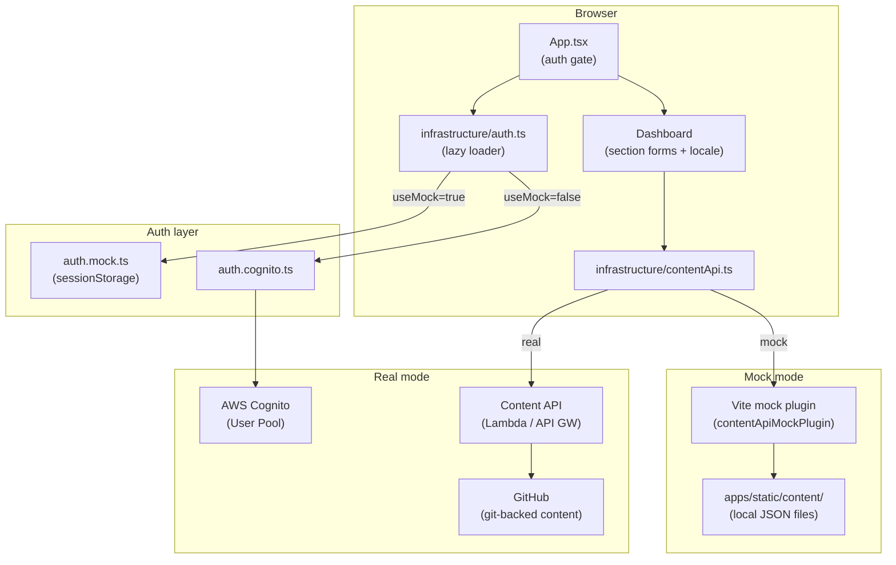
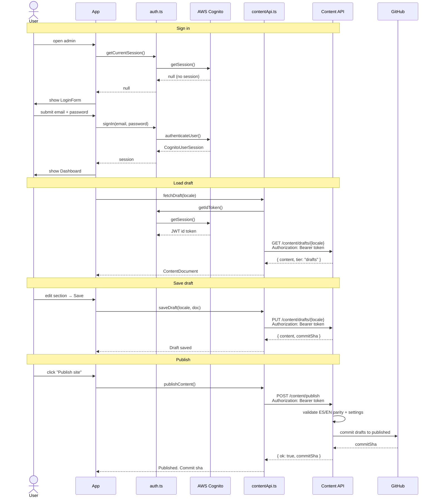

# bonae-admin

Content management UI for editing and publishing site copy (ES/EN) and settings.

## Stack

- React 18 + TypeScript, Vite, Tailwind CSS
- Auth: Amazon Cognito (`amazon-cognito-identity-js`)
- Data fetching: TanStack Query
- Forms: React Hook Form + Zod
- Content validation: `@bonae/content` (local package)

## Setup

```bash
cp .env.example .env
```

Fill in `.env`:

| Variable | Description |
|---|---|
| `VITE_API_BASE_URL` | Content API base URL |
| `VITE_COGNITO_USER_POOL_ID` | Cognito User Pool ID |
| `VITE_COGNITO_CLIENT_ID` | Cognito App Client ID |
| `VITE_AWS_REGION` | AWS region (default: `us-east-1`) |

## Dev

**Mock mode** — no AWS, no backend. Reads/writes `apps/static/content/` on disk:

```bash
npm run dev:mock
```

**Real mode** — requires `.env` with valid Cognito + API config:

```bash
npm run dev
```

Mock mode is active when `VITE_USE_MOCK=true`. Auth is bypassed and the Vite dev server intercepts all `/content/*` API calls locally.

## Build

```bash
npm run build
```

Runs `tsc --noEmit` then `vite build`. Output goes to `dist/`.

## Architecture

### Components



### User flow



### File tree

```
src/
  config.ts                  # Reads env vars, exposes isConfigured()
  App.tsx                    # Auth gate: ConfigMissing | LoginForm | Dashboard
  infrastructure/
    auth.ts                  # Lazy-loads auth.mock.ts or auth.cognito.ts
    auth.mock.ts             # No-op auth for mock mode
    auth.cognito.ts          # Cognito sign-in/out/session
    contentApi.ts            # fetch() wrapper: fetchDraft, saveDraft, publishContent
  ui/
    Dashboard.tsx            # Tab layout over all section editors
    LoginForm.tsx
    ConfigMissing.tsx
    components/
      JsonSectionEditor.tsx  # Raw JSON fallback editor
    sections/                # Form per content section (Hero, About, etc.)
```

### API surface (`contentApi.ts`)

| Method | Path | Description |
|---|---|---|
| `GET` | `/content/drafts/{es\|en\|settings}` | Load draft |
| `PUT` | `/content/drafts/{es\|en\|settings}` | Save draft |
| `POST` | `/content/publish` | Promote drafts to published |

All requests send a Cognito `Bearer` ID token. In mock mode the Vite plugin handles these routes directly against `apps/static/content/`.

## Deploy

The app is a static SPA hosted on S3 + CloudFront. Env vars are baked in at build time.

Run from the repo root `infra/terraform` directory:

```bash
# 1. Read Terraform outputs
export BUCKET=$(terraform output -raw admin_s3_bucket_name) \
export DIST_ID=$(terraform output -raw admin_cloudfront_distribution_id) \
export API_URL=$(terraform output -raw api_url) \
export POOL_ID=$(terraform output -raw user_pool_id) \
export CLIENT_ID=$(terraform output -raw user_pool_client_id)

# 2. Build with real env vars
cd ../../apps/admin
VITE_COGNITO_USER_POOL_ID=$POOL_ID \
VITE_COGNITO_CLIENT_ID=$CLIENT_ID \
VITE_API_BASE_URL=$API_URL \
npm run build

# 3. Sync to S3 and invalidate CloudFront cache
aws s3 sync dist/ s3://$BUCKET --delete --region sa-east-1
aws cloudfront create-invalidation --distribution-id $DIST_ID --paths "/*"
```

The admin is served at the `admin_cloudfront_domain` Terraform output (`https://<id>.cloudfront.net`).

> CloudFront caches aggressively. The invalidation step is required for changes to be visible immediately.
