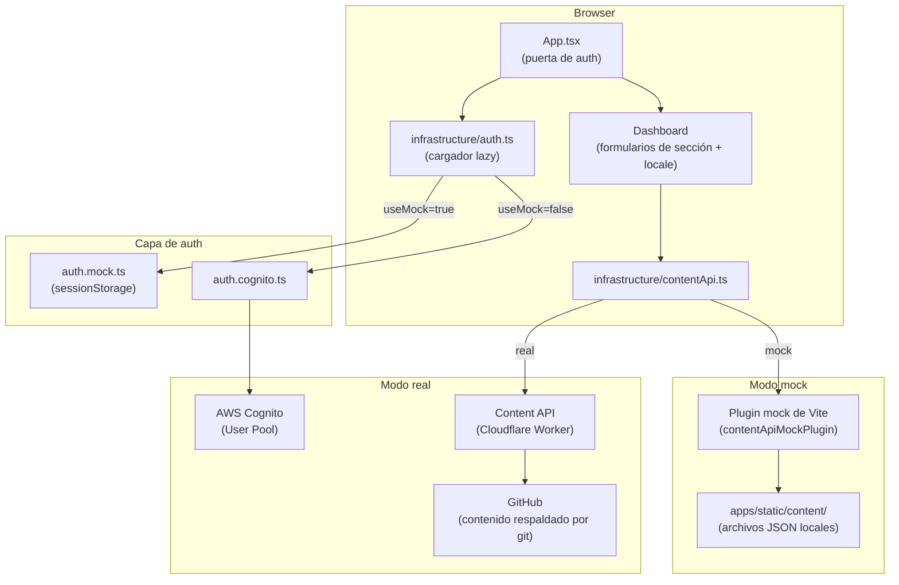
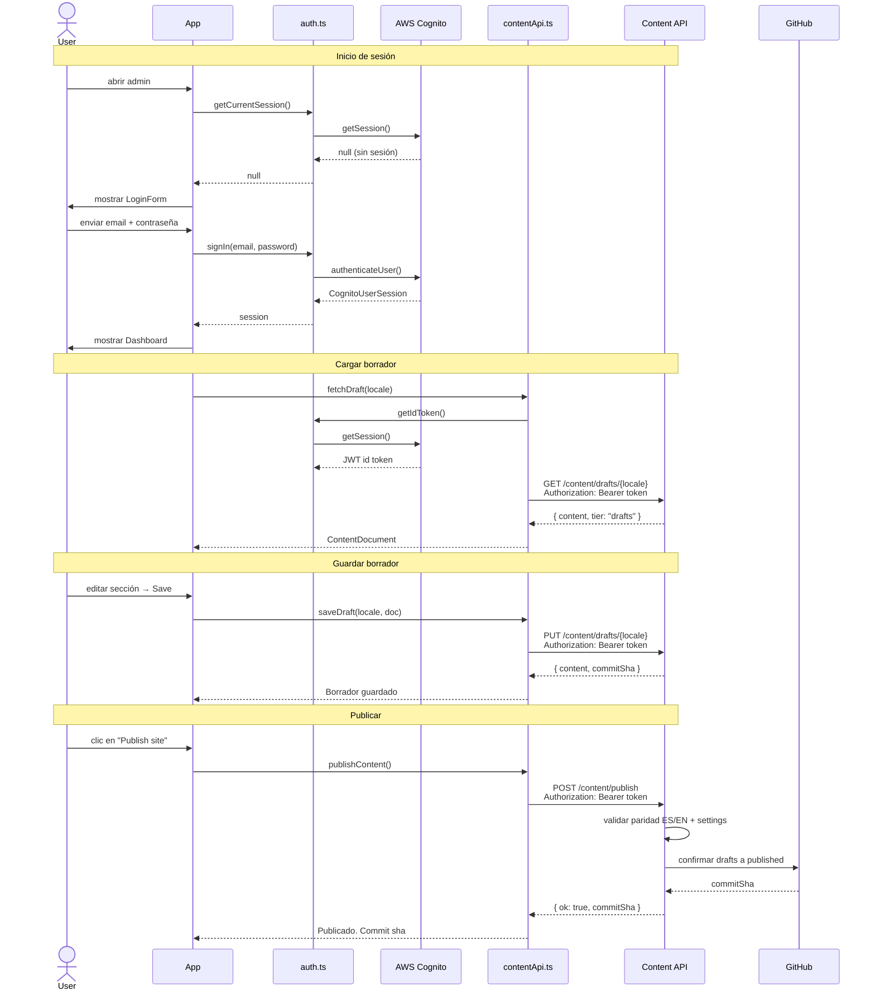

# bonae-admin

Interfaz de gestión de contenido para editar y publicar textos del sitio (ES/EN) y configuración.

## Stack

- React 18 + TypeScript, Vite, Tailwind CSS
- Auth: Amazon Cognito (`amazon-cognito-identity-js`)
- Obtención de datos: TanStack Query
- Formularios: React Hook Form + Zod
- Validación de contenido: `@bonae/content` (paquete local)

## Configuración

```bash
cp .env.example .env
```

Completar `.env`:

| Variable | Descripción |
|---|---|
| `VITE_API_BASE_URL` | URL base de la API de contenido (dejar vacío para same-origin `/content/*` en Cloudflare Pages) |
| `VITE_COGNITO_USER_POOL_ID` | ID del User Pool de Cognito |
| `VITE_COGNITO_CLIENT_ID` | ID del App Client de Cognito |
| `VITE_AWS_REGION` | Región AWS (predeterminado: `sa-east-1`) |

## Desarrollo

**Modo mock** — sin AWS, sin backend. Lee/escribe `apps/static/content/` en disco:

```bash
npm run dev:mock
```

**Modo real** — requiere `.env` con config válida de Cognito + API:

```bash
npm run dev
```

El modo mock está activo cuando `VITE_USE_MOCK=true`. Se omite la auth y el servidor de desarrollo Vite intercepta localmente todas las llamadas API `/content/*`.

## Build

```bash
npm run build
```

Ejecuta `tsc --noEmit` y luego `vite build`. La salida va a `dist/`.

## Arquitectura

### Componentes



### Flujo de usuario



### Árbol de archivos

```
src/
  config.ts                  # Lee vars de entorno, expone isConfigured()
  App.tsx                    # Puerta de auth: ConfigMissing | LoginForm | Dashboard
  infrastructure/
    auth.ts                  # Carga lazy auth.mock.ts o auth.cognito.ts
    auth.mock.ts             # Auth no-op para modo mock
    auth.cognito.ts          # Inicio/cierre/sesión Cognito
    contentApi.ts            # Wrapper fetch: fetchDraft, saveDraft, publishContent
  ui/
    Dashboard.tsx            # Layout con pestañas sobre todos los editores de sección
    LoginForm.tsx
    ConfigMissing.tsx
    components/
      JsonSectionEditor.tsx  # Editor JSON raw de respaldo
    sections/                # Formulario por sección de contenido (Hero, About, etc.)
```

### Superficie de API (`contentApi.ts`)

| Método | Ruta | Descripción |
|---|---|---|
| `GET` | `/content/drafts/{es\|en\|settings}` | Cargar borrador |
| `PUT` | `/content/drafts/{es\|en\|settings}` | Guardar borrador |
| `POST` | `/content/publish` | Promover borradores a publicado |

Todas las solicitudes envían un token ID de Cognito `Bearer`. En modo mock el plugin Vite maneja estas rutas directamente contra `apps/static/content/`.

## Flujo del editor

1. Iniciar sesión (usuario Cognito en el grupo `Administrators`, o cualquier credencial en modo mock)
2. Seleccionar locale (ES / EN) y sección
3. Editar campos y hacer clic en **Save draft** — confirma en `content/drafts/` vía la API de contenido
4. Hacer clic en **Publish site** — copia `drafts/` → `published/` en un commit; dispara rebuild automático de Cloudflare Pages

Los borradores nunca son visibles en el sitio de marketing público hasta publicarlos.

## Reglas

- Los documentos ES y EN deben tener **longitudes de arreglo coincidentes** en todas las rutas mapeadas (paridad de locale). La API rechaza guardados que rompan la paridad.
- El sitio estático lee solo `content/published/` — nunca `content/drafts/`.
- Los usuarios son solo por invitación — sin auto-registro. Crear usuarios vía `aws cognito-idp admin-create-user`.

## Deploy

Los deploys los maneja `deploy-admin.yml` en push a `main` (proyecto Cloudflare Pages `bonae-admin`). Los IDs de Cognito se incluyen en tiempo de build desde variables del repositorio GitHub. Dejar `API_BASE_URL` vacío para enrutamiento same-origin de la API vía service binding de Pages.

Ver [docs/architecture.md](../../docs/architecture.md) y [docs/workflows.md](../../docs/workflows.md).
