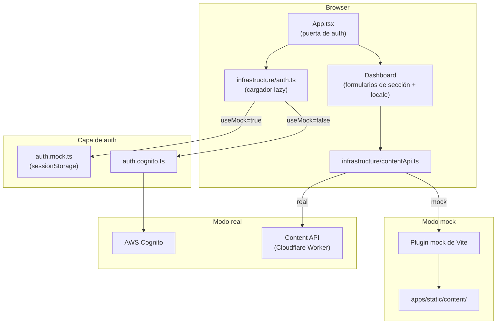

# bonae-admin

Interfaz de gestión de contenido para editar y publicar textos del sitio (ES/EN) y configuración.

## Stack

- React 18 + TypeScript, Vite, Tailwind CSS
- Auth: Amazon Cognito (`amazon-cognito-identity-js`)
- Obtención de datos: TanStack Query
- Formularios: React Hook Form + Zod
- Validación de contenido: `@bonae/content` (paquete local)

## Configuración

```bash
cp .env.example .env
```

Completar `.env`:

| Variable | Descripción |
|---|---|
| `VITE_API_BASE_URL` | URL base de la API de contenido (dejar vacío para same-origin `/content/*` en Cloudflare Pages) |
| `VITE_COGNITO_USER_POOL_ID` | ID del User Pool de Cognito |
| `VITE_COGNITO_CLIENT_ID` | ID del App Client de Cognito |
| `VITE_AWS_REGION` | Región AWS (predeterminado: `sa-east-1`) |

## Desarrollo

**Modo mock** — sin AWS, sin backend. Lee/escribe `apps/static/content/` en disco:

```bash
npm run dev:mock
```

**Modo real** — requiere `.env` con config válida de Cognito + API:

```bash
npm run dev
```

El modo mock está activo cuando `VITE_USE_MOCK=true`. Se omite la auth y el servidor de desarrollo Vite intercepta localmente todas las llamadas API `/content/*`.

## Build

```bash
npm run build
```

Ejecuta `tsc --noEmit` y luego `vite build`. La salida va a `dist/`.

## Arquitectura

Flujos de autenticación end to end (sign-in, refresh, expiry, password reset, SES, API autorizada): **[docs/admin-authentication.md](../../docs/admin-authentication.md)** — documento canónico del repositorio para estos flujos.

### Componentes en el admin SPA



Vista resumida de componentes locales. Secuencias detalladas, principios de diseño y servicios AWS: [docs/admin-authentication.md](../../docs/admin-authentication.md).

### Árbol de archivos

```
src/
  config.ts                  # Lee vars de entorno, expone isConfigured()
  App.tsx                    # Puerta de auth: login | forgot | reset | newPassword | Dashboard
  infrastructure/
    auth.ts                  # Carga lazy auth.mock.ts o auth.cognito.ts
    auth.mock.ts             # Auth no-op para modo mock
    auth.cognito.ts          # SRP, refresh, forgot/confirm password
    cognitoErrors.ts         # Mensajes de error amigables (Cognito)
    passwordPolicy.ts        # Validación de contraseña (cliente)
    contentApi.ts            # fetchContentState, saveDraft, publish, publish/status
    contentReview.ts         # Review modal: diff, validation, parity
  hooks/
    useContentWorkspace.ts   # Autosave, discard, bootstrap state
    usePublishFlow.ts        # Publish overlay + polling
  ui/
    Dashboard.tsx            # Review & publish, status bar, discard
    components/
      PublishingOverlay.tsx
      ReviewPublishModal.tsx
    LoginForm.tsx
    ForgotPasswordForm.tsx
    ResetPasswordForm.tsx
    ConfigMissing.tsx
```

### Superficie de API (`contentApi.ts`)

| Método | Ruta | Descripción |
|---|---|---|
| `GET` | `/content/state` | Bootstrap: borradores, publicado, publishState |
| `GET` | `/content/drafts/{es\|en\|settings}` | Cargar borrador (legacy; preferir `/content/state`) |
| `PUT` | `/content/drafts/{es\|en\|settings}` | Guardar borrador (autosave y Save draft) |
| `POST` | `/content/drafts/discard` | Descartar todos los borradores |
| `POST` | `/content/publish` | Iniciar publicación → `{ accepted: true }` |
| `GET` | `/content/publish/status` | Estado del overlay (poll cada ~1.5s) |

En modo mock el plugin Vite (`mockContentStore.ts`) simula la misma API y máquina de estados de publish.

## Flujo del editor

1. Iniciar sesión (Cognito `Administrators`, o cualquier credencial en modo mock)
2. `GET /content/state` carga borradores y baseline publicado
3. Editar — autosave (~2.5s) o **Save draft** → `PUT /content/drafts/{locale}`
4. **Review & publish** — diff/validación ES, EN y settings
5. Overlay: committing → building → success (poll `GET /content/publish/status`)

En producción el callback de **Deploy site** cierra el paso *building*. En mock el éxito se simula tras ~2s.

## Reglas

- La paridad de locale se valida al **publicar** (cliente y servidor), no en cada autosave de borrador.
- El sitio estático lee solo `content/published/` — nunca `content/drafts/`.
- Los usuarios son solo por invitación — sin auto-registro. Crear usuarios vía `aws cognito-idp admin-create-user`.

## Deploy

Los deploys los maneja `deploy-admin.yml` en push a `main` (proyecto Cloudflare Pages `bonae-admin`). Los IDs de Cognito se incluyen en tiempo de build desde variables del repositorio GitHub. Dejar `API_BASE_URL` vacío para enrutamiento same-origin de la API vía service binding de Pages.

Ver [docs/admin-authentication.md](../../docs/admin-authentication.md) (auth), [docs/architecture.md](../../docs/architecture.md) (plataforma) y [docs/workflows.md](../../docs/workflows.md) (CI/CD).

### Gestión de usuarios Cognito

Los usuarios son solo por invitación (`allow_admin_create_user_only = true`). Crear usuarios vía AWS CLI — reciben una contraseña temporal por email y deben establecer una permanente en el primer inicio de sesión.

```bash
POOL_ID=$(cd infra/terraform && terraform output -raw user_pool_id)
REGION=sa-east-1

# Crear usuario (envía email de invitación; email_verified requerido para reset de contraseña)
aws cognito-idp admin-create-user \
  --user-pool-id $POOL_ID \
  --username editor@example.com \
  --user-attributes Name=email,Value=editor@example.com Name=email_verified,Value=true \
  --desired-delivery-mediums EMAIL \
  --region $REGION

# Agregar al grupo Administrators
aws cognito-idp admin-add-user-to-group \
  --user-pool-id $POOL_ID \
  --username editor@example.com \
  --group-name Administrators \
  --region $REGION
```

Para deshabilitar o eliminar un usuario:

```bash
aws cognito-idp admin-disable-user --user-pool-id $POOL_ID --username editor@example.com --region $REGION
aws cognito-idp admin-delete-user  --user-pool-id $POOL_ID --username editor@example.com --region $REGION
```
