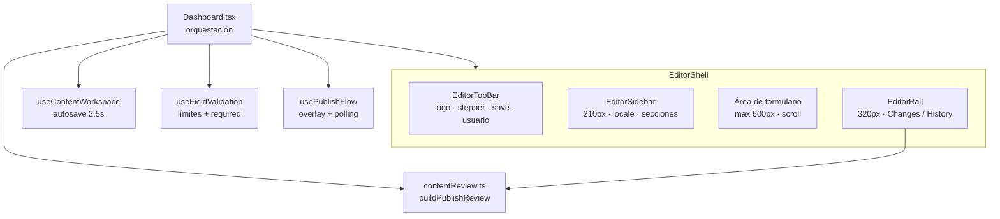
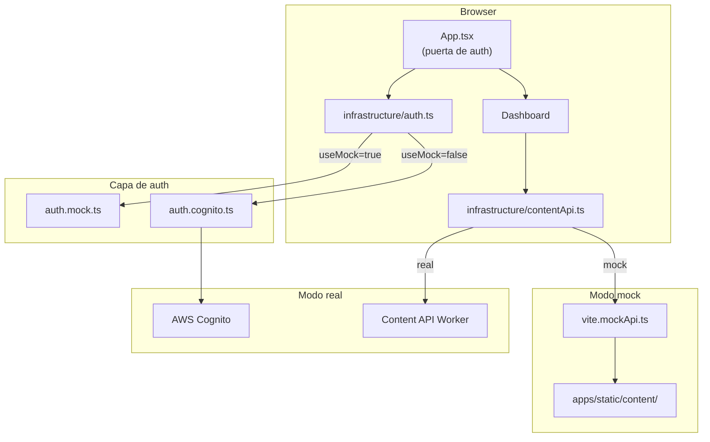

# bonae-admin

Interfaz de gestión de contenido para editar y publicar textos del sitio (ES/EN) y configuración.

## Stack

- React 18 + TypeScript, Vite, Tailwind CSS
- Auth: Amazon Cognito (`amazon-cognito-identity-js`)
- Obtención de datos: TanStack Query
- Formularios: React Hook Form + Zod
- Validación de contenido: `@bonae/content` (paquete local)

## Configuración

```bash
cp .env.example .env
```

Completar `.env`:

| Variable | Descripción |
|---|---|
| `VITE_API_BASE_URL` | URL base de la API de contenido (dejar vacío para same-origin `/content/*` en Cloudflare Pages) |
| `VITE_COGNITO_USER_POOL_ID` | ID del User Pool de Cognito |
| `VITE_COGNITO_CLIENT_ID` | ID del App Client de Cognito |
| `VITE_AWS_REGION` | Región AWS (predeterminado: `sa-east-1`) |

## Desarrollo

**Modo mock** — sin AWS, sin backend. Borradores en memoria; publish escribe `apps/static/content/published/` en disco:

```bash
npm run dev:mock
```

**Modo real** — requiere `.env` con config válida de Cognito + API:

```bash
npm run dev
```

El modo mock está activo cuando `VITE_USE_MOCK=true`. Se omite la auth y el servidor de desarrollo Vite intercepta localmente todas las llamadas API `/content/*`.

## Build

```bash
npm run build
```

Ejecuta `tsc --noEmit` y luego `vite build`. La salida va a `dist/`.

## Caché y headers

Misma política que el sitio de marketing: **[docs/caching-pages.md](../../docs/caching-pages.md)**.

Este app (Vite SPA):

- Hashed assets: `/assets/*`
- SW prefix: `bonae-admin` (no cachea `/content/*`)
- Inject pre-deploy: `node ../../scripts/inject-sw-build-hash.mjs dist` (también en **Deploy admin**)

## Arquitectura

Almacenamiento draft/publish: [docs/architecture.md § Niveles de contenido](../../docs/architecture.md#niveles-de-contenido-draft-vs-publicado). Mapa secciones ↔ API: [admin-content-api-map.md](../../docs/admin-content-api-map.md).

Flujos de autenticación: **[docs/admin-authentication.md](../../docs/admin-authentication.md)**.

### Editor (post-rediseño)

El editor es una SPA de una sola pantalla con shell persistente de tres columnas. No hay routing entre páginas — el estado local controla `locale`, `section` y la pestaña del rail.



**Top bar** — wordmark Bonae, stepper Draft → Review → Publish, estado de guardado, **Save draft** (`flushPendingSaves`), última publicación, menú de usuario.

**Sidebar** — toggle ES/EN, navegación por sección con badge de errores, **Discard all drafts** al pie.

**Formulario** — formularios por sección (`Hero`, `Services / value prop`, `About / team`, `Contact`, `Site settings`, `Advanced JSON`). Campos en `FieldCard` con contadores y validación inline.

**Rail derecho** — pestaña **Changes**: diff draft vs publicado (`ChangeRow`), banners de unsaved/validación, **Approve & publish**. Pestaña **History**: stub con `lastPublishedAt` y `lastCommitSha`.

Las pantallas de auth (`LoginForm`, etc.) conservan el estilo anterior (`slate` / `dark-blue`). El editor usa tokens `editor.*` en `tailwind.config.js` e `index.css`.

### Componentes y datos



### Árbol de archivos

```
public/
  bonae-logo.svg             # Logo Bonae (top bar)
src/
  config.ts
  App.tsx
  index.css                  # Utilidades editor (.editor-shell, .btn-editor-save, …)
  infrastructure/
    auth.ts / auth.mock.ts / auth.cognito.ts
    cognitoErrors.ts
    passwordPolicy.ts
    session.ts
    contentApi.ts            # fetchContentState, saveDraft, publish, publish/status
    contentReview.ts         # buildPublishReview, diff labels, validation gate
    settingsEditorAdapter.ts # Formulario Site settings ↔ ES/EN docs + SiteSettings
  hooks/
    useContentWorkspace.ts   # Autosave, discard, bootstrap state
    usePublishFlow.ts        # Publish overlay + polling
    useFieldValidation.ts    # Límites de caracteres y required por sección
    useFormEditSync.ts       # watch() subscription → onEdit sin re-render loop
    publishStatusPoller.ts
  ui/
    Dashboard.tsx            # Orquesta shell, secciones, rail, publish
    editor/
      EditorShell.tsx
      EditorTopBar.tsx
      EditorSidebar.tsx
      EditorRail.tsx
      EditorRailChanges.tsx
      EditorRailHistory.tsx
      WorkflowStepper.tsx
      types.ts               # SectionId, NAV_ITEMS, RailTab
    sections/
      HeroSectionForm.tsx
      ValuePropSectionForm.tsx
      AboutSectionForm.tsx
      ContactSectionForm.tsx
      SettingsSectionForm.tsx
      AdvancedJsonSection.tsx
    components/
      FieldCard.tsx
      SectionHeader.tsx
      CharCounter.tsx
      FieldError.tsx
      InlineCallout.tsx
      ChangeRow.tsx
      JsonReadOnlyViewer.tsx
      UserMenu.tsx
      PublishStatusIndicator.tsx
    LoginForm.tsx
    ForgotPasswordForm.tsx
    ResetPasswordForm.tsx
    ConfigMissing.tsx
```

### Superficie de API (`contentApi.ts`)

Catálogo completo (Postman + secciones UI): [admin-content-api-map.md](../../docs/admin-content-api-map.md).

Resumen: `GET /content/state` al cargar; `PUT /content/drafts/*` en autosave y Save draft; `POST /content/drafts/discard` al descartar; `POST /content/publish` + poll `GET /content/publish/status` desde el rail.

## Flujo del editor

1. Iniciar sesión (Cognito `Administrators`, o cualquier credencial en modo mock)
2. `GET /content/state` carga borradores y baseline publicado
3. Editar una sección — cambios en memoria; autosave (~2.5s) persiste vía `PUT /content/drafts/{locale}`
4. Estado visible en top bar: **Unsaved edits** → **Saving draft…** → **Draft saved {time}**. **Save draft** fuerza `flushPendingSaves`
5. **Changes** (rail) — diff entre draft actual y publicado (`buildPublishReview`). Validación inline bloquea **Approve & publish**
6. **Approve & publish** → overlay de publish; poll `GET /content/publish/status` hasta success/failure

En producción el callback de **Deploy site** cierra el paso *building*. En mock el éxito se simula tras ~2s.

### Site settings

El formulario de configuración usa campos orientados al editor (`siteName`, `whatsapp`, `email`, …). `settingsEditorAdapter.ts` reparte los valores en `ContentDocument` ES/EN y `SiteSettings` al guardar.

### Validación

- Límites de caracteres y campos requeridos por sección (`useFieldValidation`)
- Badges de error en la navegación lateral
- Paridad ES/EN y esquema Zod al publicar (cliente vía `contentReview` + servidor en el Worker)
- Los errores de validación no bloquean el autosave de borrador; sí bloquean publish

## Reglas

- Paridad ES/EN y esquema Zod se validan al **publicar**, no en cada autosave de borrador.
- El sitio estático solo lee `content/published/`.
- Usuarios solo por invitación — ver sección Cognito más abajo.

## Deploy

Los deploys los maneja `deploy-admin.yml` en push a `main` (proyecto Cloudflare Pages `bonae-admin`). Los IDs de Cognito se incluyen en tiempo de build desde variables del repositorio GitHub. Dejar `API_BASE_URL` vacío para enrutamiento same-origin de la API vía service binding de Pages.

Ver [docs/admin-authentication.md](../../docs/admin-authentication.md) (auth), [docs/architecture.md](../../docs/architecture.md) (plataforma) y [docs/workflows.md](../../docs/workflows.md) (CI/CD).

### Gestión de usuarios Cognito

Los usuarios son solo por invitación (`allow_admin_create_user_only = true`). Crear usuarios vía AWS CLI — reciben una contraseña temporal por email y deben establecer una permanente en el primer inicio de sesión.

```bash
POOL_ID=$(cd infra/terraform && terraform output -raw user_pool_id)
REGION=sa-east-1

# Crear usuario (envía email de invitación; email_verified requerido para reset de contraseña)
aws cognito-idp admin-create-user \
  --user-pool-id $POOL_ID \
  --username editor@example.com \
  --user-attributes Name=email,Value=editor@example.com Name=email_verified,Value=true \
  --desired-delivery-mediums EMAIL \
  --region $REGION

# Agregar al grupo Administrators
aws cognito-idp admin-add-user-to-group \
  --user-pool-id $POOL_ID \
  --username editor@example.com \
  --group-name Administrators \
  --region $REGION
```

Para deshabilitar o eliminar un usuario:

```bash
aws cognito-idp admin-disable-user --user-pool-id $POOL_ID --username editor@example.com --region $REGION
aws cognito-idp admin-delete-user  --user-pool-id $POOL_ID --username editor@example.com --region $REGION
```
