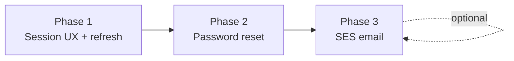

# Admin authentication — phased delivery

Specs for session expiry UX, token refresh, password reset, and optional SES email for the content admin SPA ([`apps/admin/`](../../apps/admin/)).

Platform context: [architecture.md](../architecture.md) · CI/CD: [workflows.md](../workflows.md)

## Phases

| Phase | Spec | Terraform | Admin SPA | Deploy alone? |
|-------|------|-----------|-----------|---------------|
| 1 — Session expiry & refresh | [phase-1-session-expiry.md](./phase-1-session-expiry.md) | `cognito.tf` — refresh flow | Yes | Yes |
| 2 — Password reset | [phase-2-password-reset.md](./phase-2-password-reset.md) | `cognito.tf` — recovery settings | Yes | Yes (Cognito default email) |
| 3 — SES email (optional) | [phase-3-ses-email.md](./phase-3-ses-email.md) | `ses.tf` + DNS | No | Yes (infra only) |

**Delivery rhythm:** one branch → one PR → deploy → update checklist below → next phase.

## Status

| Phase | Status | Deployed | Notes |
|-------|--------|----------|-------|
| 1 — Session expiry & refresh | code complete | infra yes, admin pending | Terraform applied 2026-06-29 |
| 2 — Password reset | code complete | infra yes, admin pending | shipped with Phase 1 in same admin build |
| 3 — SES email | code complete | pending | Two-step apply — see [phase-3-ses-email.md](./phase-3-ses-email.md) |

**Next step (Phase 3):** merge → **Deploy cognito** → add DNS from `terraform output` → verify domain → set `cognito_use_ses_email = true` → apply again → SES production access request.

## Deploy commands

From repo root unless noted.

| Phase | Steps |
|-------|--------|
| 1 & 2 | `terraform apply` in `infra/terraform/` → merge PR → **Deploy admin** (or push under `apps/admin/`) |
| 3 | Apply (SES only) → DNS in Cloudflare → `cognito_use_ses_email = true` → apply again → SES production access |

**Local test:** `npm run admin:dev:mock` for UI; `npm run admin:dev` with `.env` for Cognito after Phase 1.
