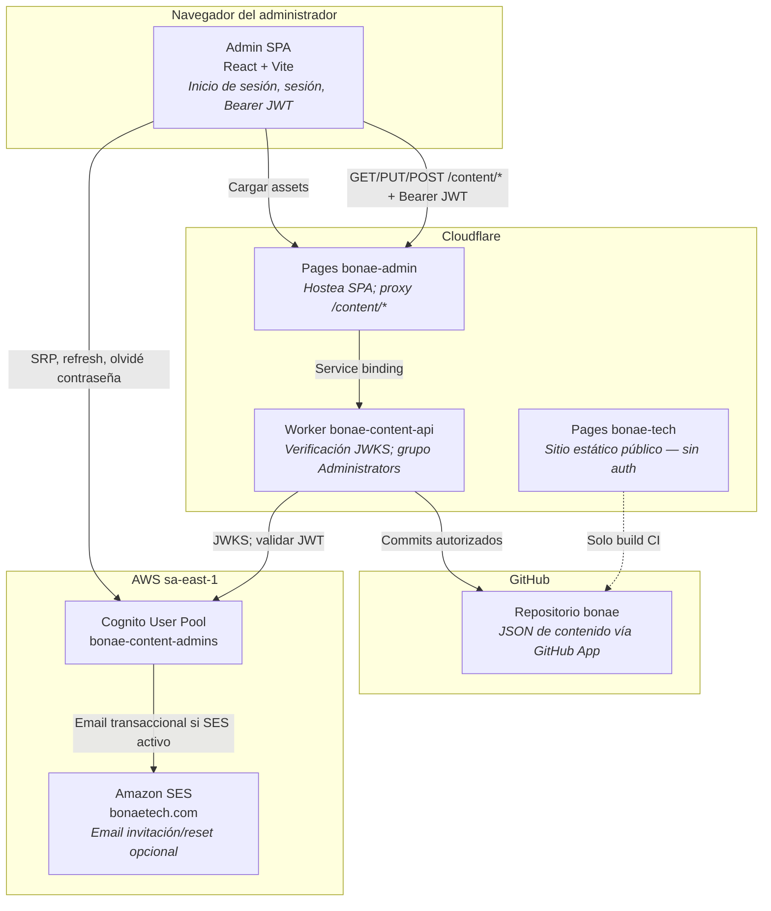
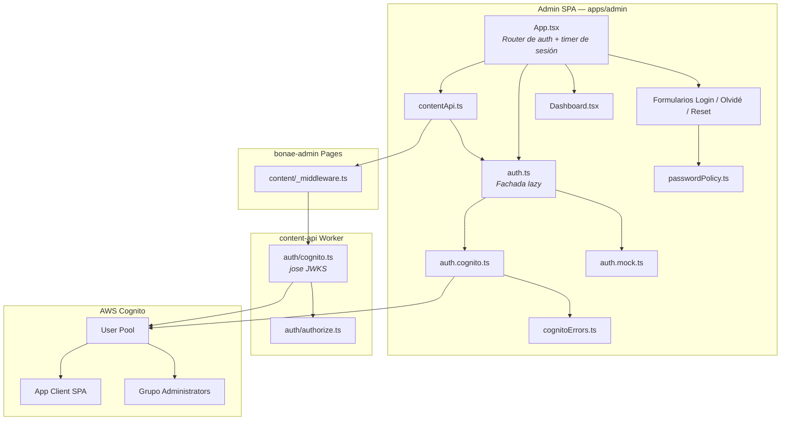
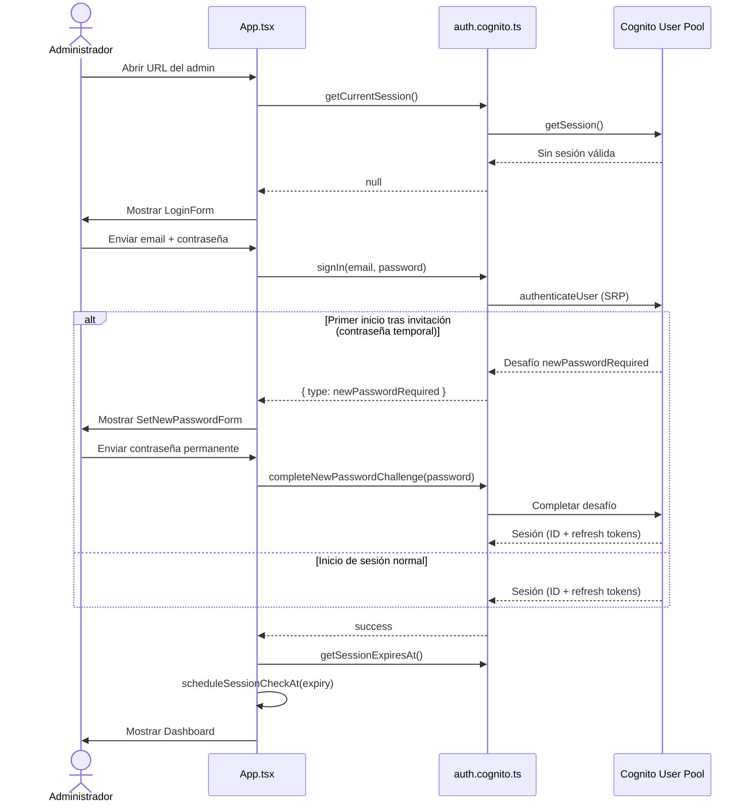
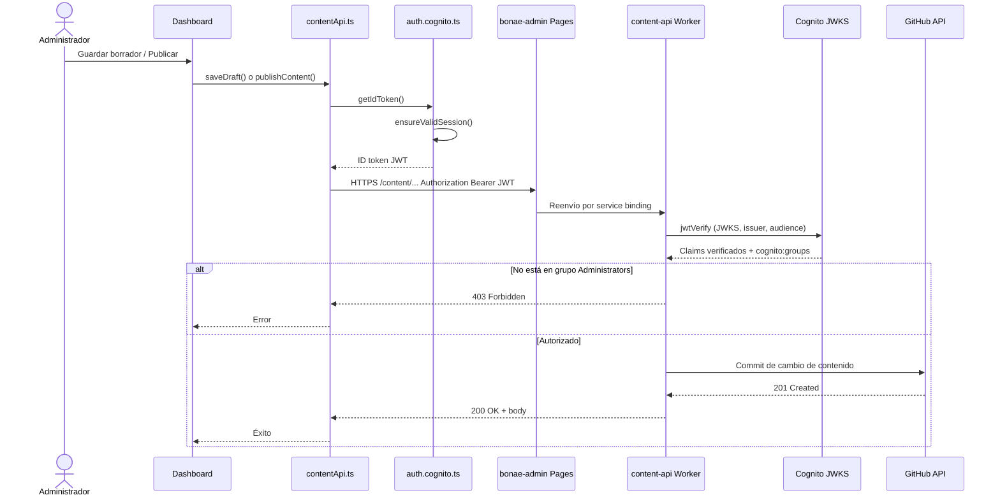
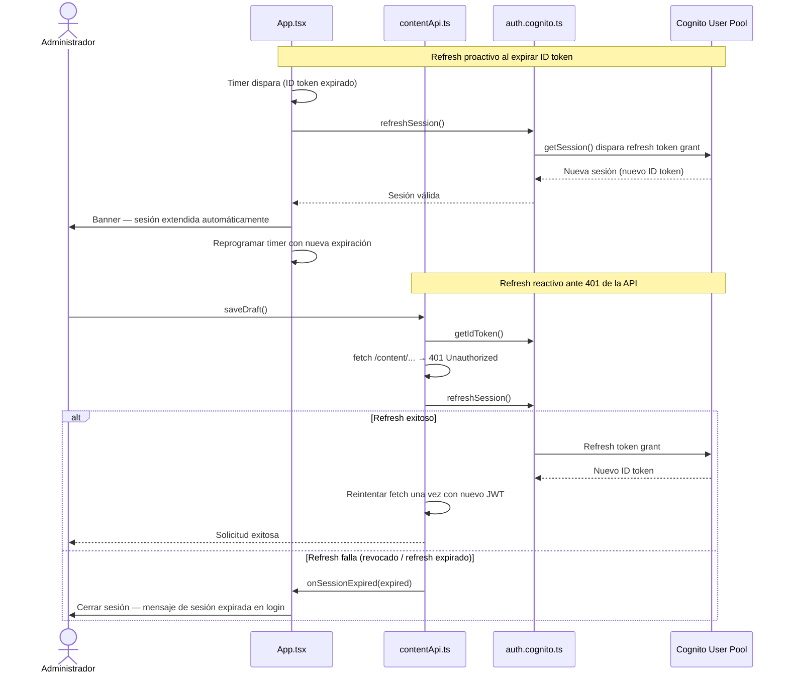
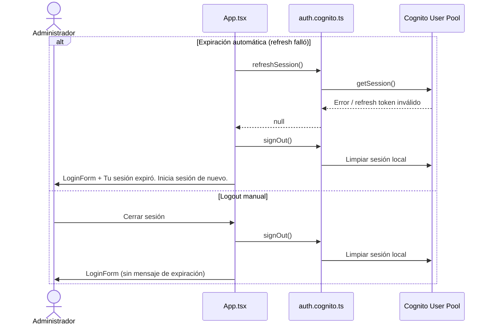
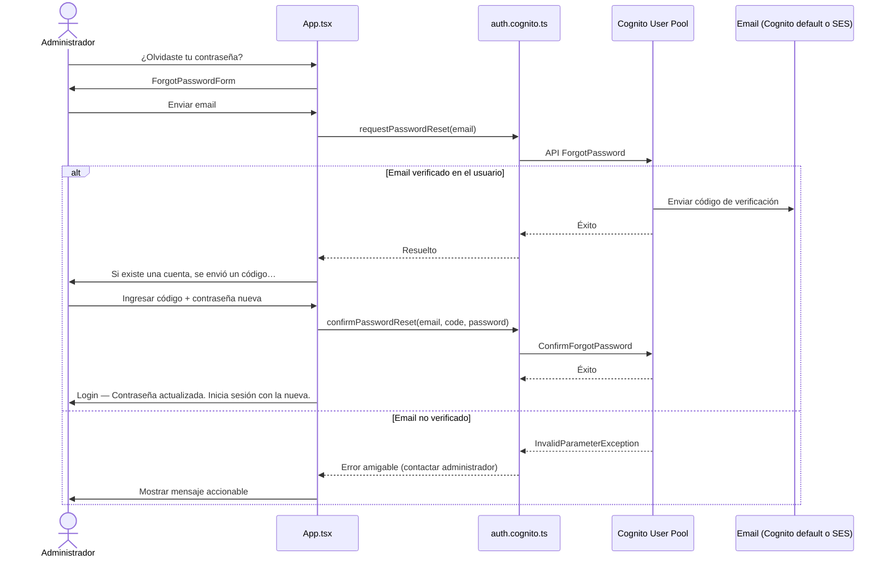
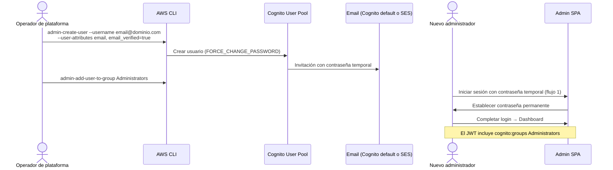
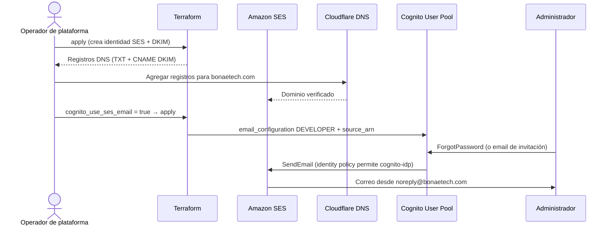

# Arquitectura de autenticación del admin

## Contenido de este documento

Esta es la **referencia canónica** de cómo los administradores se autentican en el admin SPA de contenido de BONAE y cómo esas credenciales se aplican de extremo a extremo. Describe el sistema **tal como está implementado hoy** — incluyendo refresh de sesión, reset de contraseña y email opcional vía SES.

**Incluido**

- Dónde encaja la autenticación en el Admin SPA, el sitio estático de marketing, los Workers de Cloudflare y AWS
- Diagramas de componentes (flowcharts Mermaid portables) con los límites de plataforma y solo-auth
- Principios de diseño y cada servicio AWS involucrado en identidad y email
- Diagramas de secuencia para cada flujo principal, con una breve explicación de cada uno

**Fuera de alcance**

- Edición de contenido, publicación y paridad de locale (ver [architecture.md](./architecture.md))
- Definición de jobs CI/CD (ver [workflows.md](./workflows.md))
- Checklists de entrega por fases (ver [admin-auth/README.md](./admin-auth/README.md))

**Ubicaciones principales del código:** [`apps/admin/`](../apps/admin/) · [`workers/content-api/src/auth/`](../workers/content-api/src/auth/) · [`infra/terraform/`](../infra/terraform/)

---

## Autenticación en la plataforma (vista de componentes)

La autenticación **no** la maneja el sitio estático de marketing. Solo participan el admin SPA y el Worker de la API de contenido. Cognito emite tokens en el navegador; el Worker los valida en cada solicitud protegida.

Los diagramas usan sintaxis Mermaid `flowchart` portable (se renderizan en GitHub y en la vista previa del editor sin extensiones). Los límites al estilo C4 se muestran como subgrafos.

---

## Componentes de autenticación (vista de componentes)

El admin usa una **fachada de auth con carga lazy** (`auth.ts`) que carga Cognito o una implementación mock local. El Worker nunca confía solo en la puerta de la SPA — revalida cada JWT.

---

## Principios de diseño

| Principio | Cómo se aplica |
|-----------|----------------|
| **Administradores solo por invitación** | Cognito `allow_admin_create_user_only = true`. Sin auto-registro. Los operadores crean usuarios vía AWS CLI. |
| **Sin client secret en el navegador** | App client SPA con `generate_secret = false`. SRP demuestra la contraseña sin enviarla en claro. |
| **Acceso de corta duración, sesiones renovables** | ID token válido **1 hora**. Refresh token **30 días**. La SPA refresca antes de cerrar sesión cuando es posible. |
| **Autorización en el servidor** | El Worker verifica firma JWT, issuer, audience y grupo `Administrators` en cada solicitud mutante. La puerta de auth de la UI no basta. |
| **Fail closed** | JWT inválido o expirado → `401`. Sin `Administrators` → `403`. La SPA cierra sesión y muestra mensaje claro en expiración dura. |
| **Extensión de sesión transparente** | Refresh proactivo al expirar el ID token y en reintento por `401` de la API. El usuario ve un banner de «sesión extendida» — no un fallo silencioso. |
| **Recuperación resistente a enumeración** | `prevent_user_existence_errors = ENABLED`. La UI de olvidé contraseña muestra el mismo mensaje de éxito exista o no el email (salvo errores de configuración accionables por el operador). |
| **Email verificado para recuperación** | `account_recovery_setting` usa `verified_email`. El reset exige `email_verified = true` en el registro del usuario. |
| **Runtime híbrido** | Identidad y email en **AWS**; hosting del admin y API en **Cloudflare**. Los tokens viajan en el navegador; los secretos quedan en AWS/env del Worker. |
| **Modo mock para desarrollo local** | `VITE_USE_MOCK=true` omite Cognito y usa la API de contenido en disco — nunca en builds de producción. |

---

## Servicios AWS involucrados

| Servicio | Rol en autenticación | Por qué se usa |
|----------|----------------------|----------------|
| **Amazon Cognito User Pool** (`bonae-content-admins`) | Almacén central de identidad | Auth SRP, emisión de JWT, política de contraseñas, flujo de invitación, códigos de reset, refresh tokens, claims del grupo `Administrators` |
| **Cognito App Client** (`bonae-content-admin-spa`) | Cliente OAuth/OIDC SPA | Cliente público (sin secret); habilita `ALLOW_USER_SRP_AUTH` y `ALLOW_REFRESH_TOKEN_AUTH`; define vigencia de tokens |
| **Cognito User Groups** (`Administrators`) | Claim de autorización | `cognito:groups` en el ID token; el Worker verifica membresía antes de borrador/publicación |
| **Amazon SES** (opcional, `bonaetech.com`) | Email transaccional | Con `cognito_use_ses_email = true`, Cognito envía invitación y reset desde `noreply@bonaetech.com` en lugar del remitente por defecto (límite 50/día por cuenta) |
| **S3 + DynamoDB** (bootstrap Terraform) | Solo estado de Terraform | No forman parte de la auth en runtime — almacenan estado IaC de módulos Cognito/SES |
| **IAM OIDC + rol de deploy** (bootstrap) | CI `terraform apply` | GitHub Actions asume un rol para gestionar Cognito/SES — no lo usan SPA ni Worker en tiempo de solicitud |

**Resumen de tokens**

| Token | Vigencia | Almacenamiento | Uso |
|-------|----------|----------------|-----|
| ID token (JWT) | 1 hora | Cognito SDK (almacenamiento del navegador) | `Authorization: Bearer` en `/content/*` |
| Refresh token | 30 días | Cognito SDK (almacenamiento del navegador) | Refresh silencioso vía `getSession()` al expirar el ID token |
| Access token | (emitido) | Cognito SDK | No lo usa esta app — la API de contenido valida el **ID token** |

---

## Flujos

### 1. Inicio de sesión del administrador (SRP)

Un administrador abre la URL del admin. Si no hay sesión válida, ingresa email y contraseña. La SPA usa **SRP** para no enviar la contraseña en claro a Cognito. Al tener éxito, Cognito devuelve una sesión (ID + refresh tokens). Si el usuario fue invitado con contraseña temporal, Cognito devuelve `NEW_PASSWORD_REQUIRED` y la SPA muestra el formulario de contraseña permanente antes del dashboard.

Tras el inicio de sesión, `App.tsx` programa un timer para la expiración del ID token. Al dispararse, la app intenta refresh (flujo 3) antes de cerrar sesión.

---

### 2. Solicitud autenticada a la API de contenido

Cada carga, guardado o publicación de borrador pasa por `contentApi.ts`, que obtiene un ID token válido y lo envía como header Bearer. Cloudflare Pages reenvía `/content/*` al Worker. El Worker valida el JWT contra JWKS de Cognito y comprueba el grupo `Administrators` antes de tocar GitHub.

El sitio de marketing (`bonae-tech`) no está en esta ruta — sirve HTML estático desde `content/published/` sin JWT.

---

### 3. Refresh de sesión (proactivo y ante 401 de la API)

El ID token expira a la hora. En lugar de cerrar sesión de inmediato, la SPA intenta refrescar con el refresh token del SDK de Cognito. El refresh ocurre (a) cuando el timer programado alcanza la expiración del ID token, y (b) cuando una llamada a la API devuelve `401` y aún no se reintentó. Un refresh exitoso muestra un banner verde de «sesión extendida» en el dashboard.

---

### 4. Expiración de sesión y cierre de sesión

Si el refresh falla o no hay sesión al cargar, la SPA limpia la sesión de Cognito, vuelve al login y muestra un mensaje informativo cuando la expiración fue automática (frente a logout manual).

Al volver a una pestaña en segundo plano se dispara `visibilitychange` — si hay sesión autenticada, la app revalida su vigencia.

---

### 5. Olvidé contraseña y reset

Un administrador que olvidó su contraseña solicita un código de verificación por email. Cognito envía el código (email por defecto o SES si está activo). El usuario ingresa el código y una contraseña nueva en la pantalla de reset. La validación en cliente aplica las mismas reglas que la política de Cognito. Tras el éxito, inicia sesión con la nueva contraseña.

**Requisito:** el usuario debe tener `email_verified = true` en Cognito. Usuarios invitados creados sin ese atributo no pueden resetear hasta que un operador lo establezca.

`prevent_user_existence_errors` hace que emails desconocidos reciban la misma UI de éxito que los conocidos cuando Cognito no devuelve error.

---

### 6. El operador invita a un nuevo administrador

Los operadores crean usuarios fuera de la SPA con AWS CLI. Cognito envía contraseña temporal por email (si el envío está configurado). El nuevo usuario inicia sesión por el flujo 1 y completa `NEW_PASSWORD_REQUIRED`. El operador debe agregar al usuario al grupo `Administrators` — la membresía no es automática.

---

### 7. Email SES para Cognito (infraestructura opcional)

La fase 3 agrega verificación de dominio SES y opcionalmente cambia Cognito de `COGNITO_DEFAULT` a envío `DEVELOPER`. **Sin cambios en la SPA** — los flujos 5 y 6 usan las mismas APIs de Cognito; solo cambian la dirección remitente y la ruta de entrega.

Hasta obtener **acceso de producción** en SES aplican reglas de sandbox (solo destinatarios verificados, cuotas menores). Ver [admin-auth/phase-3-ses-email.md](./admin-auth/phase-3-ses-email.md).

---

## Desarrollo local (auth mock)

Con `VITE_USE_MOCK=true`, `auth.mock.ts` reemplaza Cognito por una sesión en `sessionStorage` y un código de reset fijo `123456`. El plugin Vite `contentApiMockPlugin` sirve `/content/*` desde disco. Esta ruta existe solo para desarrollo local — los builds de producción usan Cognito y el Worker de Cloudflare.

---

## Referencias

| Documento | Propósito |
|-----------|-----------|
| [architecture.md](./architecture.md) | Diseño general de la plataforma, flujos de contenido, infraestructura |
| [workflows.md](./workflows.md) | GitHub Actions: Deploy cognito, Deploy admin, Terraform plan |
| [admin-auth/README.md](./admin-auth/README.md) | Estado de entregas por fases y checklists de deploy |
| [admin-auth/phase-1-session-expiry.md](./admin-auth/phase-1-session-expiry.md) | Especificación de refresh y UX de expiración de sesión |
| [admin-auth/phase-2-password-reset.md](./admin-auth/phase-2-password-reset.md) | Especificación de reset de contraseña |
| [admin-auth/phase-3-ses-email.md](./admin-auth/phase-3-ses-email.md) | Runbook de dominio SES, DNS y acceso de producción |
| [infra/README.md](../infra/README.md) | Módulos Terraform, comandos CLI de usuarios Cognito |
| [apps/admin/README.md](../apps/admin/README.md) | Stack del admin SPA, variables de entorno, comandos de dev (apunta aquí para flujos de auth) |
| [workers/content-api/README.md](../workers/content-api/README.md) | Rutas de la API de contenido y configuración del Worker |

**Fuentes Terraform:** [`infra/terraform/cognito.tf`](../infra/terraform/cognito.tf) · [`infra/terraform/ses.tf`](../infra/terraform/ses.tf) · [`infra/terraform/variables.tf`](../infra/terraform/variables.tf)
