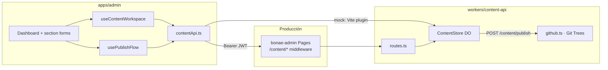
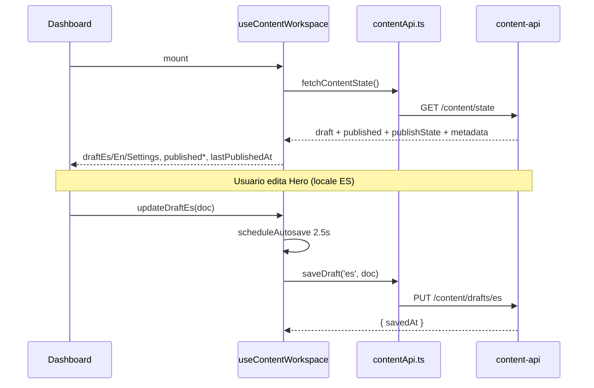
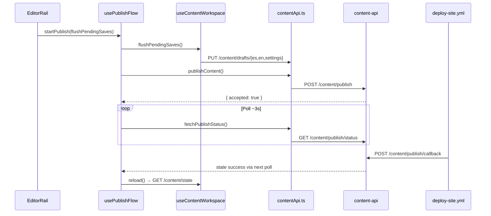
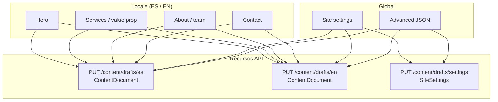
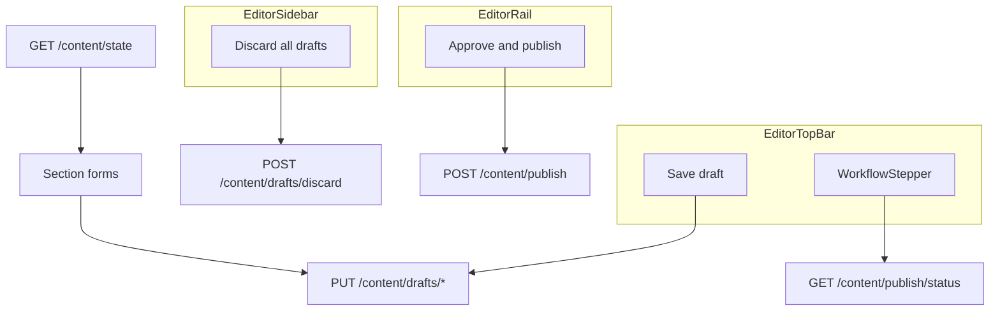

# Admin ↔ content-api — mapa de API y secciones

Referencia de cómo cada ruta del Worker `bonae-content-api` se usa desde `apps/admin`, alineada con la colección Postman en [`workers/content-api/postman/bonae-content-api.postman_collection.json`](../workers/content-api/postman/bonae-content-api.postman_collection.json).

**Auth (rutas admin):** `Authorization: Bearer <cognitoIdToken>` — ID token de Cognito; grupo `Administrators` (acciones `read_draft`, `write_draft`, `read_published`, `publish`).

**Auth (callback CI):** `Authorization: Bearer <publishCallbackSecret>` — secreto compartido `PUBLISH_CALLBACK_SECRET`; solo `deploy-site.yml`.

Modelo de almacenamiento: [architecture.md § Niveles de contenido](./architecture.md#niveles-de-contenido-draft-vs-publicado).

---

## Tabla de contenidos

1. [Vista general](#1-vista-general)
2. [Secciones del admin y recursos JSON](#2-secciones-del-admin-y-recursos-json)
3. [Catálogo de API (Postman)](#3-catálogo-de-api-postman)
4. [Matriz sección → API](#4-matriz-sección--api)
5. [Rutas expuestas pero no usadas por el admin](#5-rutas-expuestas-pero-no-usadas-por-el-admin)

---

## 1. Vista general



### Flujo de carga y edición



### Flujo de publicación



---

## 2. Secciones del admin y recursos JSON

El admin no tiene routing por URL: `section` + `locale` son estado React (`Dashboard.tsx`, `types.ts`).



| Sección admin (`SectionId`) | Etiqueta nav | Locale | Claves JSON editadas | Recurso al guardar |
|----------------------------|--------------|--------|----------------------|-------------------|
| `hero` | Hero | ES / EN | `hero.*` | `es` o `en` |
| `valueProp` | Services / value prop | ES / EN | `valueProp.*` | `es` o `en` |
| `about` | About / team | ES / EN | `about.*` | `es` o `en` |
| `contact` | Contact | ES / EN | `contact.*` (copy); canales en settings | `es` o `en` |
| `settings` | Site settings | — (global) | Fan-out vía `settingsEditorAdapter.ts` → `siteName`, `contact.*`, `footer.*`, `settings.*` | `es`, `en` y `settings` en un solo `onApply` |
| `advanced` | Advanced JSON | — | Árbol completo `{ es, en, settings }` (solo lectura) | — |

**Site settings** escribe en tres recursos: el formulario aplica el mismo patch a ES y EN (`siteName`, email, footer, etc.) y actualiza `SiteSettings` (WhatsApp, `siteUrl`, redes).

**Changes rail** no llama API propia: compara `draft` vs `published` en cliente (`buildPublishReview` en `contentReview.ts`), usando snapshots de `GET /content/state`.

---

## 3. Catálogo de API (Postman)

Definiciones alineadas con la colección Postman. Base: `{{baseUrl}}` (producción: Worker o same-origin `/content` vía Pages).

### State

| Operación Postman | Método | Ruta | Descripción | Auth |
|-------------------|--------|------|-------------|------|
| Get content state | `GET` | `/content/state` | Snapshot completo del workspace: `draft`, `published`, `lastPublishedAt`, `lastCommitSha`, `publishState`. | `read_draft` |

**Respuesta (`ContentStateResponse`):**

```json
{
  "draft": { "es": {}, "en": {}, "settings": {} },
  "published": { "es": {}, "en": {}, "settings": {} },
  "lastPublishedAt": 1730000000000,
  "lastCommitSha": "abc123…",
  "publishState": {
    "state": "idle",
    "commitSha": null,
    "runUrl": null,
    "startedAt": null,
    "finishedAt": null,
    "error": null
  }
}
```

**Admin:** `fetchContentState()` → `useContentWorkspace.load()` al montar, tras discard y tras publish exitoso.

---

### Drafts

| Operación Postman | Método | Ruta | Descripción | Auth |
|-------------------|--------|------|-------------|------|
| Get draft (locale) | `GET` | `/content/drafts/{locale}` | Lee un borrador. `locale` = `es` \| `en` \| `settings`. | `read_draft` |
| Save draft (locale) | `PUT` | `/content/drafts/{locale}` | Persiste borrador en ContentStore DO (last-write-wins; puede estar incompleto). Paridad ES/EN en **publish**, no en cada save. **Body:** `{ "content": <ContentDocument \| SiteSettings> }` — documento bare también aceptado. **Response:** `{ "savedAt": number }`. | `write_draft` |
| Discard all drafts | `POST` | `/content/drafts/discard` | Restablece todos los borradores desde `published_cache`. **Response:** `{ "discarded": true }`. | `write_draft` |
| Discard section | `POST` | `/content/drafts/discard-section` | Revierte una sección en borradores ES y EN al valor publicado. **Body:** `{ "section": "nav" \| "hero" \| "valueProp" \| "about" \| "contact" \| "plans" \| "footer" }`. **Response:** `{ "discarded": true }`. | `write_draft` |

**Admin:**

| Función `contentApi.ts` | Endpoint |
|-------------------------|----------|
| `saveDraft(resource, content)` | `PUT /content/drafts/{resource}` |
| `discardAllDrafts()` | `POST /content/drafts/discard` |
| `discardSection(section)` | `POST /content/drafts/discard-section` (definida; **no** enlazada en UI actual) |

Autosave (~2.5s) y **Save draft** (top bar) usan la misma ruta `PUT` vía `useContentWorkspace.persistResource`.

---

### Published

| Operación Postman | Método | Ruta | Descripción | Auth |
|-------------------|--------|------|-------------|------|
| Get published (locale) | `GET` | `/content/published/{locale}` | Lee contenido publicado desde caché del DO (no GitHub directo). **Response:** `{ locale, content, tier: "published" }`. | `read_published` |

**Admin:** no llama esta ruta; el baseline publicado llega en `GET /content/state` → `published`.

---

### Publish

| Operación Postman | Método | Ruta | Descripción | Auth |
|-------------------|--------|------|-------------|------|
| Publish drafts | `POST` | `/content/publish` | Valida borradores, commit atómico a `published/` en GitHub, `publish_state` → `building`, respuesta inmediata. **Response (200):** `{ "accepted": true }`. **Errors:** `409` publish en curso, `422` `{ errors: string[] }`, `500` fallo GitHub. | `publish` |
| Get publish status | `GET` | `/content/publish/status` | Poll de progreso (~3s en admin). **Response:** `{ state, commitSha, runUrl, error }` con `state` ∈ `idle` \| `committing` \| `building` \| `success` \| `failure`. **Errors:** `429` (20 req / 10s por usuario). | `read_draft` |
| Abort publish tracking | `POST` | `/content/publish/abort` | Marca publish en curso como `failure` y limpia alarm del DO. No cancela GitHub Actions / deploy CF. **Response:** `{ aborted: boolean, state: string }`. | `publish` |

**Admin:**

| UI | Función | Endpoint |
|----|---------|----------|
| EditorRail → Approve & publish | `publishContent()` | `POST /content/publish` |
| WorkflowStepper / overlay | `fetchPublishStatus()` | `GET /content/publish/status` |
| UserMenu / dismiss tracking | `abortPublish()` | `POST /content/publish/abort` |

`usePublishFlow` reanuda polling si `publishState` del state inicial está `committing` o `building` (recarga de pestaña).

---

### CI callback

| Operación Postman | Método | Ruta | Descripción | Auth |
|-------------------|--------|------|-------------|------|
| Publish callback (deploy-site) | `POST` | `/content/publish/callback` | Llamado por `deploy-site.yml` al terminar deploy (`if: always()`). **Body:** `{ commitSha, status: "success" \| "failure" \| "cancelled", runUrl }`. **Success:** rehidrata `published_cache` **y** `drafts` desde git en ese SHA (git wins completely; valida antes de escribir). Si además hay publish en curso con el mismo SHA, marca `publish_state` → `success`. **Failure/cancelled:** solo asienta publish en curso coincidente; sin rehydrate. **Response:** `204` habitual; `500` si la rehidratación falla (contenido inválido / GitHub). **Errors:** `401` secreto inválido, `400` payload inválido. | `PUBLISH_CALLBACK_SECRET` |

**Admin:** no llama esta ruta (solo CI).

---

## 4. Matriz sección → API

| Área UI | Componente / hook | APIs involucradas |
|---------|-------------------|-------------------|
| Carga inicial | `useContentWorkspace` | `GET /content/state` |
| Hero, Services, About, Contact | `*SectionForm` → `onEdit` → `updateDraftEs` / `updateDraftEn` | `PUT /content/drafts/es` o `en` (autosave) |
| Site settings | `SettingsSectionForm` → `applySettingsForm` | `PUT` ×3 (`es`, `en`, `settings`) según qué cambió |
| Top bar — Save draft | `flushPendingSaves` | `PUT /content/drafts/*` pendientes |
| Sidebar — Discard all drafts | `discardAll` | `POST /content/drafts/discard` → `GET /content/state` |
| Rail — Changes | `buildPublishReview` (cliente) | — (datos de `GET /content/state`) |
| Rail — Approve & publish | `usePublishFlow.startPublish` | `PUT` flush + `POST /content/publish` + poll `GET /content/publish/status` |
| Top bar — publish status | `WorkflowStepper`, `PublishStatusIndicator` | Poll `GET /content/publish/status` |
| Stop tracking | `dismissPublishTracking` | `POST /content/publish/abort` |
| Advanced JSON | `AdvancedJsonSection` | Solo lectura del estado en memoria |



---

## 5. Rutas expuestas pero no usadas por el admin

| API Postman | Motivo |
|-------------|--------|
| `GET /content/drafts/{locale}` | Sustituido por `GET /content/state` (`fetchDraft` deprecado en `contentApi.ts`) |
| `GET /content/published/{locale}` | Baseline publicado incluido en `/content/state` |
| `POST /content/drafts/discard-section` | Expuesto en `contentApi.ts`; sin botón en UI (solo discard global) |
| `POST /content/publish/callback` | Solo CI (`deploy-site.yml`) |

---

## Archivos de referencia

| Área | Ruta |
|------|------|
| Cliente HTTP admin | `apps/admin/src/infrastructure/contentApi.ts` |
| Workspace + autosave | `apps/admin/src/hooks/useContentWorkspace.ts` |
| Publish + poll | `apps/admin/src/hooks/usePublishFlow.ts` |
| Orquestación UI | `apps/admin/src/ui/Dashboard.tsx` |
| Rutas Worker | `workers/content-api/src/routes.ts` |
| Colección Postman | `workers/content-api/postman/bonae-content-api.postman_collection.json` |
| Tipos respuesta | `packages/content/src/content-store.ts` |
