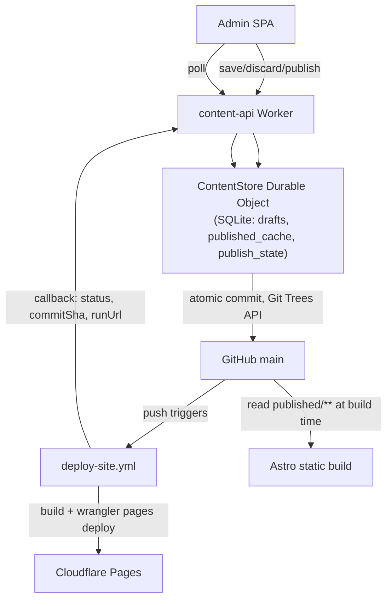
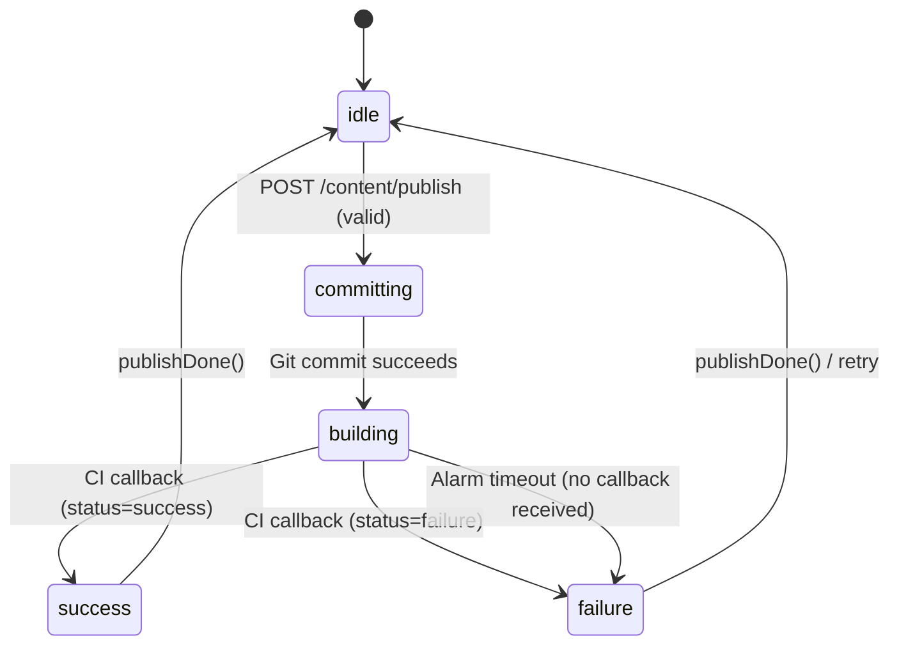

# Admin content storage and publish architecture — final spec

Canonical design reference for replacing GitHub-as-a-database with a SQLite-backed ContentStore Durable Object. See also [architecture.md](./architecture.md) for the current platform overview.

**Status:** Phases A–B implemented in the worker; Phases C–F pending.

---

## Decisions locked for this build

| Decision | Answer | Why |
|---|---|---|
| Draft storage | SQLite-backed Durable Object (`ContentStore`) | Strongly consistent, real SQL for history, 30-day point-in-time recovery built in, same primitive already needed for write-serialization — no second storage service |
| Published storage | Unchanged — git, `apps/static/content/published/**` | Astro build stays untouched; static-site delivery for low-bandwidth users is protected |
| Publish atomicity | One commit via Git Trees API for es/en/settings | Eliminates partial-publish; replaces the 3-commit loop |
| Publish lock | Durable Object serializes; 409 if a publish is already in flight | This is what actually prevents double-click/double-publish — not a disabled button |
| Deploy status | Overlay waits for real Cloudflare Pages deploy result, not just commit success | `deploy-site.yml` runs `wrangler pages deploy` itself, so the workflow can report its own outcome directly |
| Deploy status mechanism | Workflow callback step (`if: always()`), not a webhook subscription or polling loop | Lowest resource use, most reliable — no missed webhook deliveries, no GitHub API polling quota, no extra infra to operate |
| Draft concurrency | Last-write-wins (DO's natural request ordering) | Small team, low risk; reserve strict conflict checks for publish only |
| Draft conflict UX | Keep existing 409-after-save-attempt behavior | Acceptable for a 2-3 person team at this stage |
| Settings in review | Included in diff/validation/missing-translation checks | It's part of the same atomic publish commit; excluding it was a prototype shortcut |
| Migration cutover | None needed | No live users yet |
| Terraform | Out of scope for this work | Terraform manages AWS only; Cloudflare resources are `wrangler.toml`-only |
| Version/restore UI | Deferred | SQLite DO storage gives you the raw capability (SQL history + 30-day PITR) for free; building the actual "view/restore" screen is a later phase |

## Architecture overview



Astro, the CDN delivery, and the marketing site's fast-load characteristics for low-bandwidth users are **not touched by this work**. Only the admin's draft/publish path changes.

## `ContentStore` Durable Object

One singleton instance (`idFromName("bonae-content")` or equivalent fixed name) — there's a single site, no per-tenant sharding needed.

Use `new_sqlite_classes` in the Wrangler config (SQLite storage is the current GA recommendation for new Durable Object classes — not the legacy KV-backed storage).

### Tables

```sql
CREATE TABLE drafts (
  locale TEXT PRIMARY KEY,        -- 'es' | 'en' | 'settings'
  content TEXT NOT NULL,          -- JSON blob
  updated_at INTEGER NOT NULL
);

CREATE TABLE published_cache (
  locale TEXT PRIMARY KEY,
  content TEXT NOT NULL,
  commit_sha TEXT,
  updated_at INTEGER NOT NULL
);

CREATE TABLE publish_state (
  id INTEGER PRIMARY KEY CHECK (id = 1),  -- single row
  state TEXT NOT NULL,             -- idle | committing | building | success | failure
  commit_sha TEXT,
  run_url TEXT,
  started_at INTEGER,
  finished_at INTEGER,
  error TEXT
);
```

Note: `PRAGMA user_version` is **not** supported on Durable Objects SQLite storage — track schema version with a manual `_sql_schema_migrations` table (or a small migration helper) instead of relying on that pragma.

### Responsibilities

- **Single-writer queue** for every draft save, discard, and publish call — this is your race-condition fix. Requests to the same DO instance are naturally serialized.
- **Cold-start bootstrap**: on first access (use `blockConcurrencyWhile()` in the constructor), fetch `published/{es,en,settings}.json` from GitHub once, seed `published_cache`, and seed `drafts` from the same content if `drafts` is empty.
- **Owns the publish lock and state machine** — see below.
- **Publish timeout safety net**: when a publish moves to `committing`, schedule a DO Alarm for a generous multiple of your typical Astro build time (e.g., current build time + buffer). If the callback hasn't arrived by then, the alarm fires, sets state to `failure` with a timeout error, and releases the lock. Without this, a lost callback (network blip, runner crash before the callback step) leaves publishing permanently stuck.

## API endpoints

| Method & path | Body | Returns | Notes |
|---|---|---|---|
| `GET /content/state` | — | `{ draft: {es,en,settings}, published: {es,en,settings}, lastPublishedAt, lastCommitSha, publishState }` | Bootstrap call on admin load. `publishState` lets a second tab reflect an in-flight publish immediately. |
| `PUT /content/drafts/:locale` | full document | `{ savedAt }` | Backs **both** manual Save draft and debounced autosave — same endpoint either way. Always succeeds; drafts may be incomplete. Last-write-wins, no version check. |
| `POST /content/drafts/discard` | — | `{ discarded: true }` | Resets all three drafts from `published_cache`. Backs "Discard all drafts." |
| `POST /content/drafts/discard-section` | `{ section }` | `{ discarded: true }` | Resets that section in **both** `es` and `en` drafts from `published_cache` (matches existing UX — sections reset across locales together; `settings` isn't sectioned this way). |
| `POST /content/publish` | — | `{ accepted: true }` or `409` if already in flight | Server re-validates es/en/settings against the shared zod schemas (the real gate — never trust client-side validation alone). If invalid: `422 { errors }`. If valid: builds the atomic Git Trees API commit, sets state `committing` → `building`, schedules the timeout alarm, returns immediately. Client polls for progress. |
| `GET /content/publish/status` | — | `{ state, commitSha, runUrl, error }` | Cheap DO read, safe to poll every 1-2s while `isPublishing`. |
| `POST /content/publish/callback` | `{ commitSha, status, runUrl }` | `204` | Called by the CI workflow's final step, `if: always()`. Auth via a bearer token shared secret (`PUBLISH_CALLBACK_SECRET`), not a generic webhook HMAC scheme — simpler, and you control both ends. Matches by `commitSha` against the DO's current `publish_state`. On success: updates `published_cache` from the just-published drafts, sets state `success`. On failure: sets state `failure`, stores `runUrl` and `error` for the admin to see. |

## Publish state machine



**Important ordering rule:** `published_cache` is updated only on the `success` transition, never at `committing`. If the build fails, the commit is already on `main`, but the live site never picked it up — updating the cache early would make "Discard all drafts" reset against content that isn't actually live.

## CI workflow change

Add a final step to `.github/workflows/deploy-site.yml`, after the existing `wrangler pages deploy` step:

```yaml
- name: Report deploy status
  if: always()
  run: |
    curl -sf -X POST "$CONTENT_API_URL/content/publish/callback" \
      -H "Authorization: Bearer $PUBLISH_CALLBACK_SECRET" \
      -H "Content-Type: application/json" \
      -d "{\"commitSha\":\"${{ github.sha }}\",\"status\":\"${{ job.status }}\",\"runUrl\":\"${{ github.server_url }}/${{ github.repository }}/actions/runs/${{ github.run_id }}\"}"
  env:
    CONTENT_API_URL: ${{ secrets.CONTENT_API_URL }}
    PUBLISH_CALLBACK_SECRET: ${{ secrets.PUBLISH_CALLBACK_SECRET }}
```

`job.status` gives `success`/`failure`/`cancelled` directly from the runner — no extra API call needed to determine outcome. `github.sha` on this workflow run is exactly the commit the publish endpoint created, so matching in the DO is unambiguous.

Also narrow the existing trigger so draft activity (which no longer touches git at all once Phase B ships) can't cause a rebuild:

```yaml
on:
  push:
    branches: [main]
    paths:
      - 'apps/static/content/published/**'
      - 'packages/content/**'
```

Add `PUBLISH_CALLBACK_SECRET` as both a GitHub Actions secret and a Wrangler secret — generate it fresh, don't reuse another credential.

## Client-side responsibilities (admin app)

Keep diff, field validation, and missing-translation checks **client-side**, same as the prototype — the documents are small and the logic already exists. The one hard rule: `POST /content/publish` independently re-validates server-side as the actual gate, so a stale or bypassed client can never push invalid content live.

**Extend the existing diff/validate/missingTranslations logic to include `settings`** as its own review group, alongside Spanish (ES) and English (EN) — it was scoped out of the prototype but is part of the same atomic commit.

**Autosave:** debounced client-side timer (~2-3s after last edit) and the manual **Save draft** button both call `PUT /content/drafts/:locale`. No separate code paths.

**Publish overlay — three real stages, not two:**
- `committing` — "Saving your changes…"
- `building` — "Building your site…" (this stage can now last 30-90s for an Astro build; make sure the copy reflects that it's still working, not stuck)
- `success` — "Published!" (only shown once the CI callback confirms it)
- `failure` — clear failure state, link to `runUrl` for logs, release the lock so they can retry

Poll `GET /content/publish/status` while in `committing` or `building`.

## Out of scope for this phase (explicit, not oversights)

- Version/restore UI — SQLite DO storage plus 30-day point-in-time recovery gives you the capability for free; the actual browse/restore screen is a later phase.
- Per-key optimistic concurrency on draft saves — last-write-wins is the accepted tradeoff for now.
- "Someone else is editing this" live presence indicator — the existing 409-on-save-conflict behavior is accepted as-is for a small team.

## Key files to touch

| Area | Files |
|---|---|
| Durable Object | `workers/content-api/src/content-store/` (SQLite DO), `wrangler.toml` binding + `new_sqlite_classes` migration |
| Worker routes | `workers/content-api/src/routes.ts`, remove direct GitHub Contents API calls for drafts from `github.ts`, add Git Trees API commit helper |
| CI | `.github/workflows/deploy-site.yml` |
| Admin UX | `apps/admin/src/ui/Dashboard.tsx`, section forms (`key={locale}` fix), new `useContentSave.ts` / `usePublishStatus.ts` hooks, `apps/admin/src/infrastructure/contentApi.ts` |
| Mock dev | `apps/admin/vite.mockApi.ts` — simulate the same state machine states |
| Docs | `docs/architecture.md` |
| Secrets | `PUBLISH_CALLBACK_SECRET` in both GitHub Actions and Wrangler |

No Terraform changes — confirmed out of scope.

## Implementation phases

| Phase | Scope |
|-------|-------|
| A | ContentStore Durable Object (SQLite), schema migrations, cold-start bootstrap from git |
| B | Worker routes: `GET /content/state`, draft save/discard endpoints |
| C | Publish state machine, Git Trees API commit, alarm timeout |
| D | CI callback step in `deploy-site.yml`, narrowed path triggers |
| E | Admin autosave, settings in review, three-stage publish overlay |
| F | Mock API parity + `docs/architecture.md` update |

## Tips for building with Cursor

- **Build bottom-up, not top-down**: the Durable Object's state machine logic is pure and unit-testable without any network calls — write and test it first, in isolation, before wiring Worker routes or UI. Feed Cursor one phase at a time rather than this whole spec in one prompt.
- **Define shared types before writing either side.** Put the draft document shape and the publish-state shape in `@bonae/content` so the Worker and the admin app import the same types instead of hand-copying interfaces that will drift.
- **Write the SQL schema and a tiny migration tracker first.** Since `PRAGMA user_version` isn't available on DO SQLite, scaffold a `_sql_schema_migrations` table before writing any table-creation logic.
- **Update the mock (`vite.mockApi.ts`) in the same phase as the real endpoint**, not afterward — have it simulate the `committing → building → success/failure` timing so the overlay is demoable before the real GitHub Actions callback exists.
- **Test the alarm-based timeout path deliberately** — it's the one failure mode with no natural trigger in day-to-day use.
- **Double-check your Workers plan supports SQLite-backed Durable Objects** before Phase A.
