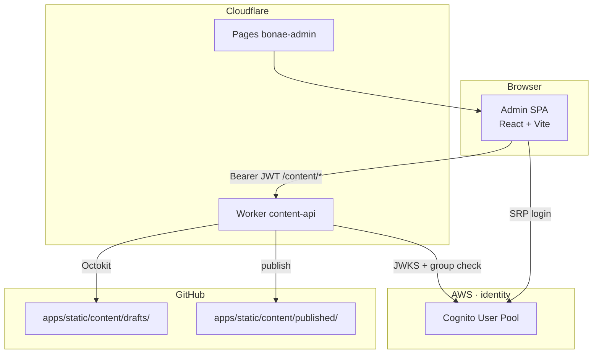

# Admin SPA — Architecture

How the content admin SPA (`apps/admin/`) works with the shared content package (`packages/content/`) and the content API Cloudflare Worker (`workers/content-api/`).

See also: [architecture.md](./architecture.md) for the full platform overview.

---

## Big picture

BONAE is a **git-backed content platform** with no database. Editors use a React admin SPA with Cognito login; a Cloudflare Worker commits changes to GitHub; the marketing site reads only `published/` at build time.



---

## The four main pieces

### 1. `packages/content` — shared contract

Single source of truth for content shape and validation. Built to `dist/` and imported by admin, Worker, and Astro site.

### 2. `apps/admin` — the SPA

| Mode | Auth | API target |
|------|------|------------|
| **Mock** (`VITE_USE_MOCK=true`) | Fake session | Vite plugin writes to disk |
| **Production** | Cognito SRP (`amazon-cognito-identity-js`) | Same-origin `/content/*` via Pages service binding |

Key layers:

- **`config.ts`** — Cognito IDs at build time; `apiBaseUrl` empty for same-origin
- **`infrastructure/auth.cognito.ts`** — login, logout, 1-hour session expiry (no refresh tokens)
- **`infrastructure/contentApi.ts`** — `fetch()` with Bearer JWT; 401 triggers logout
- **`functions/content/_middleware.ts`** — Pages middleware proxies `/content/*` to Worker binding

Hosted on **Cloudflare Pages** (`bonae-admin`), not S3/CloudFront.

### 3. `workers/content-api` — the API

Cloudflare Worker with permanent Cognito JWKS verification:

| Module | Role |
|--------|------|
| `src/auth/cognito.ts` | Verify JWT (`jose` + Cognito JWKS) |
| `src/auth/authorize.ts` | `Administrators` group today; tenant hooks for future multi-tenant |
| `src/routes.ts` | Content routes + `@bonae/content` validation |
| `src/github.ts` | Octokit GitHub App client |

Routes: `GET/PUT /content/drafts/{es|en|settings}`, `GET /content/published/{...}`, `POST /content/publish`.

### 4. Cognito — identity (AWS)

Invite-only user pool. SPA client uses SRP auth with 1-hour ID tokens and **no refresh tokens**. Worker verifies tokens cryptographically on every request.

---

## Security model

1. **Cognito** — invite-only, password policy, `Administrators` group
2. **SPA** — session expiry monitoring; explicit logout; no silent refresh
3. **Worker** — JWKS verification + `requireAuthorized()` on every mutating request
4. **GitHub App** — scoped credentials in Worker secrets only

---

## Deployment

From repository root:

```bash
make build-all
make deploy-worker   # deploy API first (Pages binding depends on it)
make deploy-admin
```

Or use GitHub Actions **Deploy** workflow with target `all`.

See [admin-cutover.md](./admin-cutover.md) for production cutover steps.
