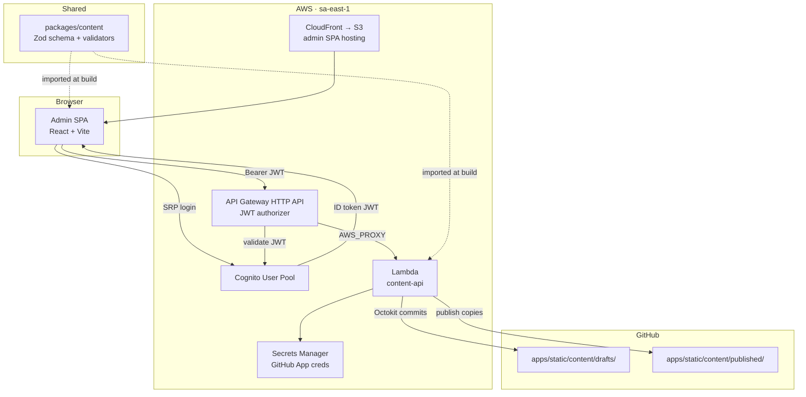
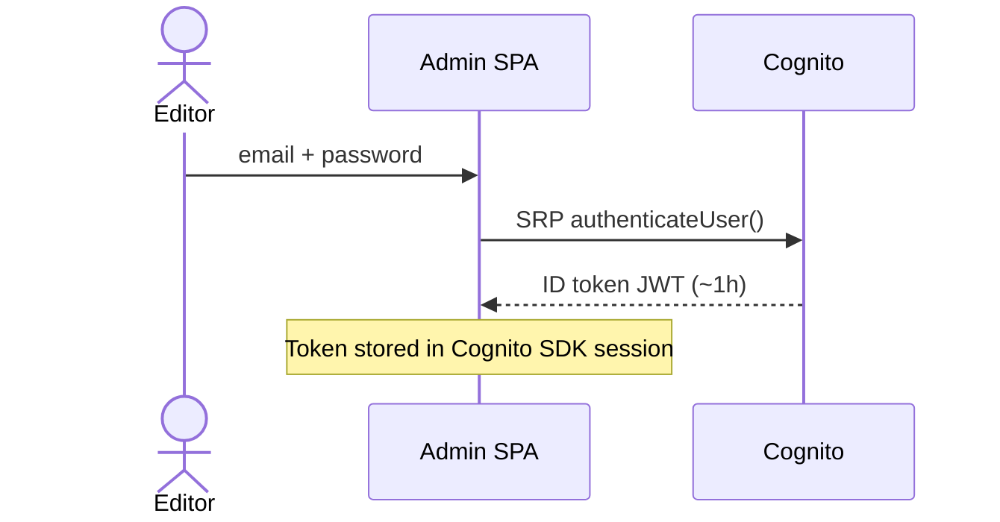
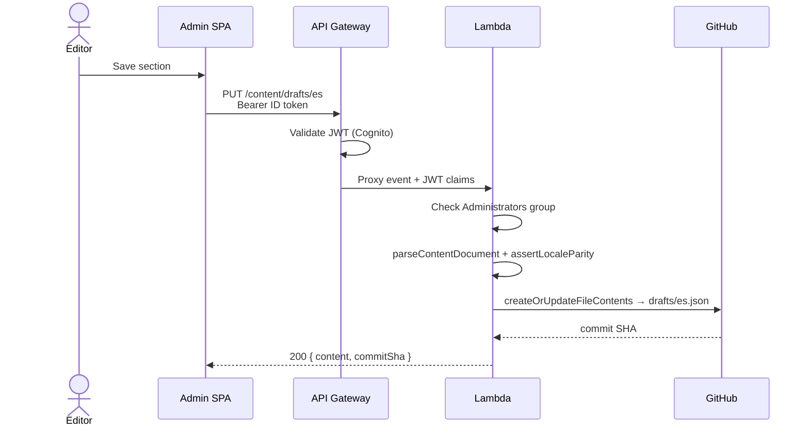
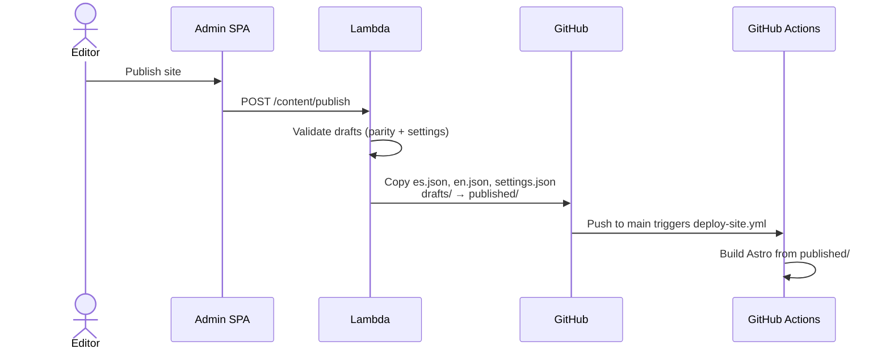

# Admin SPA — Architecture

How the content admin SPA (`apps/admin/`) works with the shared content package (`packages/content/`), API Gateway, and the content-api Lambda (`services/content-api/`).

See also: [architecture.md](./architecture.md) for the full platform overview, CI/CD, and infrastructure maintenance.

---

## Big picture

BONAE is a **git-backed content platform** with no database. Editors use a React admin SPA to change JSON copy; a Lambda behind API Gateway commits those changes to GitHub; the marketing site reads only `published/` at build time.



---

## The four main pieces

### 1. `packages/content` — shared contract

This is the **single source of truth** for content shape and validation. It is not deployed; it is compiled to `dist/` and imported by the admin, Lambda, and Astro site.

| Export | Used by |
|--------|---------|
| `ContentDocument`, `SiteSettings` | Admin forms, Lambda validation |
| `parseContentDocument`, `parseSiteSettings` | Lambda on every save/publish |
| `assertLocaleParity` | Lambda on draft save + publish (ES/EN must match structurally) |

Build order matters: **`packages/content` must be built before** admin, Lambda, or static site builds.

### 2. `apps/admin` — the SPA

A client-only React app (Vite) with two runtime modes:

| Mode | Auth | API target |
|------|------|------------|
| **Mock** (`VITE_USE_MOCK=true`) | Fake session in `sessionStorage` | Vite dev plugin writes directly to `apps/static/content/` on disk |
| **Production / real dev** | Cognito SRP via `amazon-cognito-identity-js` | API Gateway URL from `VITE_API_BASE_URL` |

Key layers:

- **`config.ts`** — reads build-time env vars (`VITE_API_BASE_URL`, Cognito IDs, mock flag)
- **`infrastructure/auth.ts`** — lazy-loads `auth.mock.ts` or `auth.cognito.ts`
- **`infrastructure/contentApi.ts`** — thin `fetch()` wrapper; attaches Cognito ID token as `Authorization: Bearer …`
- **`ui/Dashboard.tsx`** — section editors that call `fetchDraft`, `saveDraft`, `publishContent`

The SPA is hosted on **S3 + CloudFront** (not served by Lambda). Cognito and API URLs are **baked in at build time** by `deploy-admin.yml`.

### 3. API Gateway — auth gate + routing

Terraform defines an **HTTP API** (`bonae-content-api`) with:

- **CORS** for the admin CloudFront origin
- **JWT authorizer** — validates Cognito ID tokens (issuer + audience) before any route reaches Lambda
- **AWS_PROXY integration** — forwards the full request to Lambda

Authenticated routes:

| Method | Path |
|--------|------|
| `GET` | `/content/drafts/{locale}` |
| `PUT` | `/content/drafts/{locale}` |
| `GET` | `/content/published/{locale}` |
| `POST` | `/content/publish` |

`{locale}` is `es`, `en`, or `settings`. API Gateway handles JWT validation; Lambda does a **second check** that the user is in the `Administrators` Cognito group.

### 4. `services/content-api` — the Lambda

One handler (`handler.ts`), bundled with esbuild, deployed as `bonae-content-api` (Node 20).

**Per request:**

1. Handle `OPTIONS` for CORS preflight
2. Read JWT claims from API Gateway authorizer context → require `Administrators` group
3. Load GitHub App credentials from **Secrets Manager** (cached in-process for warm invocations)
4. Create an Octokit client authenticated as the GitHub App installation
5. Route by method + path:
   - **GET draft/published** — read JSON from `apps/static/content/{tier}/{file}.json` via GitHub Contents API
   - **PUT draft** — validate with `@bonae/content`, check locale parity against the other locale's draft, commit to `drafts/`
   - **POST publish** — validate ES/EN parity + settings, copy all three draft files → `published/` (three commits)

The Lambda never touches S3 or a DB. **GitHub is the content store.**

---

## End-to-end flows

### Sign in



First-time invited users hit `NEW_PASSWORD_REQUIRED`; the SPA prompts for a permanent password via `completeNewPasswordChallenge`.

### Save draft



### Publish



---

## Security model (two layers)

| Layer | What it enforces |
|-------|------------------|
| **API Gateway JWT authorizer** | Valid, non-expired Cognito token from the correct user pool client |
| **Lambda `requireAdmin()`** | Token's `cognito:groups` includes `Administrators` |

GitHub App credentials live in Secrets Manager; the Lambda IAM role can only `GetSecretValue` on that secret. Editors never see GitHub tokens — the SPA only ever holds a Cognito ID token.

---

## Local dev vs production

| Concern | Mock mode | Real mode |
|---------|-----------|-----------|
| Auth | Any email/password | Cognito `Administrators` user |
| API | Vite plugin on localhost | API Gateway + Lambda |
| Content writes | Direct to disk | Git commits via GitHub App |
| `@bonae/content` | Same validation in mock plugin | Same validation in Lambda |

```bash
# Mock — no AWS required
npm run admin:dev:mock

# Real — requires apps/admin/.env with Cognito + API config
npm run admin:dev
```

---

## How deployments connect

```
packages/content build
        ↓
apps/admin build (VITE_* from Terraform outputs)
        ↓
S3 sync + CloudFront invalidation     ← admin SPA

services/content-api build
        ↓
Terraform zips dist/ → Lambda deploy  ← API

Terraform outputs → GitHub repo vars:
  API_BASE_URL, COGNITO_*, ADMIN_S3_BUCKET, etc.
        ↓
Next admin build picks up new config
```

---

## Design takeaway

The admin SPA is a **thin UI client**. It does not write to git itself in production — it only talks HTTP to API Gateway with a Cognito token. API Gateway validates identity; Lambda validates authorization and business rules via `packages/content`, then acts as a **GitHub proxy** using a GitHub App. That keeps AWS minimal (Cognito + API GW + Lambda + Secrets Manager + static hosting) while git remains the durable content store and audit trail.

---

## Related docs

| Doc | Contents |
|-----|----------|
| [architecture.md](./architecture.md) | Full system architecture, CI/CD, maintenance |
| [apps/admin/README.md](../apps/admin/README.md) | Admin SPA setup, file tree, editor workflow |
| [services/content-api/README.md](../services/content-api/README.md) | Lambda build, API routes |
| [packages/content/README.md](../packages/content/README.md) | Schema exports and validation CLI |
