# BONAE Tech — Architecture & Operations

This document describes the full system architecture, cloud infrastructure, CI/CD pipelines, and maintenance processes for the BONAE Tech platform.

---

## Table of contents

1. [System overview](#1-system-overview)
2. [Workspaces](#2-workspaces)
3. [Cloud infrastructure](#3-cloud-infrastructure)
4. [Data flows](#4-data-flows)
5. [CI/CD pipelines](#5-cicd-pipelines)
6. [Maintenance processes](#6-maintenance-processes)

---

## 1. System overview

BONAE Tech is a **git-backed content platform**. All site copy lives as JSON files committed to this repository. There is no database — the git history is the content store.


### Key design decisions

- **No database.** Content is JSON in git. The git log is the audit trail.
- **No runtime server for marketing.** The site is static HTML on Cloudflare Pages.
- **Hybrid cloud.** Cognito on AWS for identity; Cloudflare Pages + Worker for admin hosting and API.
- **Invite-only admin.** No self-sign-up. Users are created via CLI and added to the `Administrators` Cognito group.
- **Locale parity enforced.** ES and EN documents must have matching structure at all times. The API rejects saves that break parity.

---

## 2. Workspaces

| Workspace | Path | Runtime | Deployed to |
|-----------|------|---------|-------------|
| Marketing site | `apps/static/` | Astro 4 + Tailwind | Cloudflare Pages `bonae-tech` |
| Content admin SPA | `apps/admin/` | React + Vite | Cloudflare Pages `bonae-admin` |
| Shared content schema | `packages/content/` | TypeScript → `dist/` | (not deployed — shared library) |
| Content API | `workers/content-api/` | Cloudflare Worker | `bonae-content-api` Worker |
| Infrastructure | `infra/terraform/` | Terraform | Cognito only (AWS sa-east-1) |

### Build dependency order

`packages/content` **must be compiled before** anything that imports it. All workspaces import from `packages/content/dist/`.

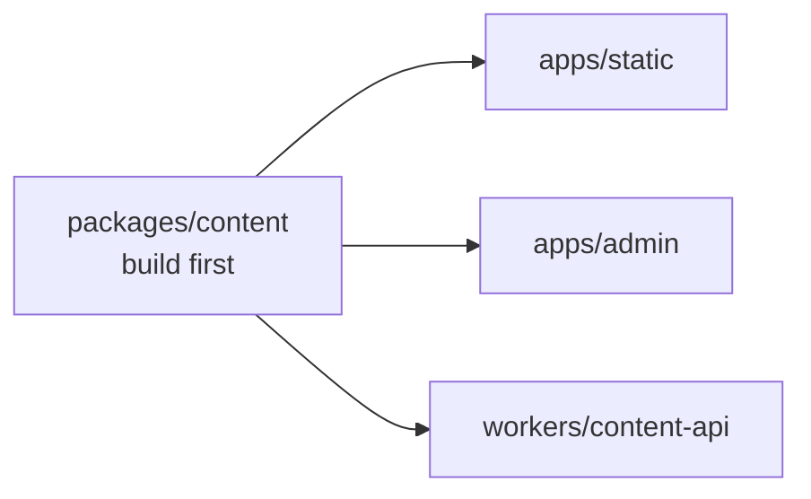

The root scripts (`admin:dev:mock`, `worker:build`) handle this automatically. When running steps manually, always run `npm run content:build` first.

---

## 3. Cloud infrastructure

### 3.1 AWS resources (sa-east-1)

All resources are in the `sa-east-1` (São Paulo) region.

#### Bootstrap resources (one-time, local Terraform state)

| Resource | Name | Purpose |
|----------|------|---------|
| S3 bucket | `bonae-terraform-state-112066795953` | Remote state for main Terraform module |
| DynamoDB table | `bonae-terraform-locks` | State locking |
| IAM OIDC provider | `token.actions.githubusercontent.com` | Allows GitHub Actions to assume IAM roles |
| IAM role | `github-actions-bonae-deploy` | Role assumed by GitHub Actions for all deploys |

The bootstrap state file lives at `infra/terraform/bootstrap/terraform.tfstate` (local, gitignored). Keep it — it is needed to manage these resources.

#### Main module resources (managed by CI after first apply)

**Auth**

| Resource | Name | Purpose |
|----------|------|---------|
| Cognito User Pool | `bonae-content-admins` | Stores admin user accounts |
| User Pool Client | `bonae-content-admin-spa` | SPA auth client (SRP flow, no client secret) |
| User Group | `Administrators` | Users in this group may call the content API |

- `allow_admin_create_user_only = true` — no self-registration
- Users receive a temporary password by email and must set a permanent one on first login (FORCE_CHANGE_PASSWORD flow)
- ID tokens expire after 1 hour; refresh tokens are disabled

**Terraform state (used by main module)**

| Resource | Name | Purpose |
|----------|------|---------|
| S3 bucket | `bonae-terraform-state-112066795953` | Created by bootstrap; used as backend |
| DynamoDB | `bonae-terraform-locks` | Created by bootstrap; used for locking |

Legacy AWS resources (API Gateway, Lambda, S3 admin bucket, CloudFront) were removed from Terraform. If they still exist in AWS from a previous apply, destroy them after cutover — see [admin-cutover.md](./admin-cutover.md).

### 3.2 Cloudflare

| Resource | Name | Purpose |
|----------|------|---------|
| Pages project | `bonae-tech` | Hosts the built Astro marketing site |
| Pages project | `bonae-admin` | Hosts the admin SPA; `/content/*` proxied to Worker via service binding |
| Worker | `bonae-content-api` | Content API — Cognito JWT verification, GitHub App commits |
| Pages build config | `wrangler.toml` (repo root) | Marketing site build; ensures `packages/content` is compiled first |
| Pages build config | `apps/admin/wrangler.toml` | Admin SPA build output + `CONTENT_API` service binding |

The root `wrangler.toml` sets:
- **Build command:** `npm run content:build && npm run build`
- **Output directory:** `apps/static/dist`

Production deployments use `wrangler pages deploy` from GitHub Actions (`deploy-site.yml`, `deploy-admin.yml`). The admin Pages project includes `functions/content/_middleware.ts`, which forwards `/content/*` to the `bonae-content-api` Worker binding.

Worker secrets (`GITHUB_APP_ID`, `GITHUB_INSTALLATION_ID`, `GITHUB_PRIVATE_KEY`) are set via `wrangler secret put`. Cognito pool/client IDs are passed as Worker vars at deploy time.

### 3.3 GitHub configuration

**Secrets** (set by bootstrap Terraform, or manually):

| Secret | Set by | Used by |
|--------|--------|---------|
| `AWS_ROLE_ARN` | bootstrap Terraform | All AWS workflows |
| `AWS_REGION` | bootstrap Terraform | All AWS workflows |
| `CLOUDFLARE_API_TOKEN` | manual (environment secret on `prod`) | Cloudflare deploy workflows |
| `CLOUDFLARE_ACCOUNT_ID` | manual (environment secret on `prod`) | Cloudflare deploy workflows |
| `GH_REPO_VARIABLES_TOKEN` | manual | `deploy-cognito.yml` (store Terraform outputs) |

**Repository variables** (set automatically after each `deploy-cognito` run):

| Variable | Set by | Used by |
|----------|--------|---------|
| `COGNITO_USER_POOL_ID` | `deploy-cognito.yml` | `deploy-admin.yml`, `deploy-worker.yml` |
| `COGNITO_CLIENT_ID` | `deploy-cognito.yml` | `deploy-admin.yml`, `deploy-worker.yml` |
| `API_BASE_URL` | optional / legacy | Leave empty for same-origin `/content/*` on Pages |

**Environments:**

| Environment | Branch restriction | Purpose |
|-------------|-------------------|---------|
| `infra-production` | `main` | Gates `terraform apply` — add required reviewers in GitHub Settings → Environments |

**GitHub App (`bonae-content-api`):**

- Permission: `Contents: Read & Write` on `mpiantella/bonae`
- Credentials stored as Cloudflare Worker secrets
- Used exclusively by the content API Worker to commit content JSON to the repository
- Not created by Terraform — must be created manually via GitHub Settings → Developer settings → GitHub Apps

---

## 4. Data flows

### 4.1 Content editing (admin → draft)

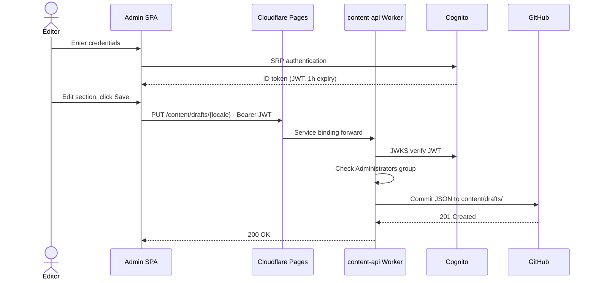

### 4.2 Publishing content (draft → published → site rebuild)

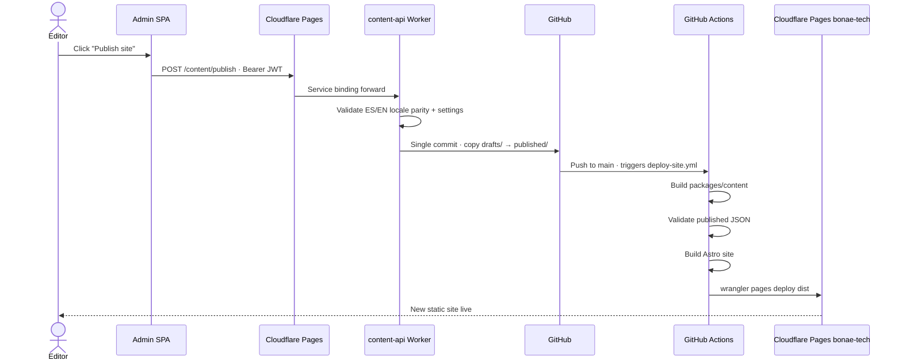

### 4.3 Authentication — first login (invite flow)

New users are created via AWS CLI and receive a temporary password by email. Cognito returns `NEW_PASSWORD_REQUIRED` on first sign-in, which the admin SPA handles automatically.

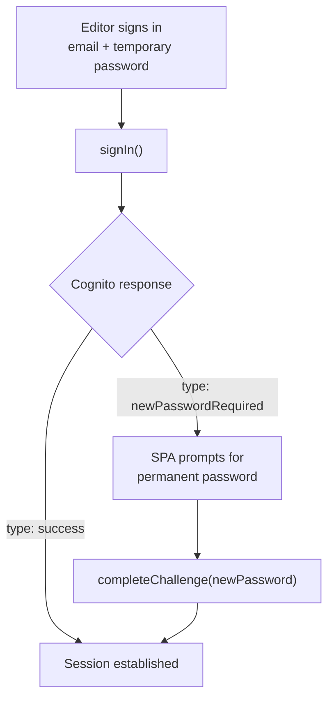

### 4.4 Admin SPA — request path

The admin SPA is a client-side React app. Vite inlines Cognito and API config at **build time** from environment variables injected by `deploy-admin.yml`.

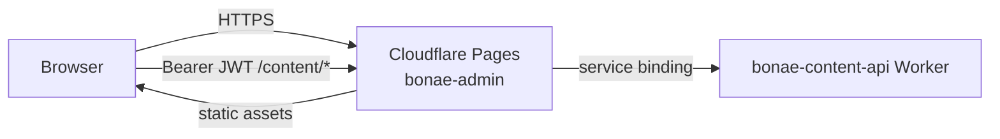

---

## 5. CI/CD pipelines

All workflows live in `.github/workflows/`. Each targets a specific part of the monorepo via path filters — unrelated changes do not trigger unrelated workflows.

### Trigger overview

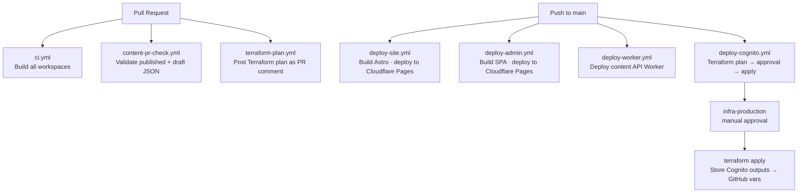

### Trigger matrix

| Workflow | Push to `main` | Pull request | Manual (`workflow_dispatch`) |
|----------|---------------|-------------|------|
| `ci.yml` | ✓ code paths | ✓ code paths | — |
| `content-pr-check.yml` | — | ✓ content paths | — |
| `deploy-site.yml` | ✓ site + content paths | — | ✓ |
| `deploy-admin.yml` | ✓ admin + content paths | — | ✓ |
| `deploy-worker.yml` | ✓ worker + content paths | — | ✓ |
| `deploy-cognito.yml` | ✓ cognito.tf paths | — | ✓ |
| `terraform-plan.yml` | — | ✓ infra paths | — |
| `deploy.yml` | — | — | ✓ (orchestrator) |

### `ci.yml` — Build verification

**Paths:** `apps/static/**`, `apps/admin/**`, `packages/content/**`, `workers/content-api/**`

Builds all workspaces in dependency order and validates published content. Uses npm caching across all four `package-lock.json` files.

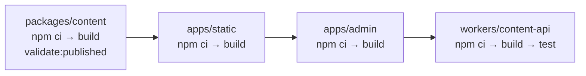

### `content-pr-check.yml` — Content validation

**Paths:** `apps/static/content/**`, `packages/content/**`

Validates both published and draft JSON against the Zod schema and checks ES/EN locale parity.

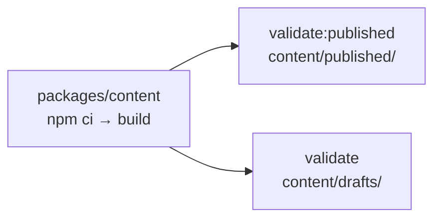

### `deploy-site.yml` — Marketing site deploy

**Paths:** `apps/static/**`, `packages/content/**`
**Secrets:** `CLOUDFLARE_API_TOKEN`, `CLOUDFLARE_ACCOUNT_ID` (both as **prod** environment secrets; the deploy job declares `environment: prod`)

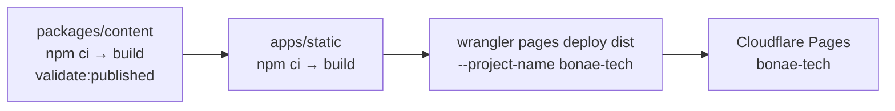

Uses a `concurrency` group (`deploy-site`) so concurrent runs queue rather than race.

### `deploy-admin.yml` — Admin SPA deploy

**Paths:** `apps/admin/**`, `packages/content/**`
**Secrets:** `CLOUDFLARE_API_TOKEN`, `CLOUDFLARE_ACCOUNT_ID`
**Variables:** `COGNITO_USER_POOL_ID`, `COGNITO_CLIENT_ID`, `API_BASE_URL` (optional)

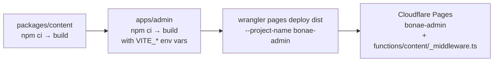

### `deploy-worker.yml` — Content API Worker deploy

**Paths:** `workers/content-api/**`, `packages/content/**`
**Secrets:** `CLOUDFLARE_API_TOKEN`, `CLOUDFLARE_ACCOUNT_ID`
**Variables:** `COGNITO_USER_POOL_ID`, `COGNITO_CLIENT_ID`

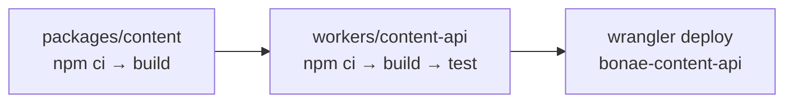

### `terraform-plan.yml` — Infrastructure plan on PRs

**Paths:** `infra/terraform/**`
**Secrets:** `AWS_ROLE_ARN`, `AWS_REGION`

Runs `terraform plan` on Cognito-only module and posts the diff as a PR comment.

### `deploy-cognito.yml` — Cognito infrastructure apply

**Paths:** `infra/terraform/cognito.tf`, related Terraform files
**Secrets:** `AWS_ROLE_ARN`, `AWS_REGION`, `GH_REPO_VARIABLES_TOKEN`
**Permissions:** `id-token: write` (OIDC), `actions: write` (to set repo variables)

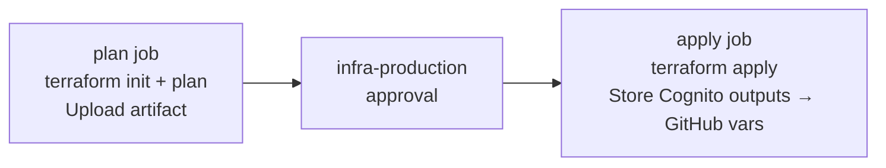

---

## 6. Maintenance processes

### Content workflow (routine)

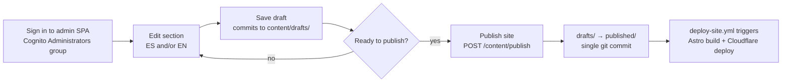

### Adding a Cognito user

```bash
POOL_ID=$(cd infra/terraform && terraform output -raw user_pool_id)
REGION=sa-east-1

aws cognito-idp admin-create-user \
  --user-pool-id $POOL_ID \
  --username editor@example.com \
  --desired-delivery-mediums EMAIL \
  --region $REGION

aws cognito-idp admin-add-user-to-group \
  --user-pool-id $POOL_ID \
  --username editor@example.com \
  --group-name Administrators \
  --region $REGION
```

The user receives a temporary password by email and is prompted to set a permanent one on first login.

### Rotating GitHub App credentials

The Worker reads GitHub App credentials from Cloudflare Worker secrets on every request.

```bash
cd workers/content-api
npx wrangler secret put GITHUB_APP_ID
npx wrangler secret put GITHUB_INSTALLATION_ID
npx wrangler secret put GITHUB_PRIVATE_KEY
```

No Worker redeploy is required for secret updates to take effect on the next request.

### Rotating the Cloudflare API token

1. Generate a new token in the Cloudflare dashboard with **Account → Cloudflare Pages → Edit** (and **Account → Account Settings → Read** if prompted)
2. Update `CLOUDFLARE_API_TOKEN` in GitHub Settings → Environments → **prod** → Environment secrets
3. The next `deploy-site.yml` run will use the new token

**Account ID (required for CI):** Wrangler needs `CLOUDFLARE_ACCOUNT_ID` when using API tokens in GitHub Actions — otherwise it calls `/memberships` to look up the account, which fails with authentication error 10000. Add `CLOUDFLARE_ACCOUNT_ID` as a **prod** environment secret (find it in the Cloudflare dashboard sidebar on any account page). Alternative: add **User → Memberships → Read** to a user-owned API token instead of setting the account ID.

### Applying infrastructure changes

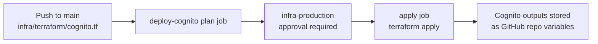

To apply locally:

```bash
cd infra/terraform
terraform plan
terraform apply
```

### Updating Terraform outputs after a manual apply

```bash
cd infra/terraform

gh variable set COGNITO_USER_POOL_ID --body "$(terraform output -raw user_pool_id)" -R mpiantella/bonae
gh variable set COGNITO_CLIENT_ID    --body "$(terraform output -raw user_pool_client_id)" -R mpiantella/bonae
```

Then trigger `deploy-admin.yml` and `deploy-worker.yml` so builds pick up the updated Cognito IDs.

### Validating content locally

```bash
# Validate published JSON (same check as prebuild hook)
npm run content:validate

# Validate draft JSON
npm --prefix packages/content run validate -- ../../apps/static/content drafts
```

### First-time bootstrap (new environment)

See [infra/README.md](../infra/README.md) for the full step-by-step guide. At a high level:

1. Run `infra/terraform/bootstrap/` once with personal AWS credentials
2. Apply Cognito Terraform (`deploy-cognito` workflow or local `terraform apply`)
3. Set Worker secrets via `wrangler secret put`
4. Deploy Worker, then admin Pages: `make deploy-all`
5. Create first Cognito user
6. Verify admin login and content save/publish flow

After bootstrap, Cognito changes are managed via `deploy-cognito.yml`.
