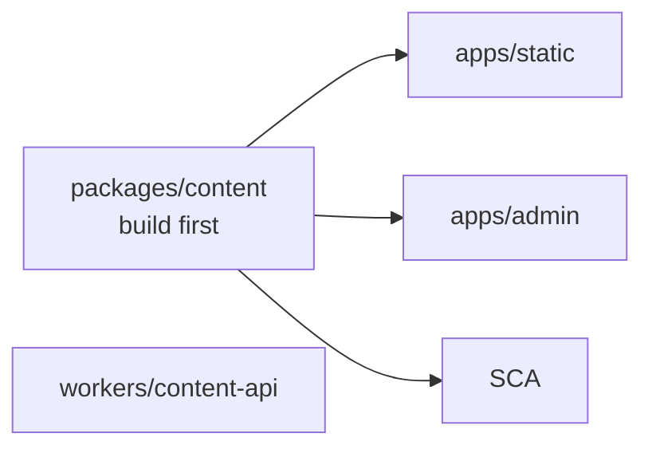
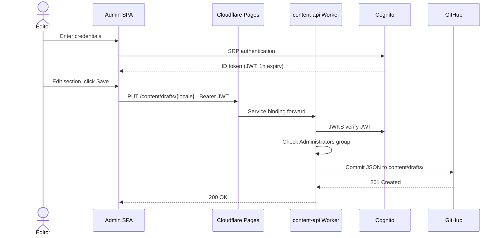
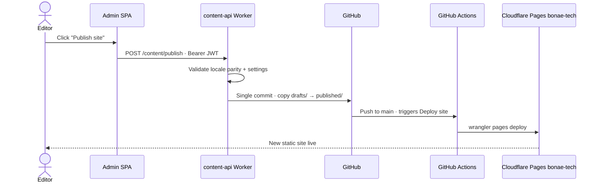
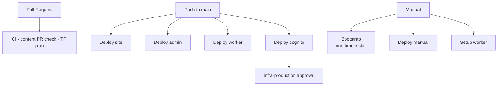

# BONAE Tech — Architecture

Platform design, infrastructure, data flows, and day-to-day operations. CI/CD workflow reference: [workflows.md](./workflows.md).

---

## Table of contents

1. [System overview](#1-system-overview)
2. [Workspaces](#2-workspaces)
3. [Cloud infrastructure](#3-cloud-infrastructure)
4. [Data flows](#4-data-flows)
5. [CI/CD](#5-cicd)
6. [Operations](#6-operations)

---

## 1. System overview

BONAE Tech is a **git-backed content platform**. All site copy lives as JSON files committed to this repository. There is no database — the git history is the content store.


### Key design decisions

- **No database.** Content is JSON in git. The git log is the audit trail.
- **No runtime server for marketing.** The site is static HTML on Cloudflare Pages.
- **Hybrid cloud.** Cognito on AWS for identity; Cloudflare Pages + Worker for admin hosting and API.
- **Invite-only admin.** No self-sign-up. Users are created via CLI and added to the `Administrators` Cognito group.
- **Locale parity enforced.** ES and EN documents must have matching structure at all times. The API rejects saves that break parity.

---

## 2. Workspaces

| Workspace | Path | Runtime | Deployed to |
|-----------|------|---------|-------------|
| Marketing site | `apps/static/` | Astro 4 + Tailwind | Cloudflare Pages `bonae-tech` |
| Content admin SPA | `apps/admin/` | React + Vite | Cloudflare Pages `bonae-admin` |
| Shared content schema | `packages/content/` | TypeScript → `dist/` | (shared library) |
| Content API | `workers/content-api/` | Cloudflare Worker | `bonae-content-api` |
| Infrastructure | `infra/terraform/` | Terraform | Cognito only (AWS sa-east-1) |

### Build dependency order

`packages/content` **must be compiled before** anything that imports it.



Root scripts handle this automatically. When running steps manually, run `npm run content:build` first.

### Admin SPA

| Mode | Auth | API target |
|------|------|------------|
| **Mock** (`VITE_USE_MOCK=true`) | Fake session | Vite plugin writes to disk |
| **Production** | Cognito SRP | Same-origin `/content/*` via Pages service binding |

Key pieces: `config.ts` (build-time Cognito IDs), `infrastructure/auth.cognito.ts` (SRP, 1-hour sessions, no refresh tokens), `infrastructure/contentApi.ts` (Bearer JWT), `functions/content/_middleware.ts` (proxies to Worker).

### Content API Worker

| Module | Role |
|--------|------|
| `src/auth/cognito.ts` | JWT verification via Cognito JWKS |
| `src/auth/authorize.ts` | `Administrators` group check |
| `src/routes.ts` | Content routes + `@bonae/content` validation |
| `src/github.ts` | Octokit GitHub App client |

Routes: `GET/PUT /content/drafts/{es|en|settings}`, `GET /content/published/{...}`, `POST /content/publish`.

### Security model

1. **Cognito** — invite-only, password policy, `Administrators` group
2. **SPA** — session expiry monitoring; explicit logout; no silent refresh
3. **Worker** — JWKS verification + authorization on every mutating request
4. **GitHub App** — scoped credentials in Worker secrets only

App-specific READMEs: [apps/admin/README.md](../apps/admin/README.md), [workers/content-api/README.md](../workers/content-api/README.md).

---

## 3. Cloud infrastructure

### 3.1 AWS (sa-east-1)

#### Bootstrap (one-time, local Terraform)

| Resource | Purpose |
|----------|---------|
| S3 bucket `bonae-terraform-state-*` | Remote state for main Terraform module |
| DynamoDB `bonae-terraform-locks` | State locking |
| IAM OIDC provider | GitHub Actions → AWS |
| IAM role `github-actions-bonae-deploy` | Role assumed by CI |

State file: `infra/terraform/bootstrap/terraform.tfstate` (local, gitignored — keep it).

#### Main module (Cognito — managed by CI)

| Resource | Purpose |
|----------|---------|
| Cognito User Pool `bonae-content-admins` | Admin accounts |
| SPA client `bonae-content-admin-spa` | SRP auth, no client secret |
| Group `Administrators` | API access |

Invite-only (`allow_admin_create_user_only = true`). ID tokens expire after 1 hour; refresh tokens disabled.

Legacy AWS resources (API Gateway, Lambda, S3 admin bucket, CloudFront) were removed from Terraform. Destroy any survivors in AWS after migrating to Cloudflare.

### 3.2 Cloudflare

| Resource | Purpose |
|----------|---------|
| Pages `bonae-tech` | Marketing site |
| Pages `bonae-admin` | Admin SPA; `/content/*` → Worker via service binding |
| Worker `bonae-content-api` | Content API |

Worker secrets synced from GitHub via **Setup worker**. Cognito IDs passed as Worker vars at deploy time.

### 3.3 GitHub configuration

| Secret / variable | Set by | Used for |
|-------------------|--------|----------|
| `AWS_ROLE_ARN`, `AWS_REGION` | bootstrap Terraform | Cognito workflows |
| `GH_REPO_VARIABLES_TOKEN` | manual | Deploy cognito |
| `CLOUDFLARE_*` | manual (prod env) | Cloudflare deploys |
| `WORKER_GITHUB_*` | manual (prod env) | Setup worker |
| `COGNITO_USER_POOL_ID`, `COGNITO_CLIENT_ID` | Deploy cognito | Admin build, Worker deploy |

| Environment | Purpose |
|-------------|---------|
| `infra-production` | Gates `terraform apply` — add required reviewers |
| `prod` | Exposes Cloudflare + Worker secrets to deploy jobs |

**GitHub App** — `Contents: Read & Write` on this repo. Created manually; credentials stored as Worker secrets via **Setup worker**.

Full secrets table: [workflows.md § Secrets](./workflows.md#secrets-and-variables).

---

## 4. Data flows

### Content editing (admin → draft)



### Publishing (draft → published → site rebuild)



### First login (invite flow)

New users receive a temporary password by email. Cognito returns `NEW_PASSWORD_REQUIRED`; the admin SPA prompts for a permanent password.

---

## 5. CI/CD

Workflow files: `.github/workflows/`. Full reference: **[workflows.md](./workflows.md)**.



**Install:** local Terraform bootstrap → **Bootstrap (one-time install)** in GitHub Actions.  
**Day-to-day:** push to `main` or **Deploy (manual)**.

---

## 6. Operations

### Content workflow

Sign in → edit ES/EN → **Save draft** (commits to `drafts/`) → **Publish** (copies `drafts/` → `published/`, triggers **Deploy site**).

### Adding a Cognito user

```bash
POOL_ID=$(cd infra/terraform && terraform output -raw user_pool_id)
REGION=sa-east-1

aws cognito-idp admin-create-user \
  --user-pool-id $POOL_ID \
  --username editor@example.com \
  --desired-delivery-mediums EMAIL \
  --region $REGION

aws cognito-idp admin-add-user-to-group \
  --user-pool-id $POOL_ID \
  --username editor@example.com \
  --group-name Administrators \
  --region $REGION
```

### Rotating credentials

| Credential | Action |
|------------|--------|
| GitHub App | Update `WORKER_GITHUB_*` prod secrets → **Setup worker** `sync-secrets` |
| Cloudflare API token | Regenerate token → update `CLOUDFLARE_API_TOKEN` on prod env |
| Cognito Terraform | Push TF changes or run **Deploy cognito** |

### Validating content locally

```bash
npm run content:validate
npm run validate -w @bonae/content -- apps/static/content drafts
```

### Custom domains

Add `admin.<domain>` and marketing domain on the respective Cloudflare Pages projects. Leave `API_BASE_URL` empty so the admin SPA uses same-origin `/content/*`.

### Local development

```bash
npm run dev:admin:mock    # admin SPA, no AWS
npm run dev:worker        # Worker (requires workers/content-api/.dev.vars)
npm run dev               # marketing site
```

See [workflows.md](./workflows.md) for install and deploy procedures.
