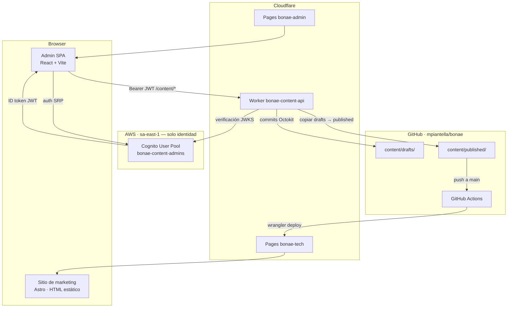
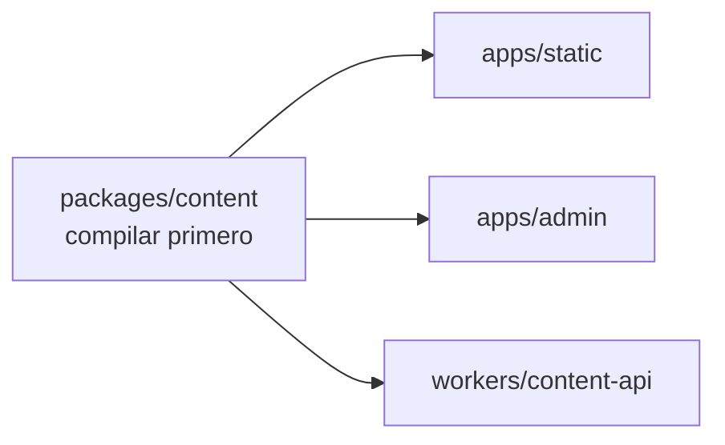
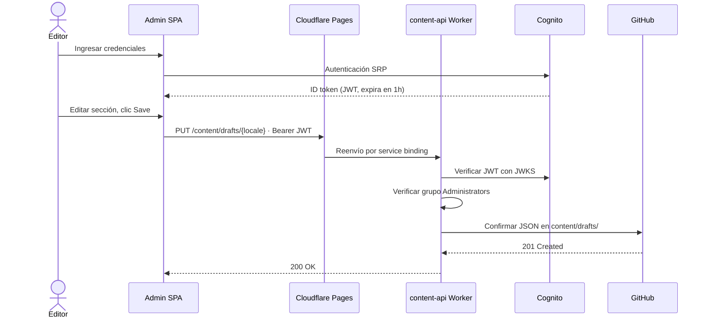
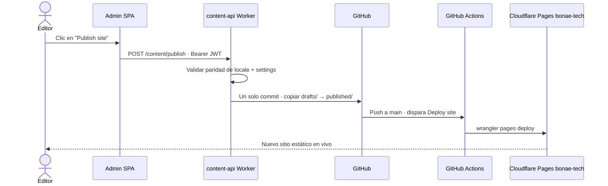

# BONAE Tech — Arquitectura

Diseño de la plataforma, infraestructura, flujos de datos y operaciones del día a día. Referencia de workflows CI/CD: [workflows.md](./workflows.md).

---

## Tabla de contenidos

1. [Vista general del sistema](#1-vista-general-del-sistema)
2. [Workspaces](#2-workspaces)
3. [Infraestructura en la nube](#3-infraestructura-en-la-nube)
4. [Flujos de datos](#4-flujos-de-datos)
5. [CI/CD](#5-cicd)
6. [Operaciones](#6-operaciones)

---

## 1. Vista general del sistema

BONAE Tech es una **plataforma de contenido respaldada por git**. Todo el copy del sitio vive como archivos JSON confirmados en este repositorio. No hay base de datos — el historial de git es el almacén de contenido.



### Decisiones de diseño clave

- **Sin base de datos.** El contenido es JSON en git. El log de git es la pista de auditoría.
- **Sin servidor en runtime para marketing.** El sitio es HTML estático en Cloudflare Pages.
- **Nube híbrida.** Cognito en AWS para identidad; Cloudflare Pages + Worker para hosting del admin y API.
- **Admin solo por invitación.** Sin auto-registro. Los usuarios se crean vía CLI y se agregan al grupo Cognito `Administrators`.
- **Paridad de locale aplicada.** Los documentos ES y EN deben tener estructura coincidente en todo momento. La API rechaza guardados que rompan la paridad.

---

## 2. Workspaces

| Workspace | Ruta | Runtime | Desplegado en |
|-----------|------|---------|-------------|
| Sitio de marketing | `apps/static/` | Astro 4 + Tailwind | Cloudflare Pages `bonae-tech` |
| Admin de contenido SPA | `apps/admin/` | React + Vite | Cloudflare Pages `bonae-admin` |
| Esquema de contenido compartido | `packages/content/` | TypeScript → `dist/` | (biblioteca compartida) |
| API de contenido | `workers/content-api/` | Cloudflare Worker | `bonae-content-api` |
| Infraestructura | `infra/terraform/` | Terraform | Solo Cognito (AWS sa-east-1) |

### Orden de dependencias de build

`packages/content` **debe compilarse antes** que cualquier cosa que lo importe.



Los scripts de la raíz manejan esto automáticamente. Al ejecutar pasos manualmente, correr `npm run content:build` primero.

### Admin SPA

| Modo | Auth | Destino de API |
|------|------|----------------|
| **Mock** (`VITE_USE_MOCK=true`) | Sesión falsa | Plugin Vite escribe en disco |
| **Producción** | Cognito SRP | Same-origin `/content/*` vía service binding de Pages |

Piezas clave: `config.ts` (IDs de Cognito en tiempo de build), `infrastructure/auth.cognito.ts` (SRP, sesiones de 1 hora, sin refresh tokens), `infrastructure/contentApi.ts` (Bearer JWT), `functions/content/_middleware.ts` (proxy al Worker).

### Worker de API de contenido

| Módulo | Rol |
|--------|-----|
| `src/auth/cognito.ts` | Verificación JWT vía Cognito JWKS |
| `src/auth/authorize.ts` | Verificación del grupo `Administrators` |
| `src/routes.ts` | Rutas de contenido + validación `@bonae/content` |
| `src/github.ts` | Cliente Octokit GitHub App |

Rutas: `GET/PUT /content/drafts/{es|en|settings}`, `GET /content/published/{...}`, `POST /content/publish`.

### Modelo de seguridad

1. **Cognito** — solo por invitación, política de contraseñas, grupo `Administrators`
2. **SPA** — monitoreo de expiración de sesión; cierre de sesión explícito; sin refresh silencioso
3. **Worker** — verificación JWKS + autorización en cada solicitud mutante
4. **GitHub App** — credenciales con alcance limitado solo en secretos del Worker

READMEs por app: [apps/admin/README.md](../apps/admin/README.md), [workers/content-api/README.md](../workers/content-api/README.md).

---

## 3. Infraestructura en la nube

### 3.1 AWS (sa-east-1)

#### Bootstrap (una vez, Terraform local)

| Recurso | Propósito |
|----------|---------|
| Bucket S3 `bonae-terraform-state-*` | Estado remoto para el módulo Terraform principal |
| DynamoDB `bonae-terraform-locks` | Bloqueo de estado |
| Proveedor IAM OIDC | GitHub Actions → AWS |
| Rol IAM `github-actions-bonae-deploy` | Rol asumido por CI |

Archivo de estado: `infra/terraform/bootstrap/terraform.tfstate` (local, gitignored — conservarlo).

#### Módulo principal (Cognito — gestionado por CI)

| Recurso | Propósito |
|----------|---------|
| Cognito User Pool `bonae-content-admins` | Cuentas de admin |
| Cliente SPA `bonae-content-admin-spa` | Auth SRP, sin client secret |
| Grupo `Administrators` | Acceso a la API |

Solo por invitación (`allow_admin_create_user_only = true`). Los ID tokens expiran a la 1 hora; refresh tokens deshabilitados.

Los recursos AWS heredados (API Gateway, Lambda, bucket S3 del admin, CloudFront) fueron eliminados de Terraform. Destruir cualquier superviviente en AWS después de migrar a Cloudflare.

### 3.2 Cloudflare

| Recurso | Propósito |
|----------|---------|
| Pages `bonae-tech` | Sitio de marketing |
| Pages `bonae-admin` | Admin SPA; `/content/*` → Worker vía service binding |
| Worker `bonae-content-api` | API de contenido |

Secretos del Worker sincronizados desde GitHub vía **Setup worker**. IDs de Cognito pasados como vars del Worker en tiempo de deploy.

### 3.3 Configuración de GitHub

| Secreto / variable | Establecido por | Usado para |
|-------------------|-----------------|------------|
| `AWS_ROLE_ARN`, `AWS_REGION` | bootstrap Terraform | Workflows de Cognito |
| `GH_REPO_VARIABLES_TOKEN` | manual | Deploy cognito |
| `CLOUDFLARE_*` | manual (entorno prod) | Deploys de Cloudflare |
| `WORKER_GITHUB_*` | manual (entorno prod) | Setup worker |
| `COGNITO_USER_POOL_ID`, `COGNITO_CLIENT_ID` | Deploy cognito | Build del admin, deploy del Worker |

| Entorno | Propósito |
|-------------|---------|
| `infra-production` | Protege `terraform apply` — agregar revisores requeridos |
| `prod` | Expone secretos de Cloudflare + Worker a jobs de deploy |

**GitHub App** — `Contents: Read & Write` en este repo. Creada manualmente; credenciales almacenadas como secretos del Worker vía **Setup worker**.

Tabla completa de secretos: [workflows.md § Secretos](./workflows.md#secretos-y-variables).

---

## 4. Flujos de datos

### Edición de contenido (admin → borrador)



### Publicación (borrador → publicado → rebuild del sitio)



### Primer inicio de sesión (flujo de invitación)

Los usuarios nuevos reciben una contraseña temporal por email. Cognito devuelve `NEW_PASSWORD_REQUIRED`; el admin SPA solicita una contraseña permanente.

---

## 5. CI/CD

Archivos de workflow: `.github/workflows/`. Referencia completa: **[workflows.md](./workflows.md)**.


**Instalación:** bootstrap Terraform local → **Bootstrap (one-time install)** en GitHub Actions.  
**Día a día:** push a `main` o **Deploy (manual)**.

---

## 6. Operaciones

### Flujo de contenido

Iniciar sesión → editar ES/EN → **Save draft** (confirma en `drafts/`) → **Publish** (copia `drafts/` → `published/`, dispara **Deploy site**).

### Agregar un usuario Cognito

```bash
POOL_ID=$(cd infra/terraform && terraform output -raw user_pool_id)
REGION=sa-east-1

aws cognito-idp admin-create-user \
  --user-pool-id $POOL_ID \
  --username editor@example.com \
  --desired-delivery-mediums EMAIL \
  --region $REGION

aws cognito-idp admin-add-user-to-group \
  --user-pool-id $POOL_ID \
  --username editor@example.com \
  --group-name Administrators \
  --region $REGION
```

### Rotación de credenciales

| Credencial | Acción |
|------------|--------|
| GitHub App | Actualizar secretos `WORKER_GITHUB_*` de prod → **Setup worker** `sync-secrets` |
| Token API de Cloudflare | Regenerar token → actualizar `CLOUDFLARE_API_TOKEN` en entorno prod |
| Terraform Cognito | Enviar cambios TF o ejecutar **Deploy cognito** |

### Validar contenido localmente

```bash
npm run content:validate
npm run validate -w @bonae/content -- apps/static/content drafts
```

### Dominios personalizados

Agregar `admin.<dominio>` y el dominio de marketing en los respectivos proyectos Cloudflare Pages. Dejar `API_BASE_URL` vacío para que el admin SPA use same-origin `/content/*`.

### Desarrollo local

```bash
npm run dev:admin:mock    # admin SPA, sin AWS
npm run dev:worker        # Worker (requiere workers/content-api/.dev.vars)
npm run dev               # sitio de marketing
```

Ver [workflows.md](./workflows.md) para procedimientos de instalación y deploy.
