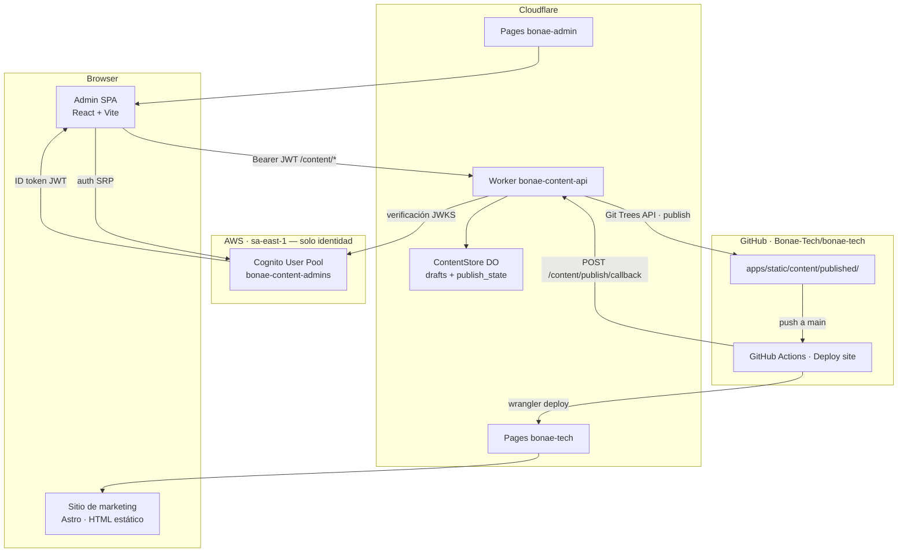
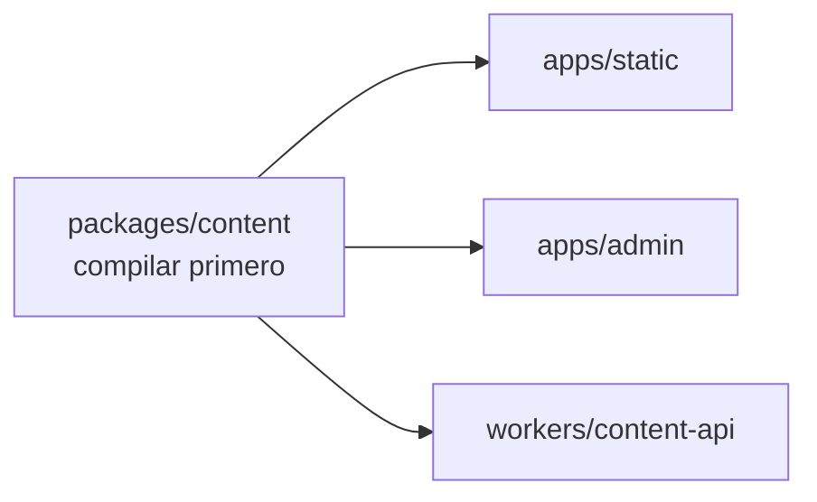
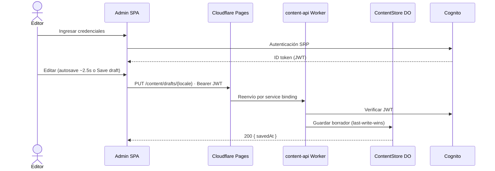
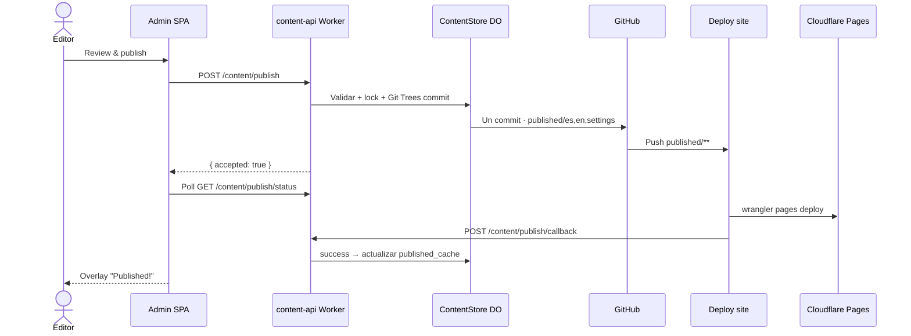

# BONAE Tech — Arquitectura

Diseño de la plataforma, infraestructura, flujos de datos y operaciones del día a día. Referencia de workflows CI/CD: [workflows.md](./workflows.md).

---

## Tabla de contenidos

1. [Vista general del sistema](#1-vista-general-del-sistema)
2. [Workspaces](#2-workspaces)
3. [Infraestructura en la nube](#3-infraestructura-en-la-nube)
4. [Flujos de datos](#4-flujos-de-datos)
   - [Niveles de contenido](#niveles-de-contenido-draft-vs-publicado)
   - [Mapa admin ↔ API](./admin-content-api-map.md)
5. [CI/CD](#5-cicd)
6. [Operaciones](#6-operaciones)

---

## 1. Vista general del sistema

BONAE Tech es una **plataforma de contenido respaldada por git**. El copy publicado del sitio vive como JSON en el repositorio; los borradores del admin viven en un **Durable Object SQLite** (`ContentStore`) hasta publicarse.



### Decisiones de diseño clave

- **Publicado en git; borradores en el DO.** Solo `published/**` se confirma en GitHub. Los borradores no disparan rebuilds del sitio.
- **Sin servidor en runtime para marketing.** El sitio es HTML estático en Cloudflare Pages.
- **Nube híbrida.** Cognito en AWS para identidad; Cloudflare Pages + Worker + Durable Objects para admin y API.
- **Admin solo por invitación.** Sin auto-registro. Los usuarios se crean vía CLI y se agregan al grupo Cognito `Administrators`.
- **Publicación atómica.** Un solo commit (Git Trees API) para ES, EN y settings. El overlay del admin espera el resultado real del deploy vía callback de CI.
- **Paridad de locale.** Validación en publicación (servidor y cliente). Los guardados de borrador son last-write-wins sin comprobar paridad.

---

## 2. Workspaces

| Workspace | Ruta | Runtime | Desplegado en |
|-----------|------|---------|-------------|
| Sitio de marketing | `apps/static/` | Astro 4 + Tailwind | Cloudflare Pages `bonae-tech` |
| Admin de contenido SPA | `apps/admin/` | React + Vite | Cloudflare Pages `bonae-admin` |
| Esquema de contenido compartido | `packages/content/` | TypeScript → `dist/` | (biblioteca compartida) |
| API de contenido | `workers/content-api/` | Cloudflare Worker | `bonae-content-api` |
| Infraestructura | `infra/terraform/` | Terraform | Solo Cognito (AWS sa-east-1) |

### Orden de dependencias de build

`packages/content` **debe compilarse antes** que cualquier cosa que lo importe.



Los scripts de la raíz manejan esto automáticamente. Al ejecutar pasos manualmente, correr `npm run content:build` primero.

### Admin SPA

| Modo | Auth | Destino de API |
|------|------|----------------|
| **Mock** (`VITE_USE_MOCK=true`) | Sesión falsa | Plugin Vite + store en memoria (misma API que el Worker) |
| **Producción** | Cognito SRP | Same-origin `/content/*` vía service binding de Pages |

Piezas clave: `config.ts` (IDs de Cognito en tiempo de build), `infrastructure/auth.cognito.ts` (SRP, refresh, reset de contraseña), `infrastructure/contentApi.ts` (Bearer JWT + retry en 401), `functions/content/_middleware.ts` (proxy al Worker). **Flujos de auth:** [admin-authentication.md](./admin-authentication.md).

### Worker de API de contenido

| Módulo | Rol |
|--------|-----|
| `src/auth/cognito.ts` | Verificación JWT vía Cognito JWKS |
| `src/auth/authorize.ts` | Verificación del grupo `Administrators` |
| `src/routes.ts` | Rutas HTTP → ContentStore DO |
| `src/content-store/` | Durable Object SQLite: borradores, caché publicado, máquina de estados de publish |
| `src/github.ts` | Cliente Octokit · commit atómico Git Trees API |

Rutas HTTP y niveles de almacenamiento: [§ Niveles de contenido](#niveles-de-contenido-draft-vs-publicado). Mapa detallado admin ↔ API (secciones, Postman): [admin-content-api-map.md](./admin-content-api-map.md).

### Modelo de seguridad

1. **Cognito** — solo por invitación, política de contraseñas, grupo `Administrators`, refresh tokens (30 días), reset por email
2. **SPA** — refresh proactivo antes de logout; mensajes claros en expiración y extensión de sesión
3. **Worker** — verificación JWKS + autorización en cada solicitud mutante
4. **GitHub App** — credenciales con alcance limitado solo en secretos del Worker

Documentación detallada de autenticación (secuencias, diagramas de componentes, AWS): [admin-authentication.md](./admin-authentication.md).

READMEs por app: 
* [apps/admin/README.md](../apps/admin/README.md)
* [workers/content-api/README.md](../workers/content-api/README.md)

---

## 3. Infraestructura en la nube

### 3.1 AWS (sa-east-1)

#### Bootstrap (una vez, Terraform local)

| Recurso | Propósito |
|----------|---------|
| Bucket S3 `bonae-terraform-state-*` | Estado remoto para el módulo Terraform principal |
| DynamoDB `bonae-terraform-locks` | Bloqueo de estado |
| Proveedor IAM OIDC | GitHub Actions → AWS |
| Rol IAM `github-actions-bonae-deploy` | Rol asumido por CI |

Archivo de estado: `infra/terraform/bootstrap/terraform.tfstate` (local, gitignored — conservarlo).

#### Módulo principal (Cognito — gestionado por CI)

| Recurso | Propósito |
|----------|---------|
| Cognito User Pool `bonae-content-admins` | Cuentas de admin |
| Cliente SPA `bonae-content-admin-spa` | Auth SRP, sin client secret |
| Grupo `Administrators` | Acceso a la API |

Solo por invitación (`allow_admin_create_user_only = true`). ID tokens expiran a la 1 hora; refresh tokens **30 días** (`ALLOW_REFRESH_TOKEN_AUTH`). Email opcional vía SES — ver [admin-authentication.md](./admin-authentication.md).

### 3.2 Cloudflare

| Recurso | Propósito |
|----------|---------|
| Pages `bonae-tech` | Sitio de marketing |
| Pages `bonae-admin` | Admin SPA; `/content/*` → Worker vía service binding |
| Worker `bonae-content-api` | API de contenido |

Secretos del Worker sincronizados desde GitHub vía **Setup worker**. IDs de Cognito pasados como vars del Worker en tiempo de deploy.

### 3.3 Configuración de GitHub

| Secreto / variable | Establecido por | Usado para |
|-------------------|-----------------|------------|
| `AWS_ROLE_ARN`, `AWS_REGION` | bootstrap Terraform | Workflows de Cognito |
| `GH_REPO_VARIABLES_TOKEN` | manual | Deploy cognito |
| `CLOUDFLARE_*` | manual (entorno prod) | Deploys de Cloudflare |
| `WORKER_GITHUB_*` | manual (entorno prod) | Setup worker |
| `COGNITO_USER_POOL_ID`, `COGNITO_CLIENT_ID` | Deploy cognito | Build del admin, deploy del Worker |

| Entorno | Propósito |
|-------------|---------|
| `infra-production` | Protege `terraform apply` — agregar revisores requeridos |
| `prod` | Expone secretos de Cloudflare + Worker a jobs de deploy |

**GitHub App** — `Contents: Read & Write` en este repo. Creada manualmente; credenciales almacenadas como secretos del Worker vía **Setup worker**.

Tabla completa de secretos: [workflows.md § Secretos](./workflows.md#secretos-y-variables).

---

## 4. Flujos de datos

### Niveles de contenido (draft vs publicado)

Referencia canónica del modelo draft/publish. No hay carpeta `content/drafts/` en el repositorio — las rutas API `/content/drafts/*` son endpoints HTTP, no rutas de archivos en git.

| Nivel | Dónde vive | En git | Quién lo lee |
|-------|------------|--------|--------------|
| **Borrador** | Tabla `drafts` del ContentStore Durable Object (SQLite) en producción; en memoria en admin mock (`mockContentStore.ts`) | No | Admin SPA vía Worker |
| **Publicado** | `apps/static/content/published/{es,en,settings}.json` | Sí (`main`) | Astro en build; Worker (bootstrap + diff) |

El DO también mantiene `published_cache` (copia de lo último publicado, sembrada desde git al arranque) y `publish_state` (máquina de estados committing → building → success/failure).

**Guardado de borrador** — autosave (~2.5s) y **Save draft** llaman `PUT /content/drafts/{es|en|settings}`. Last-write-wins; el borrador puede estar incompleto. No dispara CI.

**Publicación** — `POST /content/publish` valida esquema + paridad ES/EN, bloquea si hay otro publish en curso (409), hace un commit atómico (Git Trees API) solo bajo `published/`, y devuelve `{ accepted: true }`. El admin hace poll de `GET /content/publish/status` hasta que CI llama `POST /content/publish/callback`.

| Método | Ruta | Rol |
|--------|------|-----|
| `GET` | `/content/state` | Bootstrap: draft, published, `lastPublishedAt`, `publishState` |
| `GET` / `PUT` | `/content/drafts/{es\|en\|settings}` | Leer / persistir borrador en el DO |
| `POST` | `/content/drafts/discard` | Restablecer borradores desde `published_cache` |
| `POST` | `/content/drafts/discard-section` | Restablecer una sección en ES y EN |
| `GET` | `/content/published/{es\|en\|settings}` | Leer snapshot publicado (desde caché del DO) |
| `POST` | `/content/publish` | Validar y commitear a git |
| `GET` | `/content/publish/status` | Estado del overlay de publish |
| `POST` | `/content/publish/callback` | CI → Worker (Bearer `PUBLISH_CALLBACK_SECRET`) |

**Mock local** — `vite.mockApi.ts` intercepta `/content/*`: borradores en memoria, sembrados desde `published/` en disco; publish escribe solo `published/`.

**CI** — `deploy-site.yml` se dispara solo con cambios en `apps/static/content/published/**` o `packages/content/**`, no con actividad de borrador.

### Edición de contenido (admin → borrador)



### Publicación (borrador → git → deploy → callback)



### Primer inicio de sesión (flujo de invitación)

Los usuarios nuevos reciben una contraseña temporal por email. Cognito devuelve `NEW_PASSWORD_REQUIRED`; el admin SPA solicita una contraseña permanente.

---

## 5. CI/CD

Archivos de workflow: `.github/workflows/`. Referencia completa: **[workflows.md](./workflows.md)**.

Builds y validación usan **Turborepo** (`npx turbo run …`) con la composite action **setup-monorepo** (`npm ci` + caché local `.turbo`). Deploy final a Cloudflare sigue con Wrangler en cada workflow.


**Instalación:** bootstrap Terraform local → **Bootstrap (one-time install)** en GitHub Actions.  
**Día a día:** push a `main` o **Deploy (manual)**.

---

## 6. Operaciones

Mejoras de autenticación del admin (sesión, refresh, reset de contraseña, SES): [admin-authentication.md](./admin-authentication.md) · entregas por fases: [admin-auth/README.md](./admin-auth/README.md).

### Flujo de contenido

Iniciar sesión → editar ES/EN/settings → autosave o **Save draft** → **Approve & publish** en el rail → overlay (committing → building → success) → **Deploy site** en CI. Detalle de niveles de almacenamiento: [§ Niveles de contenido](#niveles-de-contenido-draft-vs-publicado).

### Rotación de credenciales

| Credencial | Acción |
|------------|--------|
| GitHub App | Actualizar secretos `WORKER_GITHUB_*` de prod → **Setup worker** `sync-secrets` |
| Token API de Cloudflare | Regenerar token → actualizar `CLOUDFLARE_API_TOKEN` en entorno prod |
| Terraform Cognito | Enviar cambios TF o ejecutar **Deploy cognito** |

### Validar contenido localmente

```bash
npm run content:validate
```

### Dominios personalizados

Agregar `admin.<dominio>` y el dominio de marketing en los respectivos proyectos Cloudflare Pages. Dejar `API_BASE_URL` vacío para que el admin SPA use same-origin `/content/*`.

### Desarrollo local

```bash
npm run dev:admin:mock    # admin SPA, sin AWS
npm run dev:worker        # Worker (requiere workers/content-api/.dev.vars)
npm run dev               # sitio de marketing
```

Ver [workflows.md](./workflows.md) para procedimientos de instalación y deploy.
