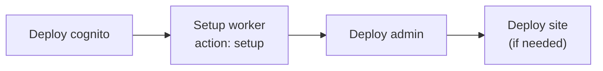

# Content API Worker — setup & teardown

Repeatable onboarding for the `bonae-content-api` Cloudflare Worker. Use the **Setup worker** GitHub Actions workflow instead of manual `wrangler secret put` commands.

See also: [architecture.md](./architecture.md), [admin-cutover.md](./admin-cutover.md).

---

## Prerequisites

1. **Bootstrap** complete (`infra/terraform/bootstrap/`) with `CLOUDFLARE_API_TOKEN` and `CLOUDFLARE_ACCOUNT_ID` on the `prod` GitHub environment.
2. **Cognito** deployed (`deploy-cognito` workflow) so repository variables exist:
   - `COGNITO_USER_POOL_ID`
   - `COGNITO_CLIENT_ID`
3. **GitHub App** created with `Contents: Read & Write` on this repository (not managed by Terraform).

---

## One-time: store GitHub App credentials in GitHub

Add these as **Environment secrets** on `prod` (Settings → Environments → prod → Environment secrets):

| Secret | Value |
|--------|--------|
| `WORKER_GITHUB_APP_ID` | GitHub App ID (numeric) |
| `WORKER_GITHUB_INSTALLATION_ID` | Installation ID from `github.com/settings/installations/{id}` |
| `WORKER_GITHUB_PRIVATE_KEY` | Full PEM private key (paste with real newlines) |

The workflow maps them to Cloudflare Worker secrets `GITHUB_APP_ID`, `GITHUB_INSTALLATION_ID`, and `GITHUB_PRIVATE_KEY`.

---

## Onboarding sequence



| Step | Workflow / command | What it does |
|------|-------------------|--------------|
| 1 | **Deploy cognito** | Cognito user pool + repo variables |
| 2 | **Setup worker** (`action: setup`) | Deploy Worker + push GitHub App secrets + Cognito vars |
| 3 | **Deploy admin** | Pages SPA + `/content/*` service binding |
| 4 | **Deploy site** | Marketing site (optional if already live) |

Run from GitHub: **Actions → Setup worker → Run workflow**, or **Actions → Deploy → target: worker-setup**.

---

## Workflow actions

| Action | When to use |
|--------|-------------|
| `setup` | First-time bootstrap or full redeploy (build, test, deploy, sync secrets) |
| `sync-secrets` | Rotate GitHub App credentials without redeploying code |
| `remove-secrets` | Strip GitHub App secrets from Worker (Worker stays deployed; saves/publish will fail) |
| `destroy` | Delete the Worker from Cloudflare (requires typing the Worker name in `confirm`) |

### Worker names

| Environment input | Worker name | `confirm` value for destroy |
|-------------------|-------------|----------------------------|
| _(empty)_ | `bonae-content-api` | `bonae-content-api` |
| `staging` | `bonae-content-api-staging` | `bonae-content-api-staging` |

---

## Local development (no Cloudflare deploy)

Create `workers/content-api/.dev.vars` (gitignored):

```
GITHUB_APP_ID=
GITHUB_INSTALLATION_ID=
GITHUB_PRIVATE_KEY=
COGNITO_USER_POOL_ID=
COGNITO_CLIENT_ID=
```

```bash
make dev-worker
```

---

## Rotating GitHub App credentials

1. Update the three `WORKER_GITHUB_*` secrets on the `prod` environment.
2. Run **Setup worker** with `action: sync-secrets`.

No code redeploy is required.

---

## Teardown

1. **Remove secrets only:** `action: remove-secrets` — Worker remains; GitHub operations disabled.
2. **Delete Worker:** `action: destroy`, `confirm: bonae-content-api` — removes the Worker entirely. Re-run `setup` to recreate.

If admin Pages still has a service binding to a deleted Worker, redeploy admin after recreating the Worker.
