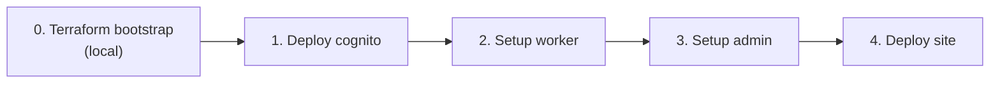

# GitHub Actions workflows

All workflow files live in [`.github/workflows/`](../.github/workflows/). Platform architecture: [architecture.md](./architecture.md).

---

## Quick reference

| Workflow | Trigger | Frequency |
|----------|---------|-----------|
| [Bootstrap (one-time install)](../.github/workflows/bootstrap.yml) | Manual | **Once** per environment |
| [Setup worker](../.github/workflows/setup-worker.yml) | Manual | **Once** at install; secret rotation / teardown |
| [Setup admin](../.github/workflows/setup-admin.yml) | Manual | **Once** at install; verify only |
| [Deploy cognito](../.github/workflows/deploy-cognito.yml) | Push (TF paths) / manual | **Once** at install; when Cognito TF changes |
| [Deploy admin](../.github/workflows/deploy-admin.yml) | Push (admin paths) / manual | Recurring |
| [Deploy site](../.github/workflows/deploy-site.yml) | Push (static paths) / manual | Recurring |
| [Deploy worker](../.github/workflows/deploy-worker.yml) | Push (worker paths) / manual | Recurring |
| [Deploy (manual)](../.github/workflows/deploy.yml) | Manual | Recurring — one component only |
| [CI](../.github/workflows/ci.yml) | Push / PR | Every code change |
| [Content PR check](../.github/workflows/content-pr-check.yml) | Content PRs | Every content PR |
| [Terraform plan](../.github/workflows/terraform-plan.yml) | Infra PRs | Plan only — no apply |

---

## One-time install

### Step 0 — Terraform bootstrap (local, before any workflow)

Run once from your machine with personal AWS credentials:

```bash
cd infra/terraform/bootstrap && terraform init && terraform apply
```

Creates S3 remote state, DynamoDB lock, GitHub OIDC role, and `infra-production` environment. Add GitHub secrets from outputs: `AWS_ROLE_ARN`, `AWS_REGION`, `GH_REPO_VARIABLES_TOKEN`.

Not included in **Bootstrap (one-time install)** — CI cannot run until this completes. See [architecture.md §3.1](./architecture.md#31-aws-resources-sa-east-1).

### Step 0b — Manual GitHub / Cloudflare setup

Before running workflows:

| Item | Where |
|------|--------|
| `CLOUDFLARE_API_TOKEN`, `CLOUDFLARE_ACCOUNT_ID` | GitHub **prod** environment secrets |
| `WORKER_GITHUB_APP_ID`, `WORKER_GITHUB_INSTALLATION_ID`, `WORKER_GITHUB_PRIVATE_KEY` | GitHub **prod** environment secrets |
| GitHub App (`Contents: Read & Write` on this repo) | GitHub Settings → Developer settings |

**Cloudflare API token** — custom token scoped to your account:

| Permission | Access |
|------------|--------|
| Account → Workers Scripts | Edit |
| Account → Cloudflare Pages | Edit |
| Account → Account Settings | Read |

`CLOUDFLARE_ACCOUNT_ID` is required in CI. Without it, Wrangler calls `/memberships` and fails with authentication error `10000`.

### Steps 1–4 — GitHub Actions bootstrap

Run **Bootstrap (one-time install)** with `step: full`, or each step individually:



| Step | Workflow | What it does |
|------|----------|--------------|
| 1 | **Deploy cognito** | `terraform apply` on Cognito module → `COGNITO_USER_POOL_ID`, `COGNITO_CLIENT_ID` repo variables |
| 2 | **Setup worker** (`action: setup`) | Deploy `bonae-content-api`, sync GitHub App secrets, set Cognito vars |
| 3 | **Setup admin** (`action: setup`) | Verify Worker exists; create `bonae-admin` Pages project if missing; deploy SPA + `/content/*` binding |
| 4 | **Deploy site** | Create `bonae-tech` Pages project if missing; deploy marketing site |

After bootstrap: create the first Cognito admin user (CLI — see [architecture.md §6](./architecture.md#adding-a-cognito-user)).

---

## Recurring deploys

Auto-triggered on push to `main` when path filters match:

| Workflow | Path filters |
|----------|--------------|
| Deploy site | `apps/static/**`, `packages/content/**` |
| Deploy admin | `apps/admin/**`, `packages/content/**` |
| Deploy worker | `workers/content-api/**`, `packages/content/**` |
| Deploy cognito | `infra/terraform/cognito.tf` and related TF files |

Publishing from the admin SPA commits to `content/published/` and triggers **Deploy site**.

**Deploy (manual)** redeploys one of site / admin / worker. It does **not** apply Cognito Terraform or sync Worker secrets. Use **Setup admin** for first-time admin Pages bootstrap.

---

## Workflow details

### Bootstrap (one-time install)

Orchestrates cognito → setup-worker → setup-admin → deploy-site. Re-run a single `step` if one stage failed.

### Setup admin

Manual only. Verifies Cognito vars and that `bonae-content-api` Worker exists, then runs **Deploy admin** (create-if-missing Pages project + deploy). **No teardown actions** — existing projects are never deleted.

| Action | When to use |
|--------|-------------|
| `setup` | First-time admin Pages bootstrap (or redeploy after Worker recreate) |
| `verify` | Check prerequisites and that `bonae-admin` Pages project exists |

**Deploy admin** is for recurring SPA code deploys (push to `main`). It still creates the Pages project if missing, but does not verify the Worker is deployed first.

### Setup worker

Manual only. Actions:

| Action | When to use |
|--------|-------------|
| `setup` | First-time Worker bootstrap (build, test, deploy, sync secrets) |
| `sync-secrets` | Rotate `WORKER_GITHUB_*` without redeploying code |
| `remove-secrets` | Strip GitHub App secrets from Worker |
| `destroy` | Delete Worker — requires typing the Worker name in `confirm` |

Worker names:

| Environment input | Worker name | `confirm` for destroy |
|-------------------|-------------|----------------------|
| _(empty)_ | `bonae-content-api` | `bonae-content-api` |
| `staging` | `bonae-content-api-staging` | `bonae-content-api-staging` |

**Deploy worker** pushes code only — it does not sync secrets. Use **Setup worker** after a fresh Cloudflare account or credential rotation.

### Deploy cognito

Plan job → approval on `infra-production` → apply job → store Cognito outputs as repo variables.

**Secrets:** `AWS_ROLE_ARN`, `AWS_REGION`, `GH_REPO_VARIABLES_TOKEN`

### Deploy site

Builds `@bonae/content`, validates published JSON, builds Astro, ensures `bonae-tech` Pages project exists, deploys via Wrangler.

**Paths:** `apps/static/**`, `packages/content/**`  
**Secrets:** `CLOUDFLARE_*` (prod environment)

### Deploy admin

Builds admin SPA with Cognito IDs baked in (`VITE_*`), ensures `bonae-admin` Pages project exists, deploys via Wrangler.

**Paths:** `apps/admin/**`, `packages/content/**`  
**Secrets:** `CLOUDFLARE_*` (prod environment)  
**Variables:** `COGNITO_USER_POOL_ID`, `COGNITO_CLIENT_ID`, `API_BASE_URL` (optional — leave empty for same-origin `/content/*`)

### Deploy worker

Builds, tests, and deploys Worker code with Cognito vars. Does not sync GitHub App secrets.

**Paths:** `workers/content-api/**`, `packages/content/**`

### Deploy (manual)

Menu: site, admin, or worker. For redeploys after install — not for bootstrap.

### CI

Builds all workspaces in dependency order; validates published content. No deploy.

### Content PR check

Validates published + draft JSON and ES/EN locale parity on PRs.

### Terraform plan

Posts Cognito Terraform plan as a PR comment. No apply.

---

## Secrets and variables

| Name | Scope | Used by |
|------|-------|---------|
| `AWS_ROLE_ARN`, `AWS_REGION` | repo secret | Cognito Terraform workflows |
| `GH_REPO_VARIABLES_TOKEN` | repo secret | Deploy cognito |
| `CLOUDFLARE_API_TOKEN` | prod secret | All Cloudflare workflows |
| `CLOUDFLARE_ACCOUNT_ID` | prod secret or repo variable | All Cloudflare workflows |
| `WORKER_GITHUB_*` (3 secrets) | prod secret | Setup worker |
| `COGNITO_USER_POOL_ID`, `COGNITO_CLIENT_ID` | repo variable | Admin build, Worker deploy |
| `API_BASE_URL` | repo variable (optional) | Admin build |

---

## What not to use

| Avoid | Use instead |
|-------|-------------|
| **Deploy (manual)** for first-time install | **Bootstrap (one-time install)** |
| **Deploy worker** on a fresh Cloudflare account | **Setup worker** first |
| **Deploy admin** for first-time install | **Setup admin** first |
| Re-running full bootstrap on every code change | Push to `main` or **Deploy (manual)** |
