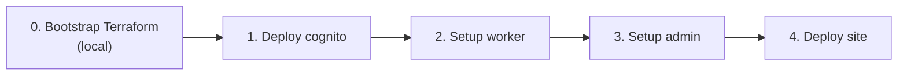

# Workflows de GitHub Actions

Todos los archivos de workflow están en [`.github/workflows/`](../.github/workflows/). Arquitectura de la plataforma: [architecture.md](./architecture.md).

**Desarrollo local:** no ejecutes estos workflows para arrancar apps — usa [README → Onboarding](../README.md#onboarding).

**Operaciones / primera instalación en prod:** continúa con la referencia rápida y [Instalación única](#instalación-única) más abajo. **Deploy (manual) no sustituye Bootstrap** en instalación inicial.

---

## Qué no usar

| Evitar | Usar en su lugar |
|-------|-------------|
| **Deploy (manual)** para instalación inicial | **Bootstrap (one-time install)** |
| **Deploy worker** en cuenta Cloudflare nueva | **Setup worker** primero |
| **Deploy admin** para instalación inicial | **Setup admin** primero |
| Re-ejecutar bootstrap completo en cada cambio de código | Push a `main` o **Deploy (manual)** |

---

## Referencia rápida

| Workflow | Disparador | Frecuencia |
|----------|---------|-----------|
| [Bootstrap (one-time install)](../.github/workflows/bootstrap.yml) | Manual | **Una vez** por entorno |
| [Setup worker](../.github/workflows/setup-worker.yml) | Manual | **Una vez** en instalación; rotación de secretos / teardown |
| [Setup admin](../.github/workflows/setup-admin.yml) | Manual | **Una vez** en instalación; solo verificación |
| [Deploy cognito](../.github/workflows/deploy-cognito.yml) | Push (rutas TF) / manual | **Una vez** en instalación; cuando cambia TF de Cognito |
| [Deploy admin](../.github/workflows/deploy-admin.yml) | Push (rutas admin) / manual | Recurrente |
| [Deploy site](../.github/workflows/deploy-site.yml) | Push (rutas static) / manual | Recurrente |
| [Deploy worker](../.github/workflows/deploy-worker.yml) | Push (rutas worker) / manual | Recurrente |
| [Deploy (manual)](../.github/workflows/deploy.yml) | Manual | Recurrente — un solo componente |
| [CI](../.github/workflows/ci.yml) | Push / PR | Cada cambio de código |
| [Content PR check](../.github/workflows/content-pr-check.yml) | PRs de contenido | Cada PR de contenido |
| [Terraform plan](../.github/workflows/terraform-plan.yml) | PRs de infra | Solo plan — sin apply |

---

## Instalación única

### Paso 0 — Bootstrap Terraform (local, antes de cualquier workflow)

Ejecutar una vez desde tu máquina con credenciales personales de AWS:

```bash
cd infra/terraform/bootstrap && terraform init && terraform apply
```

Crea estado remoto S3, bloqueo DynamoDB, rol GitHub OIDC y entorno `infra-production`. Agregar secretos de GitHub desde los outputs: `AWS_ROLE_ARN`, `AWS_REGION`, `GH_REPO_VARIABLES_TOKEN`.

No está incluido en **Bootstrap (one-time install)** — CI no puede ejecutarse hasta completar esto. Ver [architecture.md §3.1](./architecture.md#31-aws-sa-east-1).

### Paso 0b — Configuración manual de GitHub / Cloudflare

Antes de ejecutar workflows:

| Elemento | Dónde |
|------|--------|
| `CLOUDFLARE_API_TOKEN`, `CLOUDFLARE_ACCOUNT_ID` | Secretos del entorno GitHub **prod** |
| `WORKER_GITHUB_APP_ID`, `WORKER_GITHUB_INSTALLATION_ID`, `WORKER_GITHUB_PRIVATE_KEY` | Secretos del entorno GitHub **prod** |
| `PUBLISH_CALLBACK_SECRET` | Secreto del entorno **prod** — mismo valor en Worker (vía **Setup worker** → `sync-secrets`) y en **Deploy site** (callback POST) |
| `CONTENT_API_URL` | Secreto del entorno **prod** — URL base del Worker (`https://bonae-content-api.<account>.workers.dev`, sin barra final) |
| GitHub App (`Contents: Read & Write` en este repo) | GitHub Settings → Developer settings |

**Token API de Cloudflare** — token personalizado con alcance a tu cuenta:

| Permiso | Acceso |
|------------|--------|
| Account → Workers Scripts | Edit |
| Account → Cloudflare Pages | Edit |
| Account → Account Settings | Read |

`CLOUDFLARE_ACCOUNT_ID` es obligatorio en CI. Sin él, Wrangler llama a `/memberships` y falla con error de autenticación `10000`.

### Pasos 1–4 — Bootstrap de GitHub Actions

Ejecutar **Bootstrap (one-time install)** con `step: full`, o cada paso individualmente:



| Paso | Workflow | Qué hace |
|------|----------|--------------|
| 1 | **Deploy cognito** | `terraform apply` en módulo Cognito → variables de repo `COGNITO_USER_POOL_ID`, `COGNITO_CLIENT_ID` |
| 2 | **Setup worker** (`action: setup`) | Desplegar `bonae-content-api`, sincronizar secretos de GitHub App, establecer vars de Cognito |
| 3 | **Setup admin** (`action: setup`) | Verificar que el Worker existe; crear proyecto Pages `bonae-admin` si falta; desplegar SPA + binding `/content/*` |
| 4 | **Deploy site** | Crear proyecto Pages `bonae-tech` si falta; desplegar sitio de marketing |

Después del bootstrap: crear el primer usuario admin de Cognito (CLI — ver [architecture.md §6](./architecture.md#agregar-un-usuario-cognito)).

---

## Deploys recurrentes

Se disparan automáticamente en push a `main` cuando coinciden los filtros de ruta:

| Workflow | Filtros de ruta |
|----------|--------------|
| Deploy site | `apps/static/content/published/**`, `packages/content/**` |
| Deploy admin | `apps/admin/**`, `packages/content/**` |
| Deploy worker | `workers/content-api/**`, `packages/content/**` |
| Deploy cognito | `infra/terraform/cognito.tf` y archivos TF relacionados |

Publicar desde el admin escribe solo `content/published/` y dispara **Deploy site**. Los borradores no están en git — ver [architecture.md § Niveles de contenido](./architecture.md#niveles-de-contenido-draft-vs-publicado).

Cambios solo en código Astro (`apps/static/src/**`, etc.) no disparan **Deploy site** en push — usar **Deploy (manual)** → `site` o ampliar el workflow si necesitas auto-deploy de UI.

Los PRs que solo modifican `apps/static/content/**` ejecutan **Content PR check** (no el workflow CI completo de código).

---

## Detalle de workflows

### Bootstrap (one-time install)

Orquesta cognito → setup-worker → setup-admin → deploy-site. Re-ejecutar un solo `step` si una etapa falló.

### Setup admin

Solo manual. Verifica vars de Cognito y que el Worker `bonae-content-api` existe, luego ejecuta **Deploy admin** (crear proyecto Pages si falta + deploy). **Sin acciones de teardown** — los proyectos existentes nunca se eliminan.

| Acción | Cuándo usar |
|--------|-------------|
| `setup` | Bootstrap inicial de admin Pages (o redeploy tras recrear Worker) |
| `verify` | Verificar requisitos previos y que el proyecto Pages `bonae-admin` existe |

**Deploy admin** es para deploys recurrentes de código SPA (push a `main`). Aún crea el proyecto Pages si falta, pero no verifica que el Worker esté desplegado primero.

### Setup worker

Solo manual. Acciones:

| Acción | Cuándo usar |
|--------|-------------|
| `setup` | Bootstrap inicial del Worker (build, test, deploy, sync secretos) |
| `sync-secrets` | Rotar `WORKER_GITHUB_*` sin redesplegar código |
| `remove-secrets` | Eliminar secretos de GitHub App del Worker |
| `destroy` | Eliminar Worker — requiere escribir el nombre del Worker en `confirm` |

Nombres de Worker:

| Entrada environment | Nombre del Worker | `confirm` para destroy |
|-------------------|-------------|----------------------|
| _(vacío)_ | `bonae-content-api` | `bonae-content-api` |
| `staging` | `bonae-content-api-staging` | `bonae-content-api-staging` |

**Deploy worker** envía solo código — no sincroniza secretos. Usar **Setup worker** → `sync-secrets` tras una cuenta Cloudflare nueva, rotación de credenciales de GitHub App, o tras añadir/rotar `PUBLISH_CALLBACK_SECRET`.

### Deploy cognito

Job de plan → aprobación en `infra-production` → job de apply → almacenar outputs de Cognito como variables de repo.

**Secretos:** `AWS_ROLE_ARN`, `AWS_REGION`, `GH_REPO_VARIABLES_TOKEN`

### Deploy site

Compila `@bonae/content`, valida JSON publicado, compila Astro, asegura que el proyecto Pages `bonae-tech` existe, despliega vía Wrangler. Al finalizar (éxito o fallo), envía el resultado a `POST /content/publish/callback` en el Worker de contenido para cerrar el overlay de publicación en el admin.

**Rutas (push a `main`):** `apps/static/content/published/**`, `packages/content/**`  
**Secretos:** `CLOUDFLARE_*`, `CONTENT_API_URL`, `PUBLISH_CALLBACK_SECRET` (entorno prod)

El callback se omite con un mensaje informativo si faltan `CONTENT_API_URL` o `PUBLISH_CALLBACK_SECRET` (útil antes de configurar el par de secretos). Si están configurados pero el callback falla, el paso emite un warning (`continue-on-error`) sin enmascarar el resultado del deploy.

### Deploy admin

Compila admin SPA con IDs de Cognito incluidos (`VITE_*`), asegura que el proyecto Pages `bonae-admin` existe, despliega vía Wrangler.

**Rutas:** `apps/admin/**`, `packages/content/**`  
**Secretos:** `CLOUDFLARE_*` (entorno prod)  
**Variables:** `COGNITO_USER_POOL_ID`, `COGNITO_CLIENT_ID`. No establecer `API_BASE_URL` para Cloudflare (eliminarlo si existe) — same-origin `/content/*` vía service binding de Pages.

### Deploy worker

Compila, prueba y despliega código del Worker con vars de Cognito. No sincroniza secretos de GitHub App.

**Rutas:** `workers/content-api/**`, `packages/content/**`

### Deploy (manual)

Menú: site, admin o worker. Para redeploys tras instalación — no para bootstrap.

### CI

Compila todos los workspaces vía `npx turbo run build test validate:published`. Usa la composite action [setup-monorepo](../.github/actions/setup-monorepo) (`npm ci` + caché `.turbo`). Sin deploy.

### Content PR check

Valida `published/` con `npx turbo run build validate:published --filter=@bonae/content`. Sin deploy.

### Terraform plan

Publica el plan Terraform de Cognito como comentario en el PR. Sin apply.

---

## Secretos y variables

| Nombre | Alcance | Usado por |
|------|-------|---------|
| `AWS_ROLE_ARN`, `AWS_REGION` | secreto de repo | Workflows Terraform de Cognito |
| `GH_REPO_VARIABLES_TOKEN` | secreto de repo | Deploy cognito |
| `CLOUDFLARE_API_TOKEN` | secreto prod | Todos los workflows de Cloudflare |
| `CLOUDFLARE_ACCOUNT_ID` | secreto prod o variable de repo | Todos los workflows de Cloudflare |
| `WORKER_GITHUB_*` (3 secretos) | secreto prod | Setup worker |
| `COGNITO_USER_POOL_ID`, `COGNITO_CLIENT_ID` | variable de repo | Build del admin, deploy del Worker |
| `API_BASE_URL` | variable de repo (omitir para Cloudflare) | Solo API cross-origin heredada |
