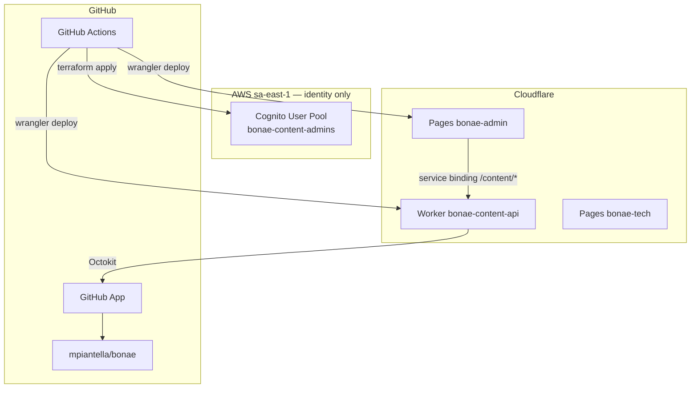

# BONAE Infrastructure

Terraform manages **Cognito identity only**. Admin hosting and the content API run on Cloudflare (Pages + Worker).

## Architecture



## Modules

1. **`terraform/bootstrap/`** — One-time: S3 state backend, DynamoDB lock, GitHub OIDC role (local state).
2. **`terraform/`** — Cognito user pool, SPA client, `Administrators` group (S3 remote state).

## Prerequisites

- Terraform ≥ 1.6
- AWS CLI with credentials for Cognito management
- Bootstrap completed (see below)

## Bootstrap (one-time)

```bash
cd infra/terraform/bootstrap
terraform init && terraform apply
```

Add GitHub repository secrets from bootstrap outputs: `AWS_ROLE_ARN`, `AWS_REGION`, `GH_REPO_VARIABLES_TOKEN`.

## Deploy Cognito

Via GitHub Actions (**Deploy cognito** workflow) or locally:

```bash
cd infra/terraform
terraform init
terraform plan
terraform apply
```

Outputs are stored as `COGNITO_USER_POOL_ID` and `COGNITO_CLIENT_ID` repository variables.

## Cognito user management

```bash
POOL_ID=$(cd infra/terraform && terraform output -raw user_pool_id)
REGION=sa-east-1

aws cognito-idp admin-create-user \
  --user-pool-id $POOL_ID \
  --username editor@example.com \
  --desired-delivery-mediums EMAIL \
  --region $REGION

aws cognito-idp admin-add-user-to-group \
  --user-pool-id $POOL_ID \
  --username editor@example.com \
  --group-name Administrators \
  --region $REGION
```

### Multi-tenant (future)

Assign consumers to Cognito groups (`site-{tenantId}`) or set `custom:site_id`. The Worker `authorize.ts` module enforces tenant-scoped access alongside platform `Administrators`.

## GitHub App credentials (Worker secrets)

The content API Worker reads GitHub App credentials from Cloudflare Worker secrets (not AWS Secrets Manager):

```bash
cd workers/content-api
npx wrangler secret put GITHUB_APP_ID
npx wrangler secret put GITHUB_INSTALLATION_ID
npx wrangler secret put GITHUB_PRIVATE_KEY
```

## Decommissioning legacy AWS resources

If S3/CloudFront/Lambda/API Gateway resources still exist from the previous architecture, run `terraform destroy` after applying this Cognito-only module. See [docs/admin-cutover.md](../docs/admin-cutover.md).

## Variables

The Cognito-only module has no required `terraform.tfvars` variables.
