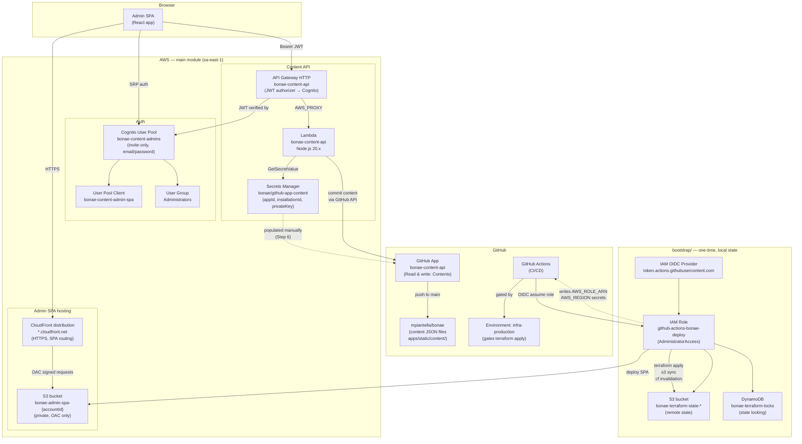

# BONAE Infrastructure

This directory contains all Terraform infrastructure for the BONAE project. There are two modules that must be applied in order:

1. **`terraform/bootstrap/`** — Run once with personal AWS credentials to create the remote state backend and GitHub Actions OIDC role. Uses local state by design.
2. **`terraform/`** — The main infrastructure module. Uses the S3 backend created by bootstrap. Deployed manually on first run, then via GitHub Actions CI on subsequent changes.

---

## Architecture Overview

All resources are deployed in **`sa-east-1` (São Paulo)**.



### Two independent flows

| Flow | Trigger | Path | GitHub App needed? |
|---|---|---|---|
| **Deploy admin SPA** | CI push to `main` or manual | GitHub Actions → S3 sync → CloudFront invalidation | No |
| **Publish content** | Editor clicks "Publish site" | Browser → API GW → Lambda → Secrets Manager → GitHub API | **Yes** |

The S3 sync/CloudFront invalidation in Step 7 deploys the React app itself. The GitHub App is only invoked at runtime by the Lambda when content is published.

---

## Prerequisites

- [Terraform](https://developer.hashicorp.com/terraform/install) >= 1.6
- AWS CLI configured with credentials that have AdministratorAccess
- A GitHub personal access token with `repo`, `secrets`, and `environments` scopes (for bootstrap only)
- The content API Lambda must be built before the main module is applied (Step 3)

All commands below are run from the **`infra/` directory**.

---

## Step 1: Apply the Bootstrap Module

This is a one-time operation. It creates the remote state backend and the GitHub Actions deployment role.

Export your credentials:

```bash
export AWS_PROFILE=your-profile   # or set AWS_ACCESS_KEY_ID / AWS_SECRET_ACCESS_KEY
export GITHUB_TOKEN=ghp_...       # GitHub PAT with repo + secrets + environments scope
```

Then run:

```bash
cd terraform/bootstrap
terraform init
terraform plan
terraform apply
```

**What this creates:**
- S3 bucket `bonae-terraform-state-112066795953` with versioning and AES-256 encryption
- DynamoDB table `bonae-terraform-locks` for state locking
- GitHub OIDC provider in AWS (`token.actions.githubusercontent.com`)
- IAM role `github-actions-bonae-deploy` trusted by that OIDC provider
- GitHub Actions secrets `AWS_ROLE_ARN` and `AWS_REGION` written to `mpiantella/bonae`
- GitHub environment `infra-production` scoped to the `main` branch

> The bootstrap state file (`terraform/bootstrap/terraform.tfstate`) is stored locally and is gitignored. Keep it safe — you need it to manage these resources later.

---

## Step 2: Create `terraform.tfvars`

From the `infra/` directory, create the vars file for the main module. Use a placeholder for `cors_origin` on the first run — the real value comes from Step 4.

```bash
cat > terraform/terraform.tfvars <<'EOF'
github_repo         = "mpiantella/bonae"
github_branch       = "main"
cors_origin         = "https://placeholder.example.com"
content_path_prefix = "apps/static/content"
EOF
```

---

## Step 3: Build the Lambda Package

The main module packages the Lambda from `services/content-api/dist`. Build it before running Terraform:

```bash
cd ../services/content-api
npm install
npm run build
cd ../../infra
```

---

## Step 4: First Deploy of the Main Module

```bash
cd terraform
terraform init
terraform plan -var-file=terraform.tfvars
terraform apply -var-file=terraform.tfvars
```

After apply completes, print the outputs:

```bash
terraform output
```

> **Capture this now — you will need it in Step 5.**
> Find the `admin_cloudfront_domain` value in the output. This is your real `cors_origin`.

| Output | Used for |
|---|---|
| `admin_cloudfront_domain` | **Your `cors_origin` for Step 5** |
| `admin_s3_bucket_name` | S3 target for SPA deployment |
| `admin_cloudfront_distribution_id` | CloudFront cache invalidation |
| `user_pool_id` | `VITE_COGNITO_USER_POOL_ID` env var in SPA build |
| `user_pool_client_id` | `VITE_COGNITO_CLIENT_ID` env var in SPA build |
| `api_url` | `VITE_API_BASE_URL` env var in SPA build |
| `github_secret_arn` | ARN of the secret to populate in Step 6 |

---

## Step 5: Update `cors_origin` with the Real CloudFront Domain

Edit `terraform/terraform.tfvars` and replace the `cors_origin` placeholder with the `admin_cloudfront_domain` value from Step 4:

```
cors_origin = "https://<admin_cloudfront_domain>"
```

Then re-apply:

```bash
terraform plan -var-file=terraform.tfvars
terraform apply -var-file=terraform.tfvars
```

This updates the Lambda environment variable and API Gateway CORS configuration.

---

## Step 6: Populate the GitHub App Secret

Terraform does not create the GitHub App — it only creates the Secrets Manager secret with placeholder values ("REPLACE"). You must create the GitHub App yourself first, then populate the secret in Step 6.

1. Create a GitHub App at github.com/settings/apps/new (or under your org's settings):

* Give it a name (e.g. bonae-content-api)
* Set Repository permissions → Contents to Read & write
* No webhooks needed
* After creation, note the App ID (shown at the top of the app page)

2. Generate a private key — on the app page scroll to "Private keys" → "Generate a private key". A .pem file will download.

* Install the app on the repo (mpiantella/bonae or wherever the content files live):

* Go to the app page → "Install App" → select the repo
* After install, the URL will be github.com/settings/installations/{installationId} — grab that number as the Installation ID

3. Then run Step 6 with the real values:

* appId → App ID from step 1
* installationId → Installation ID from step 3
* privateKey → contents of the .pem from step 2 (replace ./path/to/private-key.pem with the actual path)

Terraform only manages the secret's existence. The ignore_changes = [secret_string] lifecycle rule is specifically there to ensure terraform apply never overwrites the real credentials you populate in Step 6.

The Lambda reads GitHub App credentials from Secrets Manager. Run from `infra/`:

```bash
python3 -c "
import json
key = open('/Users/marialucena/code/secrets/bonae-content-api.2026-06-13.private-key.pem').read()
print(json.dumps({'appId': '4046714', 'installationId': 'Iv23livmEOlmiNyelrE1', 'privateKey': key}))
" > /tmp/bonae-github-secret.json

aws secretsmanager put-secret-value \
  --secret-id bonae/github-app-content \
  --secret-string file:///tmp/bonae-github-secret.json \
  --region sa-east-1

rm -f /tmp/bonae-github-secret.json
```

Terraform will not overwrite this value on future applies (protected by `ignore_changes`).

---

## Step 7: Deploy the Admin SPA

Run from `infra/`. This reads outputs from Terraform, builds the SPA, syncs to S3, and invalidates CloudFront:

```bash
BUCKET=$(cd terraform && terraform output -raw admin_s3_bucket_name)
DIST_ID=$(cd terraform && terraform output -raw admin_cloudfront_distribution_id)
API_URL=$(cd terraform && terraform output -raw api_url)
POOL_ID=$(cd terraform && terraform output -raw user_pool_id)
CLIENT_ID=$(cd terraform && terraform output -raw user_pool_client_id)

cd ../apps/admin
VITE_COGNITO_USER_POOL_ID=$POOL_ID \
VITE_COGNITO_CLIENT_ID=$CLIENT_ID \
VITE_API_BASE_URL=$API_URL \
npm run build

aws s3 sync dist/ s3://bonae-admin-spa-112066795953 --delete --region sa-east-1
aws cloudfront create-invalidation --distribution-id EJ50TQI3OIHSB --paths "/*"
```

---

## Step 8: Create the First Admin User

Users are invite-only (`allow_admin_create_user_only = true`). The user will receive an email with a temporary password and must change it on first login.

```bash
POOL_ID=$(cd infra/terraform && terraform output -raw user_pool_id)

aws cognito-idp admin-create-user \
  --user-pool-id $POOL_ID \
  --username larawebworks@gmail.com \
  --desired-delivery-mediums EMAIL \
  --region sa-east-1

aws cognito-idp admin-add-user-to-group \
  --user-pool-id $POOL_ID \
  --username mpiantella@hotmail.com \
  --group-name Administrators \
  --region sa-east-1
```

---

## Subsequent Deploys

After bootstrap is done and CI is configured, infrastructure changes are deployed by:

1. Pushing to the `main` branch
2. GitHub Actions assumes the `github-actions-bonae-deploy` role via OIDC (no static credentials stored)
3. The `infra-production` GitHub environment gates the apply behind required reviewers

To apply locally after the initial setup:

```bash
cd terraform
terraform plan -var-file=terraform.tfvars
terraform apply -var-file=terraform.tfvars
```

---

## Variable Reference

### Bootstrap (`terraform/bootstrap/variables.tf`)

| Variable | Default | Description |
|---|---|---|
| `aws_region` | `sa-east-1` | AWS region |
| `github_repo` | `mpiantella/bonae` | GitHub repo in `owner/repo` format |
| `state_bucket` | `bonae-terraform-state-112066795953` | S3 bucket name for remote state |
| `state_lock_table` | `bonae-terraform-locks` | DynamoDB table for state locking |
| `deploy_role_name` | `github-actions-bonae-deploy` | IAM role name for GitHub Actions |
| `github_environment` | `infra-production` | GitHub environment that gates `terraform apply` |

### Main Module (`terraform/variables.tf`)

| Variable | Default | Description |
|---|---|---|
| `github_repo` | *(required)* | GitHub repo in `owner/repo` format |
| `github_branch` | `main` | Branch content commits are pushed to |
| `cors_origin` | *(required)* | Admin SPA CloudFront URL (e.g. `https://d1234.cloudfront.net`) |
| `content_path_prefix` | `apps/static/content` | Path prefix for content JSON files in the repo |
