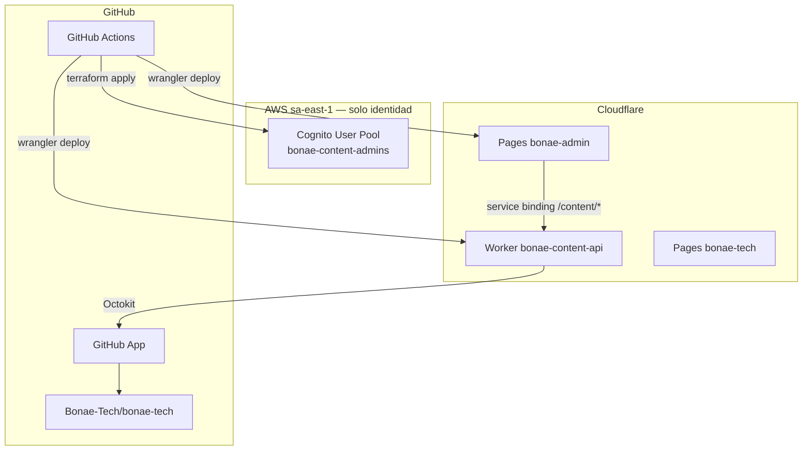

# Infraestructura BONAE

Terraform gestiona **solo identidad Cognito**. El hosting del admin y la API de contenido corren en Cloudflare (Pages + Worker).

## Arquitectura



## Módulos

1. **`terraform/bootstrap/`** — Una vez: backend de estado S3, bloqueo DynamoDB, rol GitHub OIDC (estado local).
2. **`terraform/`** — User pool Cognito, cliente SPA, grupo `Administrators`, SES para email de Cognito (estado remoto S3).

## Requisitos previos

- Terraform ≥ 1.6
- AWS CLI con credenciales para gestión de Cognito
- Bootstrap completado (ver abajo)

## Bootstrap (una vez)

```bash
cd infra/terraform/bootstrap
terraform init && terraform apply
```

Agregar secretos del repositorio GitHub desde los outputs del bootstrap: `AWS_ROLE_ARN`, `AWS_REGION`, `GH_REPO_VARIABLES_TOKEN`.

## Desplegar Cognito

Vía GitHub Actions (workflow **Deploy cognito**) o localmente:

```bash
cd infra/terraform
terraform init
terraform plan
terraform apply
```

Los outputs se almacenan como variables del repositorio `COGNITO_USER_POOL_ID` y `COGNITO_CLIENT_ID`.

## Email Cognito vía SES (Fase 3)

Ver [docs/admin-auth/phase-3-ses-email.md](../docs/admin-auth/phase-3-ses-email.md).

```bash
cd infra/terraform
terraform apply   # cognito_use_ses_email = false por defecto
terraform output ses_domain_verification_txt
terraform output ses_dkim_cname_records
# Añadir registros en Cloudflare → esperar verificación SES
# Editar terraform.tfvars: cognito_use_ses_email = true
terraform apply
```

## Gestión de usuarios Cognito

```bash
POOL_ID=$(cd infra/terraform && terraform output -raw user_pool_id)
REGION=sa-east-1

aws cognito-idp admin-create-user \
  --user-pool-id $POOL_ID \
  --username editor@example.com \
  --user-attributes Name=email,Value=editor@example.com Name=email_verified,Value=true \
  --desired-delivery-mediums EMAIL \
  --region $REGION

aws cognito-idp admin-add-user-to-group \
  --user-pool-id $POOL_ID \
  --username editor@example.com \
  --group-name Administrators \
  --region $REGION
```

### Multi-tenant (futuro)

Asignar consumidores a grupos Cognito (`site-{tenantId}`) o establecer `custom:site_id`. El módulo Worker `authorize.ts` aplica acceso con alcance por tenant junto con `Administrators` de plataforma.

## Credenciales de GitHub App (secretos del Worker)

Almacenar credenciales como secretos del entorno GitHub **prod** (`WORKER_GITHUB_APP_ID`, `WORKER_GITHUB_INSTALLATION_ID`, `WORKER_GITHUB_PRIVATE_KEY`), luego ejecutar **Setup worker** para enviarlas a Cloudflare.

Referencia de instalación y workflows: [docs/workflows.md](../docs/workflows.md). Vista general de la plataforma: [docs/architecture.md](../docs/architecture.md).

## Desmantelamiento de recursos AWS heredados

Si aún existen recursos S3/CloudFront/Lambda/API Gateway de la arquitectura anterior, destruirlos en AWS después de migrar a Cloudflare. Ver [docs/architecture.md §3.1](../docs/architecture.md#31-aws-sa-east-1).

## Variables

Opcionales en `terraform.tfvars` — ver `variables.tf` y [phase-3-ses-email.md](../docs/admin-auth/phase-3-ses-email.md) para SES.
