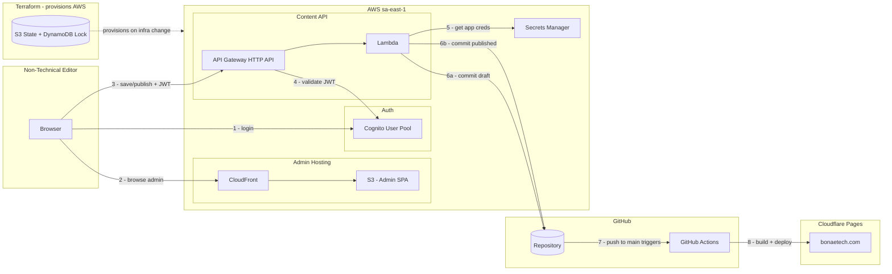
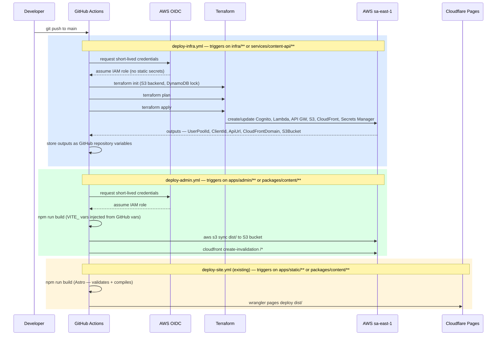
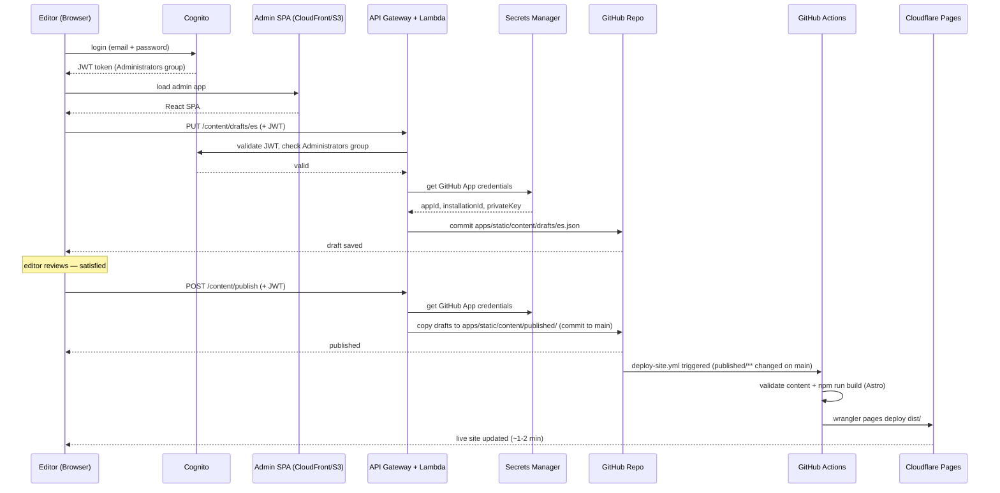

Architecture Flow

flowchart LR
  subgraph editor ["Non-Technical Editor"]
    E[Browser]
  end

  subgraph github ["GitHub"]
    REPO[(Repository)]
    GA[GitHub Actions]
  end

  subgraph aws ["AWS  sa-east-1"]
    subgraph admin_hosting ["Admin Hosting"]
      CF_ADMIN[CloudFront]
      S3_ADMIN[S3 - Admin SPA]
    end
    subgraph auth ["Auth"]
      COG[Cognito User Pool]
    end
    subgraph api ["Content API"]
      APIGW[API Gateway HTTP API]
      LAMBDA[Lambda]
    end
    SM[Secrets Manager]
  end

  subgraph cloudflare ["Cloudflare Pages"]
    SITE[bonaetech.com]
  end

  subgraph terraform ["Terraform - provisions AWS"]
    TF[(S3 State + DynamoDB Lock)]
  end

  E -->|"1 - login"| COG
  E -->|"2 - browse admin"| CF_ADMIN
  CF_ADMIN --> S3_ADMIN
  E -->|"3 - save/publish + JWT"| APIGW
  APIGW -->|"4 - validate JWT"| COG
  APIGW --> LAMBDA
  LAMBDA -->|"5 - get app creds"| SM
  LAMBDA -->|"6a - commit draft"| REPO
  LAMBDA -->|"6b - commit published"| REPO
  REPO -->|"7 - push to main triggers"| GA
  GA -->|"8 - build + deploy"| SITE
  TF -.->|"provisions on infra change"| aws
GitHub Deployment Sequence

sequenceDiagram
  participant DEV as Developer
  participant GH as GitHub Actions
  participant OIDC as AWS OIDC
  participant TF as Terraform
  participant AWS as AWS sa-east-1
  participant CF as Cloudflare Pages

  DEV->>GH: git push to main

  rect rgb(220,235,255)
    Note over GH,AWS: deploy-infra.yml — triggers on infra/** or services/content-api/**
    GH->>OIDC: request short-lived credentials
    OIDC-->>GH: assume IAM role (no static secrets)
    GH->>TF: terraform init  (S3 backend, DynamoDB lock)
    GH->>TF: terraform plan
    GH->>TF: terraform apply
    TF->>AWS: create/update Cognito, Lambda, API GW, S3, CloudFront, Secrets Manager
    AWS-->>GH: outputs — UserPoolId, ClientId, ApiUrl, CloudFrontDomain, S3Bucket
    GH->>GH: store outputs as GitHub repository variables
  end

  rect rgb(220,255,230)
    Note over GH,AWS: deploy-admin.yml — triggers on apps/admin/** or packages/content/**
    GH->>OIDC: request short-lived credentials
    OIDC-->>GH: assume IAM role
    GH->>GH: npm run build  (VITE_ vars injected from GitHub vars)
    GH->>AWS: aws s3 sync dist/ to S3 bucket
    GH->>AWS: cloudfront create-invalidation /*
  end

  rect rgb(255,245,220)
    Note over GH,CF: deploy-site.yml (existing) — triggers on apps/static/** or packages/content/**
    GH->>GH: npm run build  (Astro — validates + compiles)
    GH->>CF: wrangler pages deploy dist/
  end
Content Publish Sequence (editor flow)

sequenceDiagram
  participant ED as Editor (Browser)
  participant COG as Cognito
  participant SPA as Admin SPA (CloudFront/S3)
  participant API as API Gateway + Lambda
  participant SM as Secrets Manager
  participant REPO as GitHub Repo
  participant GA as GitHub Actions
  participant SITE as Cloudflare Pages

  ED->>COG: login (email + password)
  COG-->>ED: JWT token (Administrators group)

  ED->>SPA: load admin app
  SPA-->>ED: React SPA

  ED->>API: PUT /content/drafts/es  (+ JWT)
  API->>COG: validate JWT, check Administrators group
  COG-->>API: valid
  API->>SM: get GitHub App credentials
  SM-->>API: appId, installationId, privateKey
  API->>REPO: commit apps/static/content/drafts/es.json
  REPO-->>ED: draft saved

  Note over ED: editor reviews — satisfied

  ED->>API: POST /content/publish  (+ JWT)
  API->>SM: get GitHub App credentials
  API->>REPO: copy drafts → apps/static/content/published/ (commit to main)
  REPO-->>ED: published

  REPO->>GA: deploy-site.yml triggered (published/** changed on main)
  GA->>GA: validate content + npm run build (Astro)
  GA->>SITE: wrangler pages deploy dist/
  SITE-->>ED: live site updated (~1-2 min)
Now let me update the plan file with the Terraform approach and these diagrams.

Write transient-crafting-tide.md
402 lines
# Plan: Deploy Admin App + Content API to AWS with Terraform

## Context

The codebase is a git-backed CMS for the BONAE static marketing site. All code is written and working locally. The static site deploys to Cloudflare Pages already. The missing pieces are:
- Cloud host for the admin SPA
- Deployed AWS backend (Cognito, Lambda, API Gateway, Secrets Manager)
- Automated deployment pipeline with zero long-lived credentials

**Infrastructure choice: Terraform** — chosen over SAM/CDK because it is the most widely known IaC tool, easy to read (HCL), multi-developer friendly, and extensible as the team grows. State is managed in S3 + DynamoDB (standard practice). GitHub Actions uses AWS OIDC so no static credentials are stored anywhere.

---

## Architecture Flow



---

## GitHub Deployment Sequence



---

## Content Publish Sequence (editor workflow)



---

## Terraform File Structure

```
infra/
└── terraform/
    ├── backend.tf          # S3 remote state + DynamoDB locking
    ├── providers.tf        # AWS provider, region sa-east-1
    ├── variables.tf        # github_repo, cors_origin, github_branch, content_path_prefix
    ├── outputs.tf          # user_pool_id, client_id, api_url, cf_domain, s3_bucket, cf_id
    ├── cognito.tf          # User pool, SPA client, Administrators group
    ├── secrets.tf          # Secrets Manager — bonae/github-app-content
    ├── lambda.tf           # Lambda function + IAM execution role
    ├── api_gateway.tf      # HTTP API + JWT authorizer (Cognito)
    └── admin_spa.tf        # S3 bucket (private) + CloudFront OAC + distribution
```

Lambda code is built separately by GitHub Actions (`npm run build` in `services/content-api`) and the resulting zip is uploaded to a deployment S3 bucket. Terraform references the zip via `aws_lambda_function.filename` or an S3 key.

---

## Implementation Plan

### Phase 0 — One-time manual bootstrap (~45 min, done once)

**Step 1: Create Terraform state bucket + DynamoDB lock table**
```bash
# Run from any machine with AWS CLI configured for account 112066795953 / sa-east-1
aws s3 mb s3://bonae-terraform-state-112066795993 --region sa-east-1
aws s3api put-bucket-versioning \
  --bucket bonae-terraform-state-112066795993 \
  --versioning-configuration Status=Enabled

aws dynamodb create-table \
  --table-name bonae-terraform-locks \
  --attribute-definitions AttributeName=LockID,AttributeType=S \
  --key-schema AttributeName=LockID,KeyType=HASH \
  --billing-mode PAY_PER_REQUEST \
  --region sa-east-1
```

**Step 2: Create AWS OIDC provider for GitHub Actions**
```bash
aws iam create-open-id-connect-provider \
  --url https://token.actions.githubusercontent.com \
  --thumbprint-list 6938fd4d98bab03faadb97b34396831e3780aea1 \
  --client-id-list sts.amazonaws.com \
  --region sa-east-1
```

**Step 3: Create IAM role for GitHub Actions (trust + permissions)**
- Trust policy: `token.actions.githubusercontent.com`, repo `mpiantella/bonae`, ref `refs/heads/main`
- Permissions: `cloudformation:*`, `s3:*`, `lambda:*`, `cognito-idp:*`, `apigateway:*`, `secretsmanager:*`, `cloudfront:*`, `iam:PassRole`, `iam:CreateRole`, `iam:AttachRolePolicy`, `dynamodb:*` (for lock table)
- Save role ARN

**Step 4: Create GitHub App for Lambda content commits**
- GitHub → Settings → Developer settings → GitHub Apps → New
- Name: `bonae-content-writer`
- Permissions: `Contents: Read & Write` (this repo only)
- Generate private key — save `App ID`, `Installation ID`, `Private Key`

**Step 5: Add GitHub repository secrets**
```
AWS_ROLE_ARN   = arn:aws:iam::112066795953:role/github-actions-bonae-deploy
AWS_REGION     = sa-east-1
```

---

### Phase 1 — Write Terraform configuration

**Files to create under `infra/terraform/`:**

`backend.tf`
```hcl
terraform {
  required_version = ">= 1.6"
  required_providers {
    aws = { source = "hashicorp/aws", version = "~> 5.0" }
  }
  backend "s3" {
    bucket         = "bonae-terraform-state-112066795953"
    key            = "bonae/content-api/terraform.tfstate"
    region         = "sa-east-1"
    dynamodb_table = "bonae-terraform-locks"
    encrypt        = true
  }
}
```

`providers.tf`
```hcl
provider "aws" {
  region = "sa-east-1"
}
```

`variables.tf` — `github_repo`, `cors_origin`, `github_branch`, `content_path_prefix`

`cognito.tf` — `aws_cognito_user_pool`, `aws_cognito_user_pool_client`, `aws_cognito_user_group`

`secrets.tf` — `aws_secretsmanager_secret` (placeholder value; updated manually with real GitHub App creds)

`lambda.tf` — `aws_iam_role` (execution), `aws_lambda_function` (Node 20, from S3 zip), env vars

`api_gateway.tf` — `aws_apigatewayv2_api` (HTTP), `aws_apigatewayv2_authorizer` (JWT/Cognito), routes + integrations

`admin_spa.tf` — `aws_s3_bucket` (private), `aws_cloudfront_origin_access_control`, `aws_cloudfront_distribution`, `aws_s3_bucket_policy`

`outputs.tf` — all values needed by GitHub Actions for the admin SPA build

---

### Phase 2 — GitHub Actions: deploy-infra.yml

**File:** `.github/workflows/deploy-infra.yml`

Triggers: push to `main` on paths `infra/terraform/**` or `services/content-api/**`

Steps:
1. Checkout
2. Configure AWS credentials via OIDC (`aws-actions/configure-aws-credentials@v4`)
3. Build Lambda: `npm ci && npm run build` in `services/content-api/`
4. Package zip + upload to deployment S3 bucket
5. `terraform init`
6. `terraform apply -auto-approve -var github_repo=mpiantella/bonae -var cors_origin=https://${{ vars.ADMIN_CLOUDFRONT_DOMAIN }}`
7. Parse `terraform output -json` → set GitHub repository variables (`gh variable set`)

---

### Phase 3 — GitHub Actions: deploy-admin.yml

**File:** `.github/workflows/deploy-admin.yml`

Triggers: push to `main` on paths `apps/admin/**` or `packages/content/**`

Steps:
1. Checkout
2. Configure AWS credentials via OIDC
3. Build content package
4. Build admin SPA with env vars from GitHub vars:
   - `VITE_API_BASE_URL=${{ vars.API_BASE_URL }}`
   - `VITE_COGNITO_USER_POOL_ID=${{ vars.COGNITO_USER_POOL_ID }}`
   - `VITE_COGNITO_CLIENT_ID=${{ vars.COGNITO_CLIENT_ID }}`
   - `VITE_AWS_REGION=sa-east-1`
5. `aws s3 sync dist/ s3://${{ vars.ADMIN_S3_BUCKET }}/ --delete`
   - `index.html` with `no-cache`, assets with `max-age=31536000, immutable`
6. `aws cloudfront create-invalidation --distribution-id ${{ vars.ADMIN_CLOUDFRONT_ID }} --paths "/*"`

---

### Phase 4 — Post-deploy one-time manual steps (~15 min)

After first successful `deploy-infra.yml` run:

**Update Secrets Manager with GitHub App credentials:**
```bash
aws secretsmanager update-secret \
  --secret-id bonae/github-app-content \
  --secret-string '{"appId":"<ID>","installationId":"<ID>","privateKey":"<PEM>"}' \
  --region sa-east-1
```

**Create Cognito admin user:**
```bash
aws cognito-idp admin-create-user \
  --user-pool-id <UserPoolId> \
  --username editor@bonaetech.com \
  --region sa-east-1

aws cognito-idp admin-add-user-to-group \
  --user-pool-id <UserPoolId> \
  --username editor@bonaetech.com \
  --group-name Administrators \
  --region sa-east-1

aws cognito-idp admin-set-user-password \
  --user-pool-id <UserPoolId> \
  --username editor@bonaetech.com \
  --password "<SecurePassword>" \
  --permanent \
  --region sa-east-1
```

---

## Files to Create / Modify

| Action | File |
|--------|------|
| Delete | `services/content-api/template.yaml` (SAM template — replaced by Terraform) |
| Create | `infra/terraform/backend.tf` |
| Create | `infra/terraform/providers.tf` |
| Create | `infra/terraform/variables.tf` |
| Create | `infra/terraform/outputs.tf` |
| Create | `infra/terraform/cognito.tf` |
| Create | `infra/terraform/secrets.tf` |
| Create | `infra/terraform/lambda.tf` |
| Create | `infra/terraform/api_gateway.tf` |
| Create | `infra/terraform/admin_spa.tf` |
| Create | `.github/workflows/deploy-infra.yml` |
| Create | `.github/workflows/deploy-admin.yml` |
| Update | `infra/.env` — replace CDK vars with Terraform vars |
| Update | `services/content-api/README.md` — update deploy instructions |

---

## Full Deployment Sequence Summary

```
Bootstrap (once, ~45 min):
  1. Create Terraform state S3 bucket + DynamoDB table
  2. Create AWS OIDC provider
  3. Create IAM role for GitHub Actions
  4. Create GitHub App (bonae-content-writer)
  5. Add AWS_ROLE_ARN + AWS_REGION to GitHub secrets

Automated on push to main:
  6. deploy-infra.yml  → terraform apply → stores outputs as GitHub vars
  7. deploy-admin.yml  → npm build → S3 sync → CloudFront invalidation
  8. deploy-site.yml   → Astro build → Cloudflare Pages  (unchanged)

Manual once after first deploy:
  9. Update Secrets Manager with GitHub App credentials
  10. Create Cognito editor user + set permanent password
  11. Share admin URL with editor: https://<CloudFrontDomain>
```

---

## Verification Steps

1. Push change to `infra/terraform/` → `deploy-infra.yml` runs → CloudFormation... no, Terraform state in S3 shows applied resources
2. `aws cognito-idp list-user-pools --max-results 10 --region sa-east-1` → `bonae-content-admins` pool listed
3. Push change to `apps/admin/` → `deploy-admin.yml` runs → S3 objects visible in bucket
4. Browse `https://<CloudFrontDomain>` → admin login page loads
5. Sign in as editor → edit Hero section → Save draft → verify git commit in repo at `apps/static/content/drafts/`
6. Publish → verify commit to `apps/static/content/published/` → `deploy-site.yml` triggers → Cloudflare Pages deploys → live site updated

---

## AWS Cost Estimate (sa-east-1, low traffic)

| Service | Monthly cost |
|---------|-------------|
| Lambda + API Gateway | ~$0 (free tier) |
| Cognito (<50 MAUs) | $0 (free tier) |
| S3 (state + admin SPA + lambda zip) | ~$0.05 |
| CloudFront (admin, low traffic) | ~$0.01 |
| Secrets Manager (1 secret) | $0.40 |
| DynamoDB (on-demand, lock table) | ~$0 |
| **Total** | **~$0.50/month** |
The plan is updated. A few notes on the diagrams above:

Architecture flow — the editor never touches git or any CLI. The full path is: browser → CloudFront → Cognito → API Gateway → Lambda → Secrets Manager → GitHub → GitHub Actions → Cloudflare Pages. All provisioning is handled by Terraform running inside GitHub Actions.

Deployment sequence — three independent workflows triggered by file path, each scoped to its concern. deploy-infra is the only one that talks to Terraform and self-updates the GitHub vars that deploy-admin depends on. This means on first deploy you run deploy-infra first, then deploy-admin — or trigger both and deploy-admin will use whatever vars exist at that point (initially empty, so it would fail on first run until infra is up). This ordering can be enforced with a needs: dependency if desired.

One question before I finalize: the deploy-infra workflow auto-approves Terraform changes (-auto-approve). For a growing team this is convenient but skips review. Do you want a manual approval gate (e.g. a GitHub environment with required reviewers) on infrastructure changes, or keep it fully automated?

AskUserQuestion
OUT
User has answered your questions: "Should infrastructure changes (terraform apply) require a manual approval step before being applied?"="Manual gate (Recommended)". You can now continue with the user's answers in mind.
Read transient-crafting-tide.md (lines 156-205)
Edit transient-crafting-tide.md
Added 23 lines
Edit transient-crafting-tide.md
Added 1 line
Edit transient-crafting-tide.md
Added 3 lines
Claude’s Plan
Plan: Deploy Admin App + Content API to AWS with Terraform
Context
The codebase is a git-backed CMS for the BONAE static marketing site. All code is written and working locally. The static site deploys to Cloudflare Pages already. The missing pieces are:

Cloud host for the admin SPA
Deployed AWS backend (Cognito, Lambda, API Gateway, Secrets Manager)
Automated deployment pipeline with zero long-lived credentials
Infrastructure choice: Terraform — chosen over SAM/CDK because it is the most widely known IaC tool, easy to read (HCL), multi-developer friendly, and extensible as the team grows. State is managed in S3 + DynamoDB (standard practice). GitHub Actions uses AWS OIDC so no static credentials are stored anywhere.

Architecture Flow

flowchart LR
  subgraph editor ["Non-Technical Editor"]
    E[Browser]
  end

  subgraph github ["GitHub"]
    REPO[(Repository)]
    GA[GitHub Actions]
  end

  subgraph aws ["AWS  sa-east-1"]
    subgraph admin_hosting ["Admin Hosting"]
      CF_ADMIN[CloudFront]
      S3_ADMIN[S3 - Admin SPA]
    end
    subgraph auth ["Auth"]
      COG[Cognito User Pool]
    end
    subgraph api ["Content API"]
      APIGW[API Gateway HTTP API]
      LAMBDA[Lambda]
    end
    SM[Secrets Manager]
  end

  subgraph cloudflare ["Cloudflare Pages"]
    SITE[bonaetech.com]
  end

  subgraph terraform ["Terraform - provisions AWS"]
    TF[(S3 State + DynamoDB Lock)]
  end

  E -->|"1 - login"| COG
  E -->|"2 - browse admin"| CF_ADMIN
  CF_ADMIN --> S3_ADMIN
  E -->|"3 - save/publish + JWT"| APIGW
  APIGW -->|"4 - validate JWT"| COG
  APIGW --> LAMBDA
  LAMBDA -->|"5 - get app creds"| SM
  LAMBDA -->|"6a - commit draft"| REPO
  LAMBDA -->|"6b - commit published"| REPO
  REPO -->|"7 - push to main triggers"| GA
  GA -->|"8 - build + deploy"| SITE
  TF -.->|"provisions on infra change"| aws
GitHub Deployment Sequence

sequenceDiagram
  participant DEV as Developer
  participant GH as GitHub Actions
  participant OIDC as AWS OIDC
  participant TF as Terraform
  participant AWS as AWS sa-east-1
  participant CF as Cloudflare Pages

  DEV->>GH: git push to main

  rect rgb(220,235,255)
    Note over GH,AWS: deploy-infra.yml — triggers on infra/** or services/content-api/**
    GH->>OIDC: request short-lived credentials
    OIDC-->>GH: assume IAM role (no static secrets)
    GH->>TF: terraform init  (S3 backend, DynamoDB lock)
    GH->>TF: terraform plan
    GH->>TF: terraform apply
    TF->>AWS: create/update Cognito, Lambda, API GW, S3, CloudFront, Secrets Manager
    AWS-->>GH: outputs — UserPoolId, ClientId, ApiUrl, CloudFrontDomain, S3Bucket
    GH->>GH: store outputs as GitHub repository variables
  end

  rect rgb(220,255,230)
    Note over GH,AWS: deploy-admin.yml — triggers on apps/admin/** or packages/content/**
    GH->>OIDC: request short-lived credentials
    OIDC-->>GH: assume IAM role
    GH->>GH: npm run build  (VITE_ vars injected from GitHub vars)
    GH->>AWS: aws s3 sync dist/ to S3 bucket
    GH->>AWS: cloudfront create-invalidation /*
  end

  rect rgb(255,245,220)
    Note over GH,CF: deploy-site.yml (existing) — triggers on apps/static/** or packages/content/**
    GH->>GH: npm run build  (Astro — validates + compiles)
    GH->>CF: wrangler pages deploy dist/
  end
Content Publish Sequence (editor workflow)

sequenceDiagram
  participant ED as Editor (Browser)
  participant COG as Cognito
  participant SPA as Admin SPA (CloudFront/S3)
  participant API as API Gateway + Lambda
  participant SM as Secrets Manager
  participant REPO as GitHub Repo
  participant GA as GitHub Actions
  participant SITE as Cloudflare Pages

  ED->>COG: login (email + password)
  COG-->>ED: JWT token (Administrators group)

  ED->>SPA: load admin app
  SPA-->>ED: React SPA

  ED->>API: PUT /content/drafts/es  (+ JWT)
  API->>COG: validate JWT, check Administrators group
  COG-->>API: valid
  API->>SM: get GitHub App credentials
  SM-->>API: appId, installationId, privateKey
  API->>REPO: commit apps/static/content/drafts/es.json
  REPO-->>ED: draft saved

  Note over ED: editor reviews — satisfied

  ED->>API: POST /content/publish  (+ JWT)
  API->>SM: get GitHub App credentials
  API->>REPO: copy drafts to apps/static/content/published/ (commit to main)
  REPO-->>ED: published

  REPO->>GA: deploy-site.yml triggered (published/** changed on main)
  GA->>GA: validate content + npm run build (Astro)
  GA->>SITE: wrangler pages deploy dist/
  SITE-->>ED: live site updated (~1-2 min)
Terraform File Structure

infra/
└── terraform/
    ├── backend.tf          # S3 remote state + DynamoDB locking
    ├── providers.tf        # AWS provider, region sa-east-1
    ├── variables.tf        # github_repo, cors_origin, github_branch, content_path_prefix
    ├── outputs.tf          # user_pool_id, client_id, api_url, cf_domain, s3_bucket, cf_id
    ├── cognito.tf          # User pool, SPA client, Administrators group
    ├── secrets.tf          # Secrets Manager — bonae/github-app-content
    ├── lambda.tf           # Lambda function + IAM execution role
    ├── api_gateway.tf      # HTTP API + JWT authorizer (Cognito)
    └── admin_spa.tf        # S3 bucket (private) + CloudFront OAC + distribution
Lambda code is built separately by GitHub Actions (npm run build in services/content-api) and the resulting zip is uploaded to a deployment S3 bucket. Terraform references the zip via aws_lambda_function.filename or an S3 key.

Implementation Plan
Phase 0 — One-time manual bootstrap (~45 min, done once)
Step 1: Create Terraform state bucket + DynamoDB lock table


# Run from any machine with AWS CLI configured for account 112066795953 / sa-east-1
aws s3 mb s3://bonae-terraform-state-112066795993 --region sa-east-1
aws s3api put-bucket-versioning \
  --bucket bonae-terraform-state-112066795993 \
  --versioning-configuration Status=Enabled

aws dynamodb create-table \
  --table-name bonae-terraform-locks \
  --attribute-definitions AttributeName=LockID,AttributeType=S \
  --key-schema AttributeName=LockID,KeyType=HASH \
  --billing-mode PAY_PER_REQUEST \
  --region sa-east-1
Step 2: Create AWS OIDC provider for GitHub Actions


aws iam create-open-id-connect-provider \
  --url https://token.actions.githubusercontent.com \
  --thumbprint-list 6938fd4d98bab03faadb97b34396831e3780aea1 \
  --client-id-list sts.amazonaws.com \
  --region sa-east-1
Step 3: Create IAM role for GitHub Actions (trust + permissions)

Trust policy: token.actions.githubusercontent.com, repo mpiantella/bonae, ref refs/heads/main
Permissions: cloudformation:*, s3:*, lambda:*, cognito-idp:*, apigateway:*, secretsmanager:*, cloudfront:*, iam:PassRole, iam:CreateRole, iam:AttachRolePolicy, dynamodb:* (for lock table)
Save role ARN
Step 4: Create GitHub App for Lambda content commits

GitHub → Settings → Developer settings → GitHub Apps → New
Name: bonae-content-writer
Permissions: Contents: Read & Write (this repo only)
Generate private key — save App ID, Installation ID, Private Key
Step 5: Add GitHub repository secrets


AWS_ROLE_ARN   = arn:aws:iam::112066795953:role/github-actions-bonae-deploy
AWS_REGION     = sa-east-1
Phase 1 — Write Terraform configuration
Files to create under infra/terraform/:

backend.tf


terraform {
  required_version = ">= 1.6"
  required_providers {
    aws = { source = "hashicorp/aws", version = "~> 5.0" }
  }
  backend "s3" {
    bucket         = "bonae-terraform-state-112066795953"
    key            = "bonae/content-api/terraform.tfstate"
    region         = "sa-east-1"
    dynamodb_table = "bonae-terraform-locks"
    encrypt        = true
  }
}
providers.tf


provider "aws" {
  region = "sa-east-1"
}
variables.tf — github_repo, cors_origin, github_branch, content_path_prefix

cognito.tf — aws_cognito_user_pool, aws_cognito_user_pool_client, aws_cognito_user_group

secrets.tf — aws_secretsmanager_secret (placeholder value; updated manually with real GitHub App creds)

lambda.tf — aws_iam_role (execution), aws_lambda_function (Node 20, from S3 zip), env vars

api_gateway.tf — aws_apigatewayv2_api (HTTP), aws_apigatewayv2_authorizer (JWT/Cognito), routes + integrations

admin_spa.tf — aws_s3_bucket (private), aws_cloudfront_origin_access_control, aws_cloudfront_distribution, aws_s3_bucket_policy

outputs.tf — all values needed by GitHub Actions for the admin SPA build

Phase 2 — GitHub Actions: terraform-plan.yml + deploy-infra.yml
Two workflows handle infrastructure — one for review, one for apply.

File: .github/workflows/terraform-plan.yml

Triggers: pull request touching infra/terraform/** or services/content-api/**

Steps:

Checkout
Configure AWS credentials via OIDC
terraform init
terraform plan -no-color → capture output
Post plan output as PR comment (via actions/github-script) so reviewers see exactly what will change before merging
File: .github/workflows/deploy-infra.yml

Triggers: push to main on paths infra/terraform/** or services/content-api/**

Uses GitHub environment: infra-production — configured in repo Settings → Environments with required reviewers. GitHub pauses the workflow and notifies reviewers before terraform apply runs.

Steps:

Checkout
Configure AWS credentials via OIDC
Build Lambda: npm ci && npm run build in services/content-api/
Package zip + upload to deployment S3 bucket
terraform init
terraform plan (shown in Actions log for final confirmation)
[waits for manual approval in GitHub environment gate]
terraform apply -auto-approve
Parse terraform output -json → set GitHub repository variables (gh variable set)
One-time setup: Create environment infra-production in GitHub repo Settings → Environments → add required reviewers (the two developers). Any future team member added as reviewer gains approval rights there — no workflow changes needed.

This means: PRs show the plan as a comment → merge to main → reviewer approves in GitHub Actions UI → apply runs. Infra changes are never silent.

Phase 3 — GitHub Actions: deploy-admin.yml
File: .github/workflows/deploy-admin.yml

Triggers: push to main on paths apps/admin/** or packages/content/**

Steps:

Checkout
Configure AWS credentials via OIDC
Build content package
Build admin SPA with env vars from GitHub vars:
VITE_API_BASE_URL=${{ vars.API_BASE_URL }}
VITE_COGNITO_USER_POOL_ID=${{ vars.COGNITO_USER_POOL_ID }}
VITE_COGNITO_CLIENT_ID=${{ vars.COGNITO_CLIENT_ID }}
VITE_AWS_REGION=sa-east-1
aws s3 sync dist/ s3://${{ vars.ADMIN_S3_BUCKET }}/ --delete
index.html with no-cache, assets with max-age=31536000, immutable
aws cloudfront create-invalidation --distribution-id ${{ vars.ADMIN_CLOUDFRONT_ID }} --paths "/*"
Phase 4 — Post-deploy one-time manual steps (~15 min)
After first successful deploy-infra.yml run:

Update Secrets Manager with GitHub App credentials:


aws secretsmanager update-secret \
  --secret-id bonae/github-app-content \
  --secret-string '{"appId":"<ID>","installationId":"<ID>","privateKey":"<PEM>"}' \
  --region sa-east-1
Create Cognito admin user:


aws cognito-idp admin-create-user \
  --user-pool-id <UserPoolId> \
  --username editor@bonaetech.com \
  --region sa-east-1

aws cognito-idp admin-add-user-to-group \
  --user-pool-id <UserPoolId> \
  --username editor@bonaetech.com \
  --group-name Administrators \
  --region sa-east-1

aws cognito-idp admin-set-user-password \
  --user-pool-id <UserPoolId> \
  --username editor@bonaetech.com \
  --password "<SecurePassword>" \
  --permanent \
  --region sa-east-1
Files to Create / Modify
Action	File
Delete	services/content-api/template.yaml (SAM template — replaced by Terraform)
Create	infra/terraform/backend.tf
Create	infra/terraform/providers.tf
Create	infra/terraform/variables.tf
Create	infra/terraform/outputs.tf
Create	infra/terraform/cognito.tf
Create	infra/terraform/secrets.tf
Create	infra/terraform/lambda.tf
Create	infra/terraform/api_gateway.tf
Create	infra/terraform/admin_spa.tf
Create	.github/workflows/terraform-plan.yml
Create	.github/workflows/deploy-infra.yml
Create	.github/workflows/deploy-admin.yml
Update	infra/.env — replace CDK vars with Terraform vars
Update	services/content-api/README.md — update deploy instructions
Full Deployment Sequence Summary

Bootstrap (once, ~45 min):
  1. Create Terraform state S3 bucket + DynamoDB table
  2. Create AWS OIDC provider
  3. Create IAM role for GitHub Actions
  4. Create GitHub App (bonae-content-writer)
  5. Add AWS_ROLE_ARN + AWS_REGION to GitHub secrets

On PR:
  6. terraform-plan.yml  → posts plan diff as PR comment for review

Automated on push to main (with manual gate):
  7. deploy-infra.yml  → terraform plan → [reviewer approves] → terraform apply → stores outputs as GitHub vars
  7. deploy-admin.yml  → npm build → S3 sync → CloudFront invalidation
  8. deploy-site.yml   → Astro build → Cloudflare Pages  (unchanged)

Manual once after first deploy:
  9. Update Secrets Manager with GitHub App credentials
  10. Create Cognito editor user + set permanent password
  11. Share admin URL with editor: https://<CloudFrontDomain>
Verification Steps
Push change to infra/terraform/ → deploy-infra.yml runs → CloudFormation... no, Terraform state in S3 shows applied resources
aws cognito-idp list-user-pools --max-results 10 --region sa-east-1 → bonae-content-admins pool listed
Push change to apps/admin/ → deploy-admin.yml runs → S3 objects visible in bucket
Browse https://<CloudFrontDomain> → admin login page loads
Sign in as editor → edit Hero section → Save draft → verify git commit in repo at apps/static/content/drafts/
Publish → verify commit to apps/static/content/published/ → deploy-site.yml triggers → Cloudflare Pages deploys → live site updated
AWS Cost Estimate (sa-east-1, low traffic)
Service	Monthly cost
Lambda + API Gateway	~$0 (free tier)
Cognito (<50 MAUs)	$0 (free tier)
S3 (state + admin SPA + lambda zip)	~$0.05
CloudFront (admin, low traffic)	~$0.01
Secrets Manager (1 secret)	$0.40
DynamoDB (on-demand, lock table)	~$0
Total	~$0.50/month
